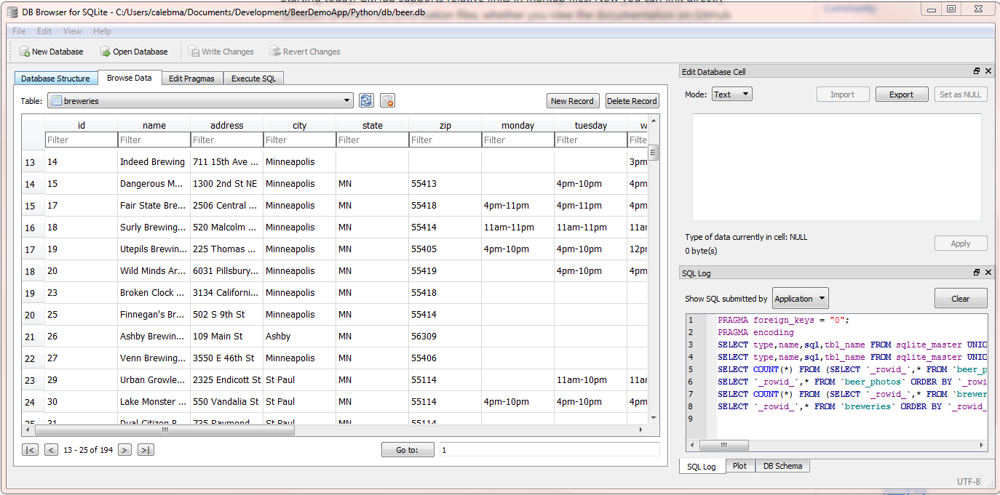

## Getting Started 

### install node modules  (inside VS Code Terminal)
1. launch VS Code and open the `student` folder
2. open the terminal and type the following commands, hitting `enter` after each one:

	* `cd app`
	* `npm install`

##### this will take a while to run, so while this is working please move on to setting up Postman

### set up Postman to test our API
1. launch Postman
2. create a new environment 
    - hit the gear button in the upper right hand corner > Manage Environments > Add
    - Call it `Brewery API`
    - Add the following (key, value) pairs:
		
| key  | value |
| ------------- | ------------- |
| host  | localhost  |
| port  | 5001  | 
| auth | <leave blank, we will fill this out later> |

3. import the API tests from the `/student/API_Tests/Brewery_API.postman_collection.json` file
    * this will load all the API tests for the REST API (note: the tests will not work until the routes are created!)

#### test the Flask app
1. double click the `run.sh`
    * the terminal message should say it started the `virtualenv` and the app is running on port `5001`
2. Go back to Postman and find the `Brewery API` Collection in the left pane and expand it
3. the first request in the list is a `GET` request called `endpoints`.  Click on this.
    * notice the request url is set to `{{host}}:{{port}}/endpoints`.  Postman will use our environment varialbes to fill in the host and port automatically.  It is good practice to use variables for things like this to test development and production environments by simply swapping out the host and port variables.
    * Hit the `Send` button to make the requst.  You should get a JSON response that looks like this:
   
```json
{
    "endpoints": [
        {
            "methods": "HEAD,OPTIONS,GET",
            "url": "/"
        },
        {
            "methods": "HEAD,OPTIONS,GET",
            "url": "/downloads/[filename]"
        },
        {
            "methods": "HEAD,POST,OPTIONS,GET",
            "url": "/endpoints"
        },
        {
            "methods": "HEAD,OPTIONS,GET",
            "url": "/test"
        },
        {
            "methods": "HEAD,OPTIONS,GET",
            "url": "/tests/exceptions/[code]"
        }
    ]
}
```

5. the `/endpoints` request automatically shows all the available routes in our API.  This will grow as we add more.  

#### understanding request parameters
when working with   `HTTP` requests, there's a variety of ways data/query params can be passed back and forth.  The `app.utils` Python module has a powerful function called `collect_args`, which will parse request arguments from the [query string](https://en.wikipedia.org/wiki/Query_string), [form data](https://developer.mozilla.org/en-US/docs/Learn/HTML/Forms/Sending_and_retrieving_form_data), or raw json in the request body.

Next, run click on the `/test` route in the `Brewery API` Collection in Postman.  In this request, there is a parameter in the query string as well as the body.  This route just returns back a response of the arguments passed in (processed by `collect_args()`) and the response should be:

```
{
    "body_param": "bar",
    "query_param": "foo"
}
```

#### working with real data in our REST API
Now that we know our REST API is working, it is time to start playing with our Brewery Data; but first, we need a database to work with.  To create our database double click on the `create_db_data.sh` file in the `Python` folder.  This will create a SQLite database called `beer.db` inside the `/Python/db` directory and load in some CSV files.  You should see a success message pretty quick after the database is set up.

Before we start setting up the API methods, we need to should understand the data.  The `models.py` file contains the schema for our database tables represented as the following classes:

* `Brewery`  - model for `breweries` table
* `Beer` - model for `beers` table
* `Category` - model for `categories` table (beer categories) - we actually aren't using this table directly
* `Style` - model for `styles` table (beer style)
* `User` - model for `users` table (note this extends the [flask_login.UserMixin]() class

We can view this data easier by looking at the actual `beers.db` database in the [DB Browser for SQLite](http://sqlitebrowser.org/) application (can right click on the `beers.db` and choose "Open With DB Browser for SQLite").  Choose the `breweries` table in the Browse Data tab.



Note that the Brewery Information contains latitude and longitude values stored in the `y` and `x` fields respectively.  This will be crucial for displaying the breweries in the map.  Take a moment to look at the other tables as well to become familiar with the data and schema.  Once complete, close the DB Browser for SQLite application to prevent any database locks.

#### test the `Brewery Finder` app boiler plate

1. Go back into VS Code and check to make sure the `npm install` command completed successfully.  The following dependencies should have installed (see `package.json`):

* `vue` - Vue.js, our application framework
* `vue-router` - [Vue Router](https://router.vuejs.org/) is a Vue Plugin to assist with creating Single Page Applications (SPAs)
* `bootstrap-vue` - [Bootstrap 4 bindings for Vue JS](https://bootstrap-vue.js.org/) implemented as convenient Vue.js Components
* `axios` - [client](https://github.com/axios/axios) for making web requests
* `@fortawesome/fontawesome-free` - [fontawesome](https://fontawesome.com/) icon library (free version)
* `@fortawesome/vue-fontawesome` - Vue.js [wrapper](https://github.com/FortAwesome/vue-fontawesome) for font awesome icons, essential for making reactive changes
* `@fortawesome/fontawesome-svg-core` - needed for `vue-fontawesome` for dom watching utils
* `mapbox-gl` - [Mapbox GL](https://www.mapbox.com/mapbox-gl-js/api/) JavaScript API that will provide our map interface
* `mapbox-gl-vue` - implements the Mapbox-gl Map as a [Vue component](https://github.com/phegman/vue-mapbox-gl) for Vue.js

2. Now let's take a quick look at the [code](https://github.com/Bolton-and-Menk-GIS/Full-Stack-Application-Development/tree/master/src/student/app/src) provided in the boiler plate in VS Code (`/student/app/src`):
3. View the `main.js` file in VS Code.  This begins with importing all the necessary modules.  Some important things to note is that since we are using a plugin for Vue (`bootstrap-vue`), we have to tell Vue to use it by doing:
4. 
`Vue.use(BootstrapVue)`

We are also going to register font awesome icons as a global component like this: 

`Vue.component('font-awesome-icon', FontAwesomeIcon);`

Because this `main.js` file is the entry point to the application and we do not want to hard code configuration in the application code itself such as the base url to our REST API and our mapbox access token, we are going to use a `config.json` file which can be found in at `app/public/config.json`.  It should look like this:

```json
{
  "map": {
    "accessToken": "pk.eyJ1IjoiZ2lzLWxpcyIsImEiOiJjam02Zmw2cDAzeGNjM3FsaTd0NmlzYTdvIn0.WCNnv0GbbVy624j8Dejs1A",
    "mapStyle": "mapbox://styles/mapbox/streets-v10",
    "center": [
      -93.37,
      44.9
    ],
    "zoom": 9
  },
  "api_base": "http://localhost:5001" 
}
```

If you have your own [mapbox token](https://www.mapbox.com/help/how-access-tokens-work/), please use it.  The token above is just a demo token and will not allow more than 50K map views per month.  We are also setting a default map center as well as the mapbox tile style for the basemap (`streets` in this case).  The other important thing being set is the `api_base`.  By making this configuration driven, you can easily change from a development to production environment for the REST API being used in this application without having to change any of the app code itself.  This is a best practice I would strongly recommend.

Now that we know about this `config.json` file, we want to initialize our Vue instance within the application to store these configuration options.  Because we have placed this config file in the `public` folder, we can load it relatively to our application by simply making a request to `./config.json`.  The reason we are loading this via `axios`/`xhr` is because if we were to place it next to the `main.js` file and `import config from './config'`, it would be bundled with all of our other application code when we build for production and it becomes a static asset within the code bundle instead of something that loads dynamically when the application initializes.


