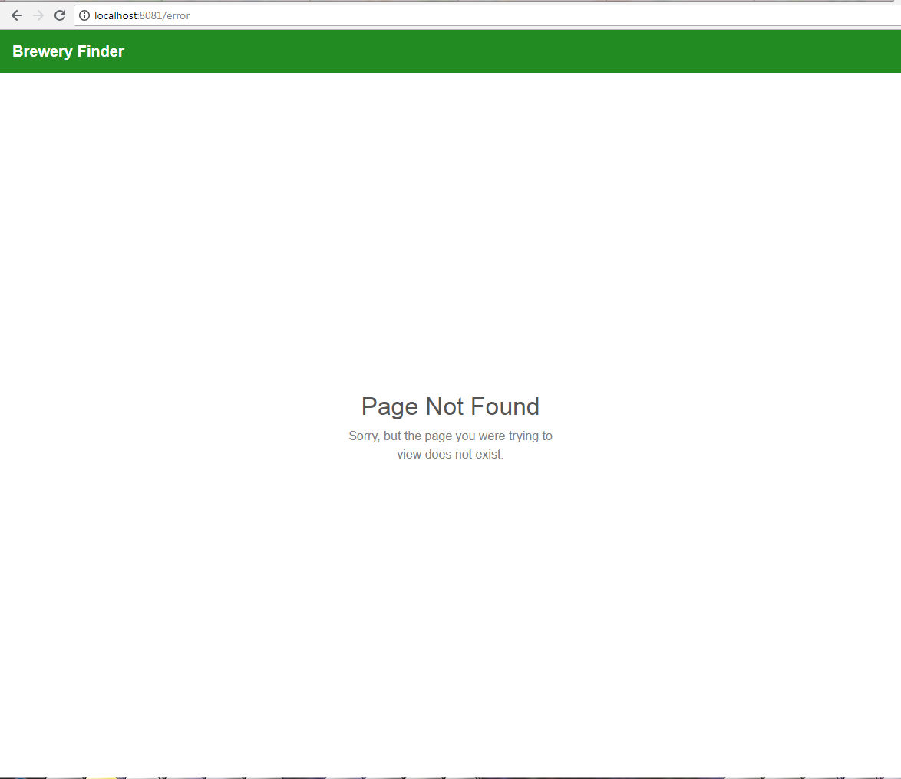

## Getting Started 

### install node modules  (inside VS Code Terminal)
1. launch VS Code and open the `student` folder
2. open the terminal and type the following commands, hitting `enter` after each one:

	* `cd app`
	* `npm install`

##### this will take a while to run, so while this is working please move on to setting up Postman

### set up Postman to test our API
1. launch Postman
2. create a new environment 
    - hit the gear button in the upper right hand corner > Manage Environments > Add
    - Call it `Brewery API`
    - Add the following (key, value) pairs:
		
| key  | value |
| ------------- | ------------- |
| host  | localhost  |
| port  | 5001  | 
| auth | <leave blank, we will fill this out later> |

3. import the API tests from the `/student/API_Tests/Brewery_API.postman_collection.json` file
    * this will load all the API tests for the REST API (note: the tests will not work until the routes are created!)

#### test the Flask app
1. Before we can launch our flask REST API (app), we need to make sure the dependencies required are available.  For your convenience, I have provided a shell script to create a `virtualenv` and install the necessary modules for windows users. Find the `setup_venv.sh` file inside the `student/Python` folder and double click to run.
    * If using a mac, skip this step as there is a `virtualenv` called `mac_venv` inside the `app` folder.  (note: the script may not work for everyone, if you're having issues visit the [Setting up the virtualenv manually]() page).   
2. start the Flask service by double clicking the `run.sh` insdie the `student/Python` folder
    * the terminal message should say it started the `virtualenv` and the app is running on port `5001`
    * *IMPORTANT* - make sure to hit `Ctrl + C` to stop the app from within the terminal window, simply closing the window **may not** kill the python process!
3. Go back to Postman and find the `Brewery API` Collection in the left pane and expand it
4. the first request in the list is a `GET` request called `endpoints`.  Click on this.
    * notice the request url is set to `{{host}}:{{port}}/endpoints`.  Postman will use our environment varialbes to fill in the host and port automatically.  It is good practice to use variables for things like this to test development and production environments by simply swapping out the host and port variables.
    * Hit the `Send` button to make the requst.  You should get a JSON response that looks like this:
   
```json
{
    "endpoints": [
        {
            "methods": "HEAD,OPTIONS,GET",
            "url": "/"
        },
        {
            "methods": "HEAD,OPTIONS,GET",
            "url": "/downloads/[filename]"
        },
        {
            "methods": "HEAD,POST,OPTIONS,GET",
            "url": "/endpoints"
        },
        {
            "methods": "HEAD,OPTIONS,GET",
            "url": "/test"
        },
        {
            "methods": "HEAD,OPTIONS,GET",
            "url": "/tests/exceptions/[code]"
        }
    ]
}
```

6. the `/endpoints` request automatically shows all the available routes in our API.  This will grow as we add more.  

#### understanding request parameters
when working with   `HTTP` requests, there's a variety of ways data/query params can be passed back and forth.  The `app.utils` Python module has a powerful function called `collect_args`, which will parse request arguments from the [query string](https://en.wikipedia.org/wiki/Query_string), [form data](https://developer.mozilla.org/en-US/docs/Learn/HTML/Forms/Sending_and_retrieving_form_data), or raw json in the request body.

Next, run click on the `/test` route in the `Brewery API` Collection in Postman.  In this request, there is a parameter in the query string as well as the body.  This route just returns back a response of the arguments passed in (processed by `collect_args()`) and the response should be:

```
{
    "body_param": "bar",
    "query_param": "foo"
}
```

#### working with real data in our REST API
Now that we know our REST API is working, it is time to start playing with our Brewery Data; but first, we need a database to work with.  To create our database double click on the `create_db_data.sh` file in the `Python` folder.  This will create a SQLite database called `beer.db` inside the `/Python/db` directory and load in some CSV files.  You should see a success message pretty quick after the database is set up.

Before we start setting up the API methods, we need to should understand the data.  The `models.py` file contains the schema for our database tables represented as the following classes:

* `Brewery`  - model for `breweries` table
* `Beer` - model for `beers` table
* `Category` - model for `categories` table (beer categories) - we actually aren't using this table directly
* `Style` - model for `styles` table (beer style)
* `User` - model for `users` table (note this extends the [flask_login.UserMixin]() class

We can view this data easier by looking at the actual `beers.db` database in the [DB Browser for SQLite](http://sqlitebrowser.org/) application (can right click on the `beers.db` and choose "Open With DB Browser for SQLite").  Choose the `breweries` table in the Browse Data tab.


Note that the Brewery Information contains latitude and longitude values stored in the `y` and `x` fields respectively.  This will be crucial for displaying the breweries in the map.  Take a moment to look at the other tables as well to become familiar with the data and schema.  Once complete, close the DB Browser for SQLite application to prevent any database locks.

## test the `Brewery Finder` app boiler plate

1. Go back into VS Code and check to make sure the `npm install` command completed successfully.  The following dependencies should have installed (see `package.json`):

* `vue` - Vue.js, our application framework
* `vue-router` - [Vue Router](https://router.vuejs.org/) is a Vue Plugin to assist with creating Single Page Applications (SPAs)
* `bootstrap-vue` - [Bootstrap 4 bindings for Vue JS](https://bootstrap-vue.js.org/) implemented as convenient Vue.js Components
* `axios` - [client](https://github.com/axios/axios) for making web requests
* `@fortawesome/fontawesome-free` - [fontawesome](https://fontawesome.com/) icon library (free version)
* `@fortawesome/vue-fontawesome` - Vue.js [wrapper](https://github.com/FortAwesome/vue-fontawesome) for font awesome icons, essential for making reactive changes
* `@fortawesome/fontawesome-svg-core` - needed for `vue-fontawesome` for dom watching utils
* `mapbox-gl` - [Mapbox GL](https://www.mapbox.com/mapbox-gl-js/api/) JavaScript API that will provide our map interface
* `mapbox-gl-vue` - implements the Mapbox-gl Map as a [Vue component](https://github.com/phegman/vue-mapbox-gl) for Vue.js

2. Now let's take a quick look at the [code](https://github.com/Bolton-and-Menk-GIS/Full-Stack-Application-Development/tree/master/src/student/app/src) provided in the boiler plate in VS Code (`/student/app/src`):
3. View the `main.js` file in VS Code.  This begins with importing all the necessary modules.  Some important things to note is that since we are using a plugin for Vue (`bootstrap-vue`), we have to tell Vue to use it by doing:
4. 
`Vue.use(BootstrapVue)`

We are also going to register font awesome icons as a global component like this: 

`Vue.component('font-awesome-icon', FontAwesomeIcon);`

Because this `main.js` file is the entry point to the application and we do not want to hard code configuration in the application code itself such as the base url to our REST API and our mapbox access token, we are going to use a `config.json` file which can be found in at `app/public/config.json`.  It should look like this:

```json
{
  "map": {
    "accessToken": "pk.eyJ1IjoiZ2lzLWxpcyIsImEiOiJjam02Zmw2cDAzeGNjM3FsaTd0NmlzYTdvIn0.WCNnv0GbbVy624j8Dejs1A",
    "mapStyle": "mapbox://styles/mapbox/streets-v10",
    "center": [
      -93.37,
      44.9
    ],
    "zoom": 9
  },
  "api_base": "http://localhost:5001" 
}
```

If you have your own [mapbox token](https://www.mapbox.com/help/how-access-tokens-work/), please use it.  The token above is just a demo token and will not allow more than 50K map views per month.  We are also setting a default map center as well as the mapbox tile style for the basemap (`streets` in this case).  The other important thing being set is the `api_base`.  By making this configuration driven, you can easily change from a development to production environment for the REST API being used in this application without having to change any of the app code itself.  This is a best practice I would strongly recommend.

Now that we know about this `config.json` file, we want to initialize our Vue instance within the application to store these configuration options.  Because we have placed this config file in the `public` folder, we can load it relatively to our application by simply making a request to `./config.json`.  The reason we are loading this via `axios`/`xhr` is because if we were to place it next to the `main.js` file and `import config from './config'`, it would be bundled with all of our other application code when we build for production and it becomes a static asset within the code bundle instead of something that loads dynamically when the application initializes.

The rest of the `main.js` file code is instantiating the Vue instance once the config is loaded and the promise is resolved. The config files is loaded using the `request()` function from the `modules/xhr.js` file, which simply provides a light wrapper for `axios`.  We will use the `request` function quite heavily for our client side interactions with the REST API.  Here is the code used for creating the Vue instance with some additional comments not found in the app code:

```javascript
// wait for config file to load before initializing Vue instance
request('./config.json').then((config) => {

  // set base url for our REST API from config file, this will be used globally
  // axios to prepend the base url to all requests that start with /
  axios.defaults.baseURL = config.api_base;

  // our new Vue instance
  new Vue({
  
    // render function is called to bring in the template created in the App.vue file
    render: h => h(App),

    // register router with vue, this stores all the routes our single page app will use
    router,

    // mounted event, just logging to show when it is created
    mounted(){
      console.log('MOUNTED MAIN VUE INSTANCE');
    },

    // data for vue instance, it must be a function that returns an object
    data(){
      return {
        // this is our configuration options 
        config: config
      }
    }
  // finally 'mount' the Vue instance to the <div id=app></div> element in the App.vue file's template
  }).$mount('#app');
});
```

Now that we know how the Vue instance is created, let's take a look at the `App.vue` file. This file is also pretty slim, even though it represents the skeleton for the entire application.  The `<template>` tag only contains a few elements:

* `#app` div - container for entire vue instance
* `app-nav-bar` - this is the `AppNavBar` component from the `AppNavBar.vue` file and will represent our app's navbar
* `router-view` - this is the placeholder for all of our app screens or routes. It is wrapped in the `keep-alive` component to tell Vue to reuse the components rather than recreate them each time a route changes.  In addition to the performance benefits, it will also maintain the state of each component when they are hidden and restored.

The other major thing stored in this file is the `<style>` tag at the bottom.  This is not `scoped` by design as it will serve as our global css file.  The main style classes we will use the most are the `theme` and `theme-banner` classes, which will use the two main colors I have chosen for this app: `forestgreen` (primary) and `orange` (secondary).  If you do not like these colors, feel free to change these two classes as well as the assocated `button.theme` and `button.theme:hover` classes.

*Note: the `style` tag is not required for `.vue` files and the `css` or `scss` can be stored as their own files and referenced via `import` statements*

#### Vue-Router (`modules/router.js`)

The next impotant thing for the application is the `Router`.  This will control the navigation to the different pages in the application.  The pages are:

* **Home** (`/`) - the home page that the user will see when they come to the app.  This will contain the map view.
* **Signup** (`/sign-up`) - this is the page users will see when they sign up/register with the `Brewery Finder` app
* **Activation** (`/users/:id/activate`) - when a user registers with the app, their account is created on the backend and a confirmation email is sent to allow the user to activate their account.  The activation email will provide a link to this page.
* **PageNotFound** (`*`) - this is our *catch all* route that will intercept any invalid routes that are matched (trying to visit a brewery that doesn't exist in the database, etc)

##### Bonus Material 
We probably won't get to cover all this, but the code is still provided in the solution for the routes below:
* **EditableBrewery** (`/brewery/:brewery_id`) - this will provide a place where authenticated users can create, update, or delete a brewery.  Featured beers for the brewery can also be added from this screen.
* **EditableBeer** (`/beers/:beer_id`) - This is where authenticated users can delete/update a featured beer for a brewery.  It will also include a drag/drop zone where a photo of the beer can or bottle can be uploaded.

The only routes included in the `routes.js` as part of the boiler plate are the `Home` and `PageNotFound` pages.  When registering a route, at a minimum you must provide a `path` for the route and the `component` to render for that page.  The `path` represents what will be appended to the url, so for our home page, the url will be: `http://<host>:<port?>/` for our development server, and for production it would be something like `http://<host>.com/brewery-finder/`.  A `name` attribute can also be provided for programmatic navigation to different routes.  The last thing to note is that the `Router`'s mode is set to `history`, which will use the Browser's history API and you can navigate between routes by using the Browser's back button.

*IMPORTANT* - When using the `Vue-Router` do not forget to tell Vue to use this plugin:  

```javascript
import Router from 'vue-router';
import Vue from 'vue';

// register with Vue
Vue.use(Router);
```

### Home page (`/app/components/home/Home.vue`)
This will be the main page of the application and will contain the map view of the breweries.  An important aspect that we will be building later is the `Sidebar.vue` component, which will contain the `Typeahead.vue` component that will allow users to search for breweries by name (wildcard match).  Also in the Sidebar will be the `BreweryInfo.vue` component that will be displayed for each brewery to give some basic info on the brewery and show their featured beers. 

The `MapViewMglv.vue` component is nested inside the `Home.vue` component and uses the `Mapbox-gl` JavaScript API under the hood. Identifying map breweries by clicking on the map will be handled here.

### PageNotFound (`/app/components/PageNotFound.vue`)

### Basic UI Components (`/app/UI`) 
* `Accordion.vue` - Component representing a Bootstrap Accordion (collapsible menu)
* `Spinner.vue` - Component with a spinner animation to indicate that resources are loading
* `DropZone.vue` - Component that will be used for uploading beer photos (**bonus material**)

## Launch the application via the Dev Server
Now that we are familiar with the current application structure, let's make sure the app works in it's current state.  A dev server is shipped as part of the `@vue-cli` to make the Development experience more pleasant by using some nice features such as [Hot Reloading](https://webpack.js.org/concepts/hot-module-replacement/).  To start the application through the dev server, run the following command in the VS Code terminal (or git bash, make sure you are in the `app` directory!):

```node
npm run serve
```

Once the dev build completes, the application should be running and should say at `localhost:<port>`.  You will see some `es-lint` errors, but ignore these as they are just complaining about using `console.log()`.


*Note* the `@vue-cli` dev server is actually the [webpack dev server](https://webpack.js.org/configuration/dev-server/) under the hood. This supports many different configuration options.

### view the app in chrome
Once the dev server has started, launch Chrome and navigate to the location shown in the terminal.  The app should look similar to this:


Also, be sure to launch the Chrome Developer tools (`F12`, `Ctrl + Shift + I`, or right click > inspect).  You should see the following console logs:

1[console](images/sec_01/console_mounted.PNG)

Pay close attention to the order of the console logs.  The first thing loaded/mounted is the `App.vue` and then anything that it contains is loaded after (Map View, followed by Home) with the Vue instance mounting last.  The map loaded event will probably be the last log because that does the start up of `Mapbox-gl` which also has to load in tiles.  Right now the application doesn't really do anything other than display a map.  

However, because we did implement the `PageNotFound` route to catch any unmatched routes, you can have some fun by typing invalid route names into the url such as `localhost:8080/error` to see this page displayed:



Now that the basic front end application is running and we have a working back end API as well, let's start building the fun stuff!  Feel free to move on to [Section 2](https://github.com/Bolton-and-Menk-GIS/Full-Stack-Application-Development/blob/master/sections/02_Serve_Brewery_Data.md) now.


