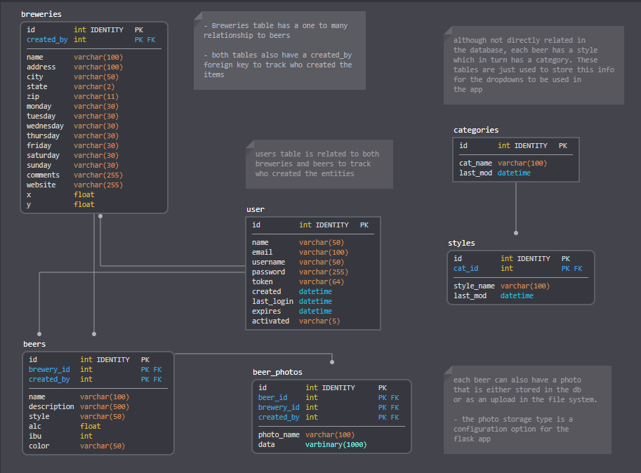
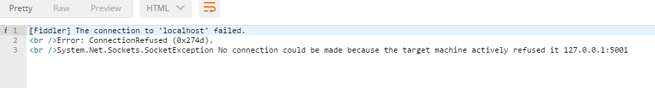
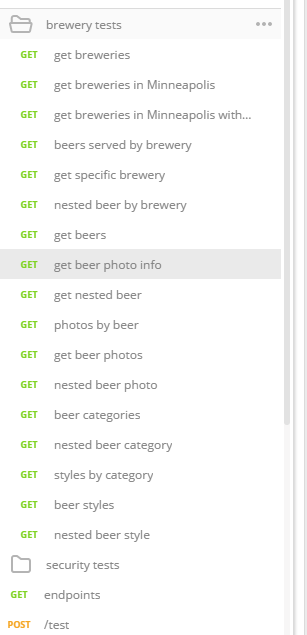

# Section 2: Serving Brewery Data

**TL;DR** - *The instructions for this section are outlined below.  If you do not want to copy and paste the code snippets, you can switch to the [solution branch]() for this section by running: `git checkout 02-serve-brewery-data`*

### Creating a REST API
Before just diving into the code, it is important to understand what capabilities the API will expose.  The most obvious thing is to serve the data from the `beer.db` SQLite database as `JSON` for the client application.  The API should also have convenient query options for fetching the brewery data.

The `app.utils` module already has some convenience methods inside that will be useful for serving the data.  Some of the functions that will be heavily used are:

* `success` - return a success message with a status code of 200
* `dynamic_error` - dynamically create runtime errors and return as a response object
* `collect_args` - gets all request arguments in a variety of formats
* `list_fields` - list fields from table
* `to_json` - converts a `Table` object into a `JSON` object
* `query_wrapper` - convenient wrapper function to handle simple and complex table queries. This will support queries based on multiple conditions, wildcards, as well as limiting the returned fields.
* `validate_fields` - function to validate fields passed into the `query_wrapper` function.  This ensures that the requested fields exist in the table.

So what makes a good REST endpoint for querying data? First, the route name should make sense.  So for querying breweries we should start with (all route urls are relative to `<host>:<port>`):

`GET`: `/breweries`

The above query implies that the request would fetch all breweries in the database.  However, it also makes sense to allow the user to narrow their search result by adding query string parameters.  For example, maybe the user is just interested in the breweries in Minneapolis.  Because the `breweries` table has a `city` field, that could be used in the query string:

`GET`: `/breweries?city=Minneapolis`

To acheive this, the `collect_args()` function can be used to parse the query parameters to obtain the condition to do the following query in SQLite:

`SELECT * from breweries WHERE city = 'Minneapolis'`

Fortunately, we are using `flask_sqlalchemy`, which is an [Object Relational Mapper](https://pythonspot.com/orm-with-sqlalchemy/) (ORM) so we do not have to write raw statements.  As a reminder the definition of an ORM from the above link:

>An object relational mapper maps a relational database system to objects. The ORM is independent of which relational database system is used. From within Python, you can talk to objects and the ORM will map it to the database.

#### using the `query_wrapper` function
Rather than writing raw queries, the `query_wrapper()` function can be used, which relies on `flask_sqlalchemy` Tables and the ORM to perform queries. The `query_wrapper` function will return one or more objects that are mapped to rows in the database.  These objects also have a `mapper` class that will fetch the actual `Table` subclass that performs the queries.  This is all abstracted by the `flask_sqlalchemy` and more specifically the `declarative_base`.  The `query_wrapper` function accepts the following parameters:

* `table` - Table/declarative base object to query
* `**kwargs` - primarily used to fetch the conditions to add to the query specific to each database.  In the brewery example above, a keyword argument could be `city='Mineapolis'` to filter based on breweries in Minneapolis. The keys are validated and the arguments are only used if the keys exist as fields in the database. The rest of the arguments are restricted keys that can be used across all tables:
    * `fields` - list or comma separated string for data fields to return in response
    * `wildcards` - comma separated list of fields that are passed in as conditions to be searched via wildcard rather than exact match.  By default, the condition `**kwargs` are an exact match like the case of `city='Minneapolis'`, but what if you want to to do a `field like '%<value>%'`?  That is where the wildcards parameter can be used.  An example would be to find all breweries that are like `'%man%'` to handle an auto complete list based on user search criteria.  That can be achieved by querying `/breweries?name=man&wildcards=name`.
    
Given that the `query_wrapper` will be able to handle some pretty robust queries, this is will be the core functionality used for `GET` requests for fetching data from the database.  This will be very convenient for querying multiple breweries, but what about when you just want one specific brewery?  Obviously, this can be achieved with the above logic, but may not be the cleanest way.  For example:

`GET`: `/breweries?name=Mankato Brewery` or `/breweries?id=57`

While both of the above requests are a perfectly valid way, we can also expose individual items as nested resources by using the brewery `id`.  The above could be fetched as: 

`GET`: `/breweries/57`

The above query would just return the requested resource `{...}`, where the prior two queries would return the one resource inside an array `[ {...} ]`.  In order to achieve this in a sane way, the easiest is to create a helper function that will first check to see if a resource `id` is passed in and if so, return a single object, otherwise perform the query with all other conditions applied.  In VS Code (or your preferred Python IDE) navigate to the `/student/Python/app/utils.py` file and add the following function at the bottom after the `to_json` function:

```py
def endpoint_query(table, fields=None, id=None, **kwargs):
    """ wrapper for for query endpoint that can query one feature by id
    or query all features via the query_wrapper

    :param table: Table to query
    :param fields: fields to be returned in query
    :param id: optional resource ID
    :return: Response() object for query result as json
    """
    if id != None:
        try:
            item = query_wrapper(table, id=int(id))[0]
            return jsonify(to_json(item, fields))
        except IndexError:
            raise InvalidResource

    # check for args and do query
    args = collect_args()
    for k,v in six.iteritems(kwargs):
        args[k] = v
    return jsonify(query_wrapper(table, **args), fields)
```

This function will be used to query all tables in the database and by default will return a `flask.Response()` object via the `flask.jsonify` function.  Note that this will also through our custom `InvalidResource` from the `app.exceptions` module if there is no resource matching requested `id`.  

So now that we have this function, we can actually see it in action by creating a REST endpoint route for it.  Rather than bloating our `app` module (`app/__init__.py`) with all of our API methods, it is cleaner to use the concept of [Blueprints] to make the application more modular.  For our API, we will create a blueprint called `brewery_api` to handle all the routes for working with the brewery data, and a `security_api` to handle the application security.  Let's start by creating a `brewery_api.py` file inside the `app` folder to represent a blueprint and add the following code:

```py
from flask import url_for, Blueprint, send_file
from flask_login import login_required, current_user
from models import *
from database_utils import create_beer_photo
from exceptions import *
from utils import *
from io import BytesIO

# add brewery API blueprint
brewery_api = Blueprint('brewery_api', __name__)

# get list of brewery fields to use as default
brewery_fields = list_fields(Brewery)

# API METHODS BELOW

@brewery_api.route('/breweries')
@brewery_api.route('/breweries/<id>')
def get_breweries(id=None):
    args = collect_args()
    return endpoint_query(Brewery, id=id, **args)
```

In the above code, we are creating a new `Blueprint` and defining 2 routes with one function (`/breweries` for full query or `/breweries/id` to get the nested resource).  Save this file and we will bring this blueprint into our flask service.  Now go to the `app/__init__.py` file and make the following changes:

* add import statement: `from brewery_api import brewery_api`
* under the line: `app.register_blueprint(security_api)` add:

```py
app.register_blueprint(brewery_api)
```

Now save the file.  One nice thing about making a flask app is that whenever changes are detected, it will automatically restart itself to reflect the changes.  If there are no errors, open Postman and run the `get breweries` query and you should get a `JSON` response similar to: 

```json
[
  {
    "address": "414 6th Ave N",
    "brew_type": "Brewery",
    "city": "Minneapolis",
    "comments": "2014 - 13,000 barrels produced (5th in MN)",
    "created_by": 1,
    "friday": "3pm-11pm",
    "id": 1,
    "monday": "",
    "name": "Fulton Brewing Co",
    "saturday": "12pm-11pm",
    "state": "MN",
    "sunday": "12pm-6pm",
    "thursday": "3pm-10pm",
    "tuesday": "3pm-10pm",
    "website": "http://www.fultonbeer.com/",
    "wednesday": "3pm-10pm",
    "x": -93.27920282199993,
    "y": 44.98494304000007,
    "zip": "55401"
  },
  ... more results
  ]
  ```
  
  Very Cool!  The `breweries` table is now searchable in a REST API!
 
  
  
  Next, feel free to play with this endpoint by adding some queries such as `/breweries?city=Minneapolis` and limit the fields to just name, and city:
  
  `/breweries?city=Minneapolis&fields=name,city` 
  
  And finally, run the `get specific brewery` test in Postman to see the nested resource for the Mankato Brewery.  The url is:
  
  `/breweries/57`
  
  Now that we know this works, other tables can also be exposed through the service. Before adding more routes, navigate to the `models.py` file to look at the schemas again. One thing to note is that several tables are using [one to many](https://fmhelp.filemaker.com/help/17/fmp/en/index.html#page/FMP_Help/one-to-many-relationships.html) [`relationships`](https://www.lifewire.com/database-relationships-p2-1019758).  The graphic below shows the layout of the database with the associated relationships:
  
  
  
  The routes we need to make are shown below, and keep in mind we also need to model the `one-to-many` relationships as accessed by the `Table` objects:
  
  | parent | child | primary_key | foreign_key | parent attribute | endpoint | nested resource |
  | ------ | ----- | :---------: | :--------- | ---------------- | ---------- | -------- |
  | breweries |  | id |  |  | `/breweries` | `/breweries/<id>` |
  | breweries | beers | id | brewery_id | `beers` | `/breweries/<brewery_id>/beers` | `/breweries/<brewery_id>/beers/<id>` |
  | beers |  | id |  | | `/beers` | `/beers/<id>` |
  | beers | beer_photos | id | beer_id | `photos` | `/beers/<beer_id>/photos` | `/beers/<beer_id>/photos/<id>` |
  | beer_photos |  | id |  |  | `/beer/photos` | `/beer/photos/<id>` |
  | categories |  | id | | |`/categories` | `/categories/<cat_id>` |
  | categories | styles | id | cat_id | `styles` |`/categories/<cat_id>/styles` | `/categories/<cat_id>/styles/<id>` |
  | styles | | id | | | `/beer/styles` | `/beer/styles/<id>` |
  | users |  | id |  |  | `/users` | `/users/id` |
  | users | breweries | id | created_by | `submitted_breweries` | `/users/<created_by>/breweries` |  `/users/<created_by>/breweries/<id>` |
  | users | beers | id | created_by | `submitted_beers` | `/users/<created_by>/beers` |  `/users/<created_by>/beers/<id>` |
  
  *Note: not all API methods defined above will be used in the app, but we are building them anyways for completeness of the API*
  
  Go back to the `brewery_api.py` file and we can start adding our routes from the table above.
  
1 . Add the `/breweries/<id>beers` routes to get beers per brewery: 

*Note: only the `Mankato Brewery` has featured beers in the database from the boiler plate*

```py
@brewery_api.route('/breweries/<id>/beers')
@brewery_api.route('/breweries/<id>/beers/<bid>')
def get_beers_from_brewery(id=None, bid=None):
    if not id:
        raise InvalidResource

    # fetch brewery first
    brewery = query_wrapper(Brewery, id=int(id))[0]
    args = collect_args()
    fields = args.get('fields')

    # fetch beers
    if bid:
        try:
            beers = brewery.beers
            # should be a way to achieve this via filter or join?
            return jsonify(to_json([b for b in beers if b.id ==int(bid)][0], fields))
        except:
            raise InvalidResource
    return jsonify(to_json(brewery.beers, **collect_args()))
```

2. Add the `/beers` routes:

```py
@brewery_api.route('/beers')
@brewery_api.route('/beers/<id>')
def get_beer_by_id(id=None):
    return endpoint_query(Beer, id=id, **collect_args())
```

3. Add the `/beers/<beer_id>/photos` routes:

for the `beer_photos` table, in case the `photo_storage_type` is set to `database`, we do not want to return the raw `blob` data for the photo as `JSON`.  So for this table, we will limit the query fields by adding a variable to specify the output fields.  Add this somewhere above the `# API METHODS BELOW` section:

`beer_photo_fields = [f for f in list_fields(BeerPhotos) if f != 'data']`

And then back in the `# API METHODS BELOW` section add the nested `/beers/photos` endpoint route:

```py
@brewery_api.route('/beers/<id>/photos')
def get_beer_photos(id=None):
    if not id:
        raise InvalidResource

    beer = query_wrapper(Beer, id=int(id))[0]
    return jsonify(to_json(beer.photos, beer_photo_fields))
```

4. Next, expose the `/beer/photos` route by itself so beer photos can be queried outside the context of a parent beer:

*Note: the `/beer/` prefix is different than `/beers/` by design, otherwise we could have collisions with the `/beers/<id>` route*

```py
@brewery_api.route('/beer/photos')
@brewery_api.route('/beer/photos/<id>')
def get_beer_photo(id=None):
    return endpoint_query(BeerPhotos, beer_photo_fields, id)
```

5. Add the `/categories` route:

```py
@brewery_api.route('/beer/categories')
@brewery_api.route('/beer/categories/<id>')
def get_categories(id=None):
    return endpoint_query(Category, id=id, **collect_args())
```

6. Add the nested `/category<id>/styles` route:

```py
@brewery_api.route('/beer/categories/<id>/styles')
def get_category_styles(id):
    if id:
        try:
            category_styles = query_wrapper(Category, id=int(id))[0].styles
        except IndexError:
            raise InvalidResource
        return jsonify(to_json(category_styles, **collect_args()))
    raise InvalidResource
```

7. Add the `/beer/styles` routes:

```py
@brewery_api.route('/beer/styles')
@brewery_api.route('/beer/styles/<id>')
def get_styles(id=None):
    return endpoint_query(Style, id=id, **collect_args())
```

That is all we will add to the `brewery_api` blueprint for now.  The `users` table queries will be handled in the `security_api` blueprint.  Now that all these routes have been added, save the changes and and test them using Postman. 

If you see this error in the `bash` shell:

`Application Terminated: press any key to exit...`

That means there is an error in the flask application.  Go back through the steps above to make sure everything is correct.  You may also notice errors in the API when you see this error in Postman which just means the application is not running:



The application usually only breaks when there is a syntax error or a variable/module is not resolved.  When errors occur on route functions, the error will be returned, but the application continues to run.

### running the API tests in Postman

*Make sure you have imported the `Brewery_API.postman_collection.json` file [from step one](01_Getting_Started.md#set-up-postman-to-test-our-api).*

Navigate to the `Brewery API` collection in the left pane and expand the `brewery tests` folder.  You should see the following tests (may differ slightly):



Run the following tests:

1. `get breweries`
2. `get breweries in Minneapolis`
3. `get breweries in Minneapolis with field limit`
4. `beers served by brewery`
5. `get specific brewery`
6. `test invalid resource error` - this is thrown when trying to access a resource that doesn't exist
7. `nested beer by brewery` 
8. `get beers`
9. `get beer photo info`
10. `get nested beer`
11. `photos by beer`
12. `get beer photos`
13. `nested beer photo`
14. `beer categories`
15. `nested beer category`
16. `beer styles`
17. `nested beer styles`

### displaying the breweries in our `Brewery Finder` application

Now that we have the breweries available for query in our REST API, we can add them as a layer source in the `Mapbox-gl` Map.  The `Mapbox-gl` JavaScript API documentation tells us that a layer has to be loaded from a [`GeojsonSource`](https://www.mapbox.com/mapbox-gl-js/api/#geojsonsource) which requires a structure `GeoJson` structure like this: 

```json
{
   "type": "FeatureCollection",
   "features": [{
       "type": "Feature",
       "properties": {
           "field": "test value"
       },
       "geometry": {
           "type": "Point",
           "coordinates": [
               -76.53063297271729,
               39.18174077994108
           ]
       }
   }]
}
 ```
 
 The most important piece is the `geometry` property for each feature.  Luckily the `x` and `y` coordinates are stored in the `breweries` table, so the data just needs to be converted to `GeoJson` format.  We could certainly handle this in the client side application with JavaScript, however, that is a burden that should not be placed on the client.  Instead, we can set up a special **request format** parameter only available to the `/breweries` route queries.  By default, the API should return brewery info in `JSON` as it currently does, but should also support fetching in `GeoJson` format.  This is best handled as a query string parameter in the url with the following client query:
 
 `/breweries?f=geojson`

To implement this in the REST API, create the following function inside the `app.utils` module (`/app/utils.py`):

```py
# toGeoJson() handler for breweries
def toGeoJson(d):
    """ return features as GeoJson (use this for brewery query)

    :param d: dict of features to return as GeoJson
    :return: GeoJson structure as dict
    """
    if not isinstance(d, list):
        d = [d]
    return {
        "type": "FeatureCollection",
        "features": [
            {
                "type": "Feature",
                "properties": f,
                "geometry": {
                    "type": "Point",
                    "coordinates": [f.get('x'), f.get('y')]
                }
            } for f in d
        ]
    }
```

Save the changes to the `utils.py` file.  Now go back into the `brewery_api.py` file and replace the `/breweries` route code with this:

```py
@brewery_api.route('/breweries')
@brewery_api.route('/breweries/<id>')
@errorHandler
def get_breweries(id=None):
    args = collect_args()
    f = args.get('f', 'json')
    handler = toGeoJson if f.lower() == 'geojson' else lambda t: t
    fields = args.get('fields') or brewery_fields

    if id:
        try:
            brewery = query_wrapper(Brewery, id=int(id))[0]
            return jsonify(handler(to_json(brewery, fields)))
        except IndexError:
            raise InvalidResource

    # query as normal
    results = query_wrapper(Brewery, **args)
    return jsonify(handler(to_json(results, fields)))
```

The above modification will now check for a query parameter called `f` and if it is set to `geojson` it will pass the `to_json` result through our `toGeoJson()` function via the `handler` variable (if not used the `lambda` function just returns the original object).

Save those changes and go back to Postman and run the `query breweries as geojson` test.  The response should now be something like:

```json
{
    "features": [
        {
            "geometry": {
                "coordinates": [
                    -93.27920282199993,
                    44.98494304000007
                ],
                "type": "Point"
            },
            "properties": {
                "address": "414 6th Ave N",
                "brew_type": "Brewery",
                "city": "Minneapolis",
                "comments": "2014 - 13,000 barrels produced (5th in MN)",
                "created_by": 1,
                "friday": "3pm-11pm",
                "id": 1,
                "monday": "",
                "name": "Fulton Brewing Co",
                "saturday": "12pm-11pm",
                "state": "MN",
                "sunday": "12pm-6pm",
                "thursday": "3pm-10pm",
                "tuesday": "3pm-10pm",
                "website": "http://www.fultonbeer.com/",
                "wednesday": "3pm-10pm",
                "x": -93.27920282199993,
                "y": 44.98494304000007,
                "zip": "55401"
            },
            "type": "Feature"
        },
        //... more results
    ],
    "type": "FeatureCollection"
}
```

Now that this is working, we can go back to our JavaScript application to add the breweries into the map.  Proceed to [Section 3](03_Add_Breweries_to_Map.md).


  
  