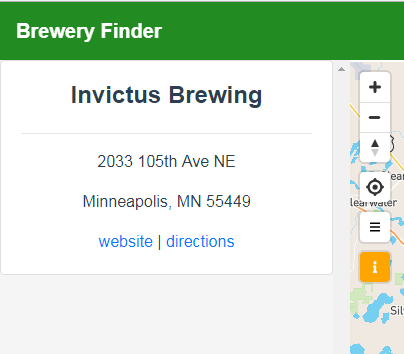

# Section 3: Add the Brewery Data to the Map

**TL;DR** - *The instructions for this section are outlined below.  If you do not want to copy and paste the code snippets, you can switch to the [solution branch]() for this section by running: `git checkout 03-add-breweries-to-map`*

## start building the client side API

Now that there is a backend web service running to serve up the brewery data, the client side application can now start consuming that data.  To best facilitate this, we will create a new JavaScript module called `api.js` and place it in the `/student/app/modules` folder (make sure you are not in the `Python/app` folder!).  Add the following code:

```js
import { request } from './xhr';

const api = {

  getBreweries({id=null, options={}}={}){
    // defaults
    options.f = options.f || 'geojson';

    // make request
    return request(`/breweries${id ? '/' + id: ''}`, options);
  }
  
}

export default api;
```

the `request` function from the `xhr` module takes a url as the first argument and any query parameters as the second argument.  The `getBreweries` function accepts an object with an optional brewery `id` to get a nested resource and an `options` object for any query parameters.  If no options are passed in, a default argument of `f` = `geojson` is passed in.

The request url also may look a little funny so let's break it down.

```js
`/breweries${id ? '/' + id: ''}`
```

The first thing to note is that the url starts with `/breweries`...How does the request function (and more importantly `axios`) know to append the prefix of our REST API (`localhost:5001` for our python dev server)?  The magic for this is actually happening in the `main.js` file.  After the application's `config.json` file is loaded, the Vue instance is intialized.  However, right before that happens, we set a global `axios` default option (see [docs](https://github.com/axios/axios#axioscreateconfig) for more config options):

```js
// set base url for API from config file
axios.defaults.baseURL = config.api_base;
```

As a reminder this is the default content for the `app/public/config.json` file:
```json
{
  "map": {
    "accessToken": "pk.eyJ1IjoiZ2lzLWxpcyIsImEiOiJjam02Zmw2cDAzeGNjM3FsaTd0NmlzYTdvIn0.WCNnv0GbbVy624j8Dejs1A",
    "mapStyle": "mapbox://styles/mapbox/streets-v10",
    "center": [
      -93.37,
      44.9
    ],
    "zoom": 9
  },
  "api_base": "http://localhost:5001" 
}
```

As mentioned in section 1, this is config driven so we can easily switch between development and production environments for flask outside of our application code base.

The next part `${id ? '/' + id: ''}`  uses a [ternary](https://developer.mozilla.org/en-US/docs/Web/JavaScript/Reference/Operators/Conditional_Operator) statement to append `/<id>` if a brewery id was passed in otherwise append nothing (`''`) to the url.  In other words:

```js
// url will be /breweries
const resp = await getBreweries();  //id passed in is null from default arguments

// url will be /breweries/57
const resp = await getBreweries({ id: 57 });
```

### load GeoJson source into `MapViewMglv.vue` component

Open the `MapViewMgl.vue` component in VS Code.  Let's add some code to fetch our brewery data on the Map's [`loaded`](https://www.mapbox.com/mapbox-gl-js/api/#map#loaded) event.  Replace the `mapLoaded` method's code with this:

```js
async mapLoaded(map){
        console.log('MAP LOADED: ', map);

        const brewerySource = await api.getBreweries();
        console.log('brewerySource: ', brewerySource);

        // add brewery data to map
        map.loadImage('./assets/beer.png', function (error, image) {
          if (error) throw error;
          map.addImage('beer', image);
          map.addLayer({
            "id": "breweries",
            "type": "symbol",
            "source": {
              "type": "geojson",
              "data": brewerySource
            },
            "layout": {
              "icon-image": "beer",
              "icon-size": 0.1,
              "text-field": "{name}",
              "text-size": 10,
              "text-font": ["Open Sans Semibold", "Arial Unicode MS Bold"],
              "text-offset": [0, 1.2],
              "text-anchor": "top"
            }
          });
        });

        // add control buttons
        const toggleMenu =(evt)=>{
          this.$emit('toggle-menu');
        };

        const menuButton = createControlButton({
          className: 'expand-menu',
          iconClass: 'fas fa-bars',
          onClick: toggleMenu,
          title: 'expand menu'
        });

        map.addControl(menuButton, 'top-left');
        // add identify button
        const toggleIdentify =(evt)=>{
          this.$emit('toggle-identify');
        };

        const identifyButton = createControlButton({
          className: 'expand-identify',
          iconClass: 'fas fa-info',
          onClick: toggleIdentify,
          title: 'expand identify window'
        });

        map.addControl(identifyButton, 'top-left');
        
      },  // don't forget this comma, we have more functions to add!
```

#### and don't forget to import the `api.js` module:

```js
// add after last import
import api from '../../modules/api';
```

This method is called when the map is loaded because we are subscribing to the `@map-load` event provided by the `mapboxgl-vue` component:

```html
<mapbox
        :access-token="$root.config.map.accessToken"
        :map-options="{
            style: $root.config.map.mapStyle,
            center: $root.config.map.center,
            zoom: $root.config.map.zoom
        }"
        :nav-control="{
          show: true,
          position: 'top-left'
        }"
        :geolocate-control="{
            show: true,
            position: 'top-left'
        }"
        :scale-control="{
            show: true,
            position: 'bottom-right'
        }"
        @map-init="mapInitialized"
        @map-load="mapLoaded">  // right here!
</mapbox>
```

the `mapLoaded()` method is registred as the event handler. Now save the changes and view the application in your browser (`localhost:8080`):


And you should see the actual data in the console:


So now we have features in the map, but they don't do anything.  Let's change that.  We want to create a nice sidebar menu that displays the brewery info when the user clicks on a brewery.



To achieve this, an event handler needs to be created for the [map-click](https://www.mapbox.com/mapbox-gl-js/api/#map.event:click) event,  add the following functions to the `methods` under the `mapLoaded` function:

```js
  mapClick(map, e) {
    console.log('map click: ', e);
    // find features
    const features = map.queryRenderedFeatures(e.point, {
      layers: ['breweries']
    });

    console.log('found features: ', features);
    if (features.length) {
      // handle selection on map
      const feature = features[0];
      this.handleIdentify(feature);
    } else if (this.selectionMarker) {
      // clear selection on map and close identify
      this.selectionMarker.remove();
      this.selectionMarker = null;
      this.$emit('cleared-selection')
    }
  },
  
  handleIdentify(feature, updateCenter=false){
    if (!feature){
      return;
    }
    this.$emit('brewery-identified', feature);

    // add marker to map
    if (!this.selectionMarker){

      this.selectionMarker = new mapboxgl.Marker({color: 'red'})
          .setLngLat(feature.geometry.coordinates)
          .addTo(this.map);
    } else {
      this.selectionMarker.setLngLat(feature.geometry.coordinates)//[feature.properties.x, feature.properties.y]
    }

    if (updateCenter){
      this.map.setCenter(feature.geometry.coordinates);
    }
  }
```

The `mapClick` function will take the point from the map and call the `queryRenderedFeatures()` method of the `mapboxgl.Map` and will return any breweries that intersect the map click from the user.  If a feature is found, that feature is passed to the `handleIdentify` function which adds a red marker to the map to show which brewery is selected and emits the `brewery-identified` event that will be intercepted by the `Home.vue` component later to render the brewery information in the `Sidebar.vue` component.  If no features are found, the map marker is removed `clear-selection` event is emitted.

Even though we have created the functions, nothing will happen yet when the user clicks on a brewery because we haven't registered the `mapClick()` function to be the event handler for the `map-click` event.  Let's add that the the `<mapbox>` tag in the `template`:

```html
<mapbox
    :access-token="$root.config.map.accessToken"
    :map-options="{
        style: $root.config.map.mapStyle,
        center: $root.config.map.center,
        zoom: $root.config.map.zoom
    }"
    :nav-control="{
      show: true,
      position: 'top-left'
    }"
    :geolocate-control="{
        show: true,
        position: 'top-left'
    }"
    :scale-control="{
        show: true,
        position: 'bottom-right'
    }"
    @map-click="mapClick"
    @map-init="mapInitialized"
    @map-load="mapLoaded">
</mapbox>
```

Now save the changes and test out clicking on breweries in the map and verify features are being returned in the console:


Next, we will build the rest of the `template` in the `BreweryInfo.vue` component.  Navigate to that file now and look at the template.  Right now, there is just a `div` that shows that there were no features found.  We want to *model* the selected brewery to this component and display some basic information.  This component accepts a `feature` prop, which is a brewery.  In order to make this component flexible so it doesn't care whether it gets a `geojson` structure vs a regular `json` structure, there is a [computed property](https://vuejs.org/v2/guide/computed.html#Computed-Properties) called `properties` that will return the regular structure if the `feature` prop is passed in as plain `json` or it will fetch the `feature.properties` object if it is passed in as `geojson`.

To test modeling some quick data, let's change the `template` slightly to this:

```html
<template>
  <div class="brewery-info-container">

    <p v-if="Object.keys(properties || {}).length">{{ properties.name }}</p>

    <div v-else>
      <h4 class="no-features mt-4">No Features Found</h4>
    </div>

  </div>
</template>
```

a  `v-if` statement is used to check of the `properties` property has any keys (i.e. is not an emtpy object) and if there is data, render a `<p>` tag with the brewery name using the Vue's [string interpolation/template syntax](https://vuejs.org/v2/guide/syntax.html) as `{{ properties.name }}`. A `v-else` statement is used to show a div saying no features found when the brewery `feature` passed in is null.  

So now this component is ready to receive a `feature`, Here is where things get interesting. The feature selection is happening in the `MapVieMglv` component, and the `brewery-identified` event is being emited from that component and passing on the selected feature.  Because that is a child of the `Home` component, the selected brewery event can be handled here and pass the selected brewery to another child component of `Home`: the `BreweryInfo` component.  This is the line that emits the `brewery-identified` event from the `handleIdentify` method in `MapViewMglv`:

`this.$emit('brewery-identified', feature);`

The first thing we need is a function to set the `currentBrewery` data property to the selected brewery.  This should also expand the `Sidebar` component if it is not already expanded and make sure it is focused on the `BreweryInfo` component, which is rendered based on the `boolean` value of the `identifyActive` data property of the `Home` component.  To accomplish all of this, add the following method to `Home.vue`:

```js
  showBreweryInfo(brewery){
    // force panel to open with identify active
    this.selectedBrewery = brewery; 
    if (brewery){
      this.$refs.sidebar.expand(); //expand the sidebar
      this.menuActive = false;
      this.identifyActive = true; // this will ensure the brewery info component is shown
    }
  },
```

To capture the event, listen for that `brewery-identified` event from the `MapVieMglv` in the `Home` template:

```html
<!-- MAP VIEW-->
    <map-view ref="mapView" 
      @brewery-identified="showBreweryInfo"
      @toggle-identify="identifyActivePanel"
      @toggle-menu="menuActivePanel"/>
```

Save the changes.  The `selectedBrewery` data property is already wired up in the `Home.vue` `template` so clicking on a brewery should display it's name in the sidebar:

```html
<!-- BREWERY IDENTIFY CONTENT -->
        <brewery-info
                v-if="identifyActive"
                :userIsAuthenticated="userIsAuthenticated"
                :feature="selectedBrewery">  // 'selectedBrewery' is passed in as 'feature' prop here
        </brewery-info>
```

You should see something like this in the app:


Now that we know the data is successfully being passed, let's build the real template for the brewery info.  For the summary view we want to show:

* name 
* address
* link to website

Replace the `template` in `BreweryInfo.vue` with:

```html
<template>
  <div class="brewery-info-container">
    <b-card v-if="Object.keys(feature || {}).length">
      <span class="brewery-info-header">
        <h4><strong>{{ properties.name }}</strong></h4>
        <span class="float-right edit-btn"
              title="edit brewery info"
              v-show="userIsAuthenticated" >
          <font-awesome-icon prefix="fas" icon="pen" />
        </span>
      </span>

      <hr>
      <p>{{ properties.address }}</p>
      <p>{{ properties.city }}, {{ properties.state }} {{ properties.zip }}</p>
      <b-link :href="properties.website" target="_blank" v-if="properties.website">view website</b-link>

      <!-- featured beers will go here -->

    </b-card>

    <div v-else>
      <h4 class="no-features mt-4">No Features Found</h4>
    </div>

  </div>
</template>
```

*Note: there is a **bonus feature** element included which is a `<span>` containing a font awesome pencil icon to allow authenticated users to edit the brewery.  Due to time constraints, this likely won't be covered in the workshop but code will be made available in the solution files*

Save the changes and click on a brewery in the app to make sure it works correctly:


That is all for this section, to add the *Featured Beers* for each brewery, continue on to the [next section](04_Add_Featured_Beers.md).


