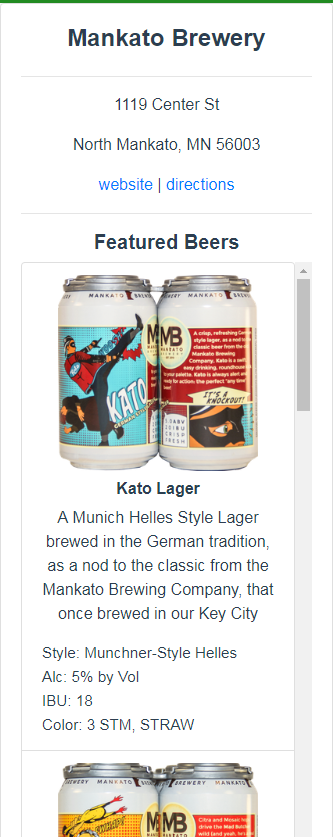
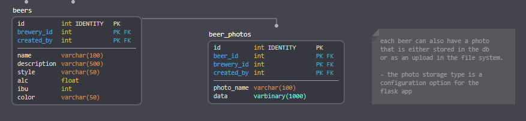
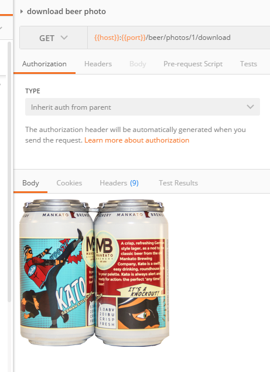
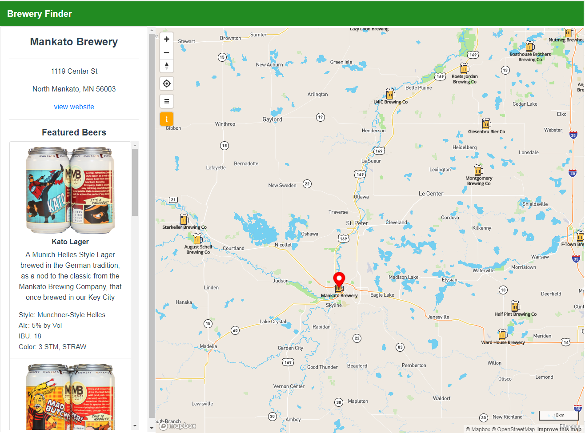

# Section 4: Add Featured Beers

**TL;DR** - *The instructions for this section are outlined below.  If you do not want to copy and paste the code snippets, you can switch to the [solution branch](https://github.com/Bolton-and-Menk-GIS/Full-Stack-Application-Development/tree/04-add-featured-beers) for this section by running: `git checkout 04-add-featured-beers`*

### displaying featured beers
The next thing to add is the *Featured Beers* for the brewery to show up like the image below:



One important piece of functionality for this application is to allow users to add breweries as well as what beers are brewed there.  We already saw that the `beers` table stores records for featured beers and also has a related table that can store `photos` for beers:



Earlier, when we created the `brewery_api.py` file for our Flask REST API, we exposed some endpoints to fetch beer info and beer photo info (`photo_name`, and foreign keys `beer_id` and `brewery_id`), but did not actually provide a way to fetch the raw photos.  

Another thing we have not covered yet is how the uploaded photos are stored.  We have two options for this:

1. store photos on the file system
2. store photos as blob data in the `beer_photos` table

Both of the above methods have their pros and cons, so to remain flexible there is a configuration option set in the flask apps `config.json` file (`/student/Python/app/config/config.json`) with a default value set to `filesytem` :

```json
{
  ...
  "photo_storage_type": "filesystem"
} 
```

If you would rather store the files in the database, change that value to `database` (you would need to re-run the `create_brewery_db.sh` script). Photos are added to our database via the `create_beer_photo` helper function in the `app.database_utils` module (`/Python/app/database_utils.py`) which will read the config file to check if the `filesystem` or `database` storage option is used, and will create the photo in the appropriate spot (in `uploads` folder or as a `blob` field respeictively).  One thing that is also done before a photo is uploaded is it is compressed and saved as a `.png` file with an aspect ratio size of `256 x 256` pixels to conserve space.

However, our REST API and more importantly the client app will not care how these photos are stored as long as they are made available.  Let's create an endpoint to allow users to download the photos.

Open the `brewery_api.py` file and add the following route at the end of our other routes:

```py
@brewery_api.route('/beer/photos/<id>/download')
def download_beer_photo(id):
    if not id:
        raise InvalidResource

    beer_photo = query_wrapper(BeerPhotos, id=int(id))[0]

    # handle appropriately based on config
    if PHOTO_STORAGE_TYPE == 'filesystem':
        to_send = os.path.join(upload_folder, beer_photo.photo_name)
    else:
        to_send = BytesIO(beer_photo.data)
    return send_file(to_send, attachment_filename=beer_photo.photo_name, as_attachment=True)
```

The above function works by checking the storage type and is loaded accordingly.  The flask [`send_file`](http://flask.pocoo.org/docs/1.0/api/#flask.send_file) function is used to send the raw photo data as an attachment via `HTTP` protocol.

#### next, add this after the `import` statements in `brewery_api.py`:

```py
# load app config file
config = load_config()
PHOTO_STORAGE_TYPE = config.get('photo_storage_type', 'database')
```

Save your changes and go to Postman and run the `download beer photo` test:



If you saw something similar to the above image, we can proceed back to the JavaScript code to add the *Featured Beer* previews in the app.

### make client side api methods

Before we can use the new endpoint we just created to render the *Featured Beers*, we need to interface with it from the JavaScript side.  We will ad some methods to the `app/modules/api.js` file:

1. add `getBeersFromBrewery()` to get all beers for a brewery:

```js
  getBeersFromBrewery(breweryId, options={}){
    if (!breweryId){
      return Promise.resolve([]);
    }
    return request(`/breweries/${breweryId}/beers`, options);
  },
 ```
 
 2. add `getBeerPhotos` to fetch photo infos from a beer (if there are any):
 
```js
  getBeerPhotos(beerId, options={}){
    return request(`/beers/${beerId}/photos`, options);
  },
```

3. add `getPhotoUrl` to get a url to the photo and import `axios`at the top of the file to get the `baseUrl` from the defaults

`import axios from 'axios';`

**then add the function:**
```js
getPhotoUrl(photo_id, cacheBust=true){
  // need to full url since this will likely be used in an  tag
  return `${axios.defaults.baseURL}/beer/photos/${photo_id}/download${cacheBust ? '?cb=' + new Date().getTime(): ''}`;
},
```

4. Save the changes to `api.js`.

*note: the `getPhotoUrl` function has a parameter called `cacheBust`, which will add a dummy query of `?cb=<time in milliseconds> at the time the photo url is requested in order to prevent the browser from caching the images. If this application were getting heavy usage, when a photo is updated/replaced, the url to it would not change since it is referenced by the photo `id` and the browser would not render the updated images because it would be cached.  Using a cache busting technique such as the one above will prevent that from happening.*

### create the `FeaturedBeers` component

Create a file called `FeaturedBeers.vue` and place it in the `app/components/home` folder. Then add the `template` below: 

*this will be rendered as a [Bootstrap Vue Media Component](https://bootstrap-vue.js.org/docs/components/media) and will be lazy loading the images*

```html
<template>
  <div>
    <b-media>
      <b-img-lazy rounded blank-color="#ccc" width="200" :src="imgSrc" v-show="imgSrcLoaded" :title="beer.name" />
      <h6 class="mt-2"><strong>{{ beer.name }}</strong></h6>
      <div class="featured-beer-body">
        <p style="text-align: center;">{{ beer.description }}</p>
        <span class="beer-info">
          <p>Style: {{ beer.style }}</p>
          <p>Alc: {{ beer.alc }}% by Vol</p>
          <p>IBU: {{ beer.ibu }}</p>
          <p>Color: {{ beer.color }}</p>
        </span>
      </div>
    </b-media>
  </div>
</template>
```

Next, add the code to control this component's behavior, a prop called `beer` will be passed into the component to model the UI to the data.  We will fire off the request to fetch the photos for the beer on the [`beforeMount`](https://vuejs.org/v2/api/#beforeMount) lifecycle hook:

```html
<script>
  import api from '../../modules/api';

  export default {
    name: "featured-beer",
    props:{
      beer: {
        type: Object,
        default(){
          return {};
        }
      }
    },
    data() {
      return {
        imgSrc: null,
        imgSrcLoaded: false
      }
    },
    async beforeMount(){
      // send off request before this is mounted
      const photos = await api.getBeerPhotos(this.beer.id);
      console.log('beer photos: ', photos);
      if (photos.length){
        console.log('setting photo url: ', api.getPhotoUrl(photos[0].id));
        this.imgSrc = api.getPhotoUrl(photos[0].id)
      }
    },
    methods: {},
    watch: {
      imgSrc(newVal){
        if (newVal){
          this.imgSrcLoaded = true;
        }
      }
    }
  }
</script>
```

And finally, add the `css`:

```html
<style>
  
  .featured-beer-body {
    text-align: left;
  }

  .beer-info > p {
    font-size: 95%;
    margin-top: 2px !important;
    margin-bottom: 2px !important;
  }

</style>
```

Next, this needs to be implemented as a nested component inside the `BreweryInfo.vue` file. Insert at the `<!-- featured beers will go here -->` placeholder.  The `BreweryInfo` `template` should now look like this:

```html
<template>
  <div class="brewery-info-container">
    <b-card v-if="Object.keys(feature || {}).length">
      <span class="brewery-info-header">
        <h4><strong>{{ properties.name }}</strong></h4>
        <span class="float-right edit-btn"
              title="edit brewery info"
              v-show="userIsAuthenticated" >
          <font-awesome-icon prefix="fas" icon="pen" />
        </span>
      </span>

      <hr>
      <p>{{ properties.address }}</p>
      <p>{{ properties.city }}, {{ properties.state }} {{ properties.zip }}</p>
      <b-link :href="properties.website" target="_blank" v-if="properties.website">view website</b-link>

      <!-- featured beers -->
      <div v-if="featuredBeers.length">
        <hr>
        <h5><strong>Featured Beers</strong></h5>
        <b-list-group class="featured-beers-container">
          <b-list-group-item v-for="beer in featuredBeers" :key="beer.id">
            <featured-beer :beer="beer"></featured-beer>
          </b-list-group-item>
        </b-list-group>
      </div>

    </b-card>

    <div v-else>
      <h4 class="no-features mt-4">No Features Found</h4>
    </div>

  </div>
</template>
```

The `v-if` directive is used to only display the *Featured Beers* section if the `featuredBeers` array has values; this data property needs to be set.  

1. import `api` and the `FeaturedBeer` component:

```js
import api from '../../modules/api'
import FeaturedBeer from './FeaturedBeer';
```

2. register the component by adding a components property to the `default` export:

```js
components: {
  FeaturedBeer
},
```

3. add `fetchBeers` method to the `methods` object:

```js
  async fetchBeers(id){
    if (!this.properties.id){
      return;
    }
    const beers = await api.getBeersFromBrewery(id || this.properties.id);
    this.featuredBeers.length = 0;
    this.featuredBeers.push(...beers);
  }
```

4. We will want to call this function whenever the component is mounted and also when the brewery changes. Change the `mounted` function to this:

```js
mounted(){
  console.log('MOUNTED BREWERY INFO COMPONENT: ', this);

  // load the beers
  this.fetchBeers()
},
```

5. add a [watcher](https://vuejs.org/v2/guide/computed.html#Watchers) to also fetch new beers when the brewery `id` changes (i.e. we have switched the selection):

```js
watch: {
  'properties.id'(newVal){
    // make sure to fetch beers each time a new brewery is identified
    this.featuredBeers.length = 0;
    this.fetchBeers(newVal);
  }
}
```

When all these steps are complete the full code for the `BreweryInfo.vue` file should be:

```html
<template>
  <div class="brewery-info-container">
    <b-card v-if="Object.keys(feature || {}).length">
      <span class="brewery-info-header">
        <h4><strong>{{ properties.name }}</strong></h4>
        <span class="float-right edit-btn"
              title="edit brewery info"
              v-show="userIsAuthenticated" >
          <font-awesome-icon prefix="fas" icon="pen" />
        </span>
      </span>

      <hr>
      <p>{{ properties.address }}</p>
      <p>{{ properties.city }}, {{ properties.state }} {{ properties.zip }}</p>
      <b-link :href="properties.website" target="_blank" v-if="properties.website">view website</b-link>

      <!-- featured beers -->
      <div v-if="featuredBeers.length">
        <hr>
        <h5><strong>Featured Beers</strong></h5>
        <b-list-group class="featured-beers-container">
          <b-list-group-item v-for="beer in featuredBeers" :key="beer.id">
            <featured-beer :beer="beer"></featured-beer>
          </b-list-group-item>
        </b-list-group>
      </div>

    </b-card>

    <div v-else>
      <h4 class="no-features mt-4">No Features Found</h4>
    </div>

  </div>
</template>

<script>
  import { EventBus } from "../../modules/EventBus";
  import api from '../../modules/api';
  import FeaturedBeer from './FeaturedBeer';

  export default {
    name: "brewery-info",
    props: {
      feature: {
        type: Object,
        default(){
          return {
            properties: {}
          }
        }
      },
      userIsAuthenticated: false
    },
    components: {
      FeaturedBeer
    },
    data() {
      return {
        featuredBeers: []
      }
    },

    mounted(){
      console.log('MOUNTED BREWERY INFO COMPONENT: ', this);

      // load the beers
      this.fetchBeers()
      
    },

    methods: {

      async fetchBeers(id){
        if (!this.properties.id){
          return;
        }
        const beers = await api.getBeersFromBrewery(id || this.properties.id);
        this.featuredBeers.length = 0;
        this.featuredBeers.push(...beers);
      }

    },

    computed: {
      properties(){
        return (this.feature || {}).properties || this.feature || {};
      }
    },
    
    watch: {
      'properties.id'(newVal){
        // make sure to fetch beers each time a new brewery is identified
        this.featuredBeers.length = 0;
        this.fetchBeers(newVal);
      }
    }
  }
</script>

<style scoped>

  .edit-btn {
    color: forestgreen;
    font-size: 1.25rem;
    cursor: pointer;
  }

  .brewery-info-header{
    display: flex;
    justify-content: space-around;
  }

  .no-features {
    color: gray;
  }

  .featured-beers-container {
    max-height: 650px;
    overflow-y: auto;
  }

</style>
```

### test the featured beers

Save the changes and click on the `Mankato Brewery`.  It is **very important** that you choose this brewery because it is the only one that will have beers until more are added!

If you see an image like the one below, all is well:



That is all for this section.  In the [next section](05_Add_Security.md), we will add security.


