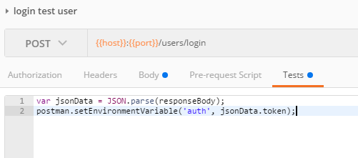
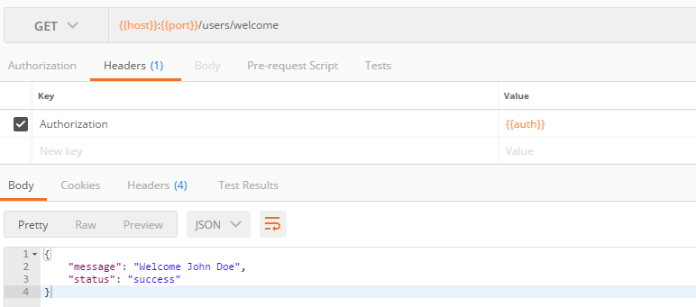

# Section 5: Add Security

**TL;DR** - *The instructions for this section are outlined below.  If you do not want to copy and paste the code snippets, you can switch to the [solution branch](https://github.com/Bolton-and-Menk-GIS/Full-Stack-Application-Development/tree/05-add-security) for this section by running: `git checkout 05-add-security`*

In this section we will implement the [`Flask-Login`](https://flask-login.readthedocs.io/en/latest/) extension and set up security for the REST API.  If you are unfamiliar with `flask_login`, this is the summary from the [docs]():

>Flask-Login provides user session management for Flask. It handles the common tasks of logging in, logging out, and remembering your users’ sessions over extended periods of time.

It will:

* Store the active user’s ID in the session, and let you log them in and out easily.
* Let you restrict views to logged-in (or logged-out) users.
* Handle the normally-tricky “remember me” functionality.
* Help protect your users’ sessions from being stolen by cookie thieves.
* Possibly integrate with Flask-Principal or other authorization extensions later on.

However, it does not:

* Impose a particular database or other storage method on you. You are entirely in charge of how the user is loaded.
* Restrict you to using usernames and passwords, OpenIDs, or any other method of authenticating.
* Handle permissions beyond “logged in or not.”
* Handle user registration or account recovery.


### handling user logins

The `flask_login` module handles authentication via the [`LoginManager`](https://flask-login.readthedocs.io/en/latest/#flask_login.LoginManager) class.  To use this in our app, we will need to register the `LoginManager` with our flask app.  We will also need to provide an `unauthorized_handler` callback to handle unauthorized user errors which we have already defined in the `security.py` module (just raises our `UnauthorizedUser` exception):

```py
unauthorized_callback = lambda: json_exception_handler(UnauthorizedUser)
```

Add the following code to the `app/__init__.py` module:

first add imports at the top:

```py
from flask_login import LoginManager
from .exceptions import *
```

then add this above where we registred the blueprints:

```py
# register flask-login manager
login_manager = LoginManager()
login_manager.init_app(app)
login_manager.unauthorized_handler(unauthorized_callback)
```

One requirement of the `LoginManager` is a `user_loader` callback that will load a user from a session via an `id` when using the 'Remember Me' functionality.  Somewhere below the blueprints section of `app/__init__.py` add the user loader:

```py
# callback to reload the user object for flask-login
@login_manager.user_loader
def load_user(userid):
    return userStore.get_user(id=userid)
```
Next, we will implement a request loader to handle loading a user from a request.  For the `Brewery Finder` app, the security model will work by having the user login to generate a token.  Secure resources can then be access by passing it as a request parameter or via an `Authorization` header.  Add the function below to handle this functionality as well to make sure the token isn't expired:

```py
@login_manager.request_loader
def load_user_from_request(request):
    """ allow users to be loaded via request params or authorization header """
    # check for token in request params or in Authorization header
    args = collect_args()
    token = args.get('token') or request.headers.get('Authorization')
    if token:
        try:
            user = userStore.get_user(token=token)
            if user.activated == 'False':
                # return None
                raise UserNotActivated
            if datetime.datetime.utcnow() > user.expires:
                # return None
                raise SessionExpired
            return user
        except UserNotFound:
            # return None
            raise UserNotFound

    # return None
    raise TokenRequired
```

Save the changes to this file.

The brewery database has a table called `users` that will be used to store users who have registered with the `Brewery Finder` app.  The database was created with one user added with the username `test_user`, but the application will also handle creating new users when someone registers.  This functionlity will go in the `security_api` blueprint.  Part of the process for creating a new user should be to not allow any duplicate usernames and therefore we will need a way to query the usernames. Add the following route under the `# API METHODS BELOW` placeholder in the `app/security.py` file:

```py
@security_api.route('/users')
@security_api.route('/users/<id>')
def get_users(id=None):
    args = collect_args()
    fields = [f for f in validate_fields(User, args.get('fields')) if f in user_fields]
    return endpoint_query(User, fields, id)
```

In the above function, we are limiting the fields that can be fetched by the request for obvious security reasons (do not want the ability to query passwords, etc).  Next, add a route for creating a new user:

```py
@security_api.route('/users/create', methods=['POST'])
def create_user():
    args = collect_args()
    args['activated'] = 'False'
    try:
        args['password'] = base64.b64decode(args.get('password'))
    except:
        # in case not passed in as base64
        args['password'] = args.get('password')
    activation_url = args.get('activation_url')
    if 'activation_url' in args:
        del args['activation_url']

    try:
        user = userStore.create_user(**args)
        try:
            send_authentication_email(user.email, activation_msg.format(activation_url.format(id=user.id)))
        except SendAuthenticationEmailFailed:
            # we want to delete the user if the authentication email fails as they won't be able to activate their account
            user.delete()
            session.commit()

            # now raise the error
            raise SendAuthenticationEmailFailed

        return success('successfully created user: {}'.format(args.get('username')), activation_url=activation_url.format(id=user.id))
    except:
        raise CreateUserError
```

The above function creates a route called `/users/create` that will only work via a `POST` request.  A user is created in the database using the `UserStore.create_user()` method and sets the initial value of the `activated` field to `False`.  In order for the user to be activated, an email will be sent with a link that will take them to an `ActivationPage` component that we will build later in the client side app.  To handle the activation on the back end (set `activation` field to `True`) add the endpoint below:

```py
@security_api.route('/users/<id>/activate', methods=['POST'])
def activate_user(id):
    user = userStore.get_user(id=int(id))
    if user:
        if user.activated == 'True':
            return success('User is already activated!')
        user.activated = 'True'
        session.commit()
        return success('Successfully activated user')
    return UserNotFound
```

Now we are ready to add the actual `/users/login` endpoint to authenticate a user to the application.  The `UserStore.check_user` function will be used to test the credential passed in.  Add the endpoint below:

```py
@security_api.route('/users/login', methods=['POST'])
def login():
    args = collect_args()
    username = args.get('username')
    try:
        password = base64.b64decode(args.get('password', ''))
    except:
        password = args.get('password', '')
    remember_me = args.get('remember', False) in ('true', True)
    validatedUser = userStore.check_user(username, password)
    if validatedUser:
        if validatedUser.activated == 'False':
            raise UserNotActivated
        login_user(validatedUser, remember=remember_me)

        # update last login and expires
        validatedUser.last_login = datetime.utcnow()
        validatedUser.expires = validatedUser.last_login + timedelta(hours=8)
        session.commit()
        return success('user logged in', token=validatedUser.token)
    raise InvalidCredentials
```

If a user can login, they should also be able to logout.  This will be handled by adding the `users/logout` endpoint below:

```py
@security_api.route('/users/logout', methods=['POST'])
@login_required
def logout():
    print('CURRENT USER: ', current_user)
    try:
        logout_user()
    except Exception as e:
        raise UnauthorizedUser
    return success('successfully logged out')
```

Finally, we will add a test to make sure the user has authenticated:

```py
@security_api.route('/users/welcome')
@login_required
def welcome():
    return success('Welcome {}'.format(current_user.name))
```

Save the changes.  The above function returns a `success` messae, but how does it test if the user is logged in?  This is working because we have the function wrapped in the `@login_required` docorated from `flask_login` which uses the `unauthorized_callback` if the user hasn't logged in.  The `login_required` decorator provides a very convenient way to integrate fine grained security to lock down individual REST endpoints and we will use it for any secured resources we create.

### test the security endpoints in Postman

Run the following tests:

1. `get users`
2. `login test user`
    * this will set and store 2 cookies in Postman because the `remember` parameter is set to `true`.  We will not be able to see this in our app because the cookies will be bound to the hostname of `localhost`, which does not allow cookies to be remembered as a designed browser limitation.
    * before running this request, create the `Test` script shown in the image below to set the `auth` environment variable we created earlier to automatically fetch the response token:
    
    ```js
    var jsonData = JSON.parse(responseBody);
    postman.setEnvironmentVariable('auth', jsonData.token);
    ```
    
    It should look like this:
 
        
3. `create user`
4. `activate user`
5. `welcome auth test`
    * for this we are passing in an authorization header with the token that was set when we ran the login test.

        

That is all for the tests and setting up our security API.  Please continue on to the [next section](06_Client_Side_Auth.md) to set up the authentication in the `Brewery Finder` app.
  
  


