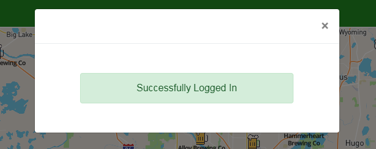

# Section 6: Client Side Authentication

**TL;DR** - *The instructions for this section are outlined below.  If you do not want to copy and paste the code snippets, you can switch to the [solution branch](https://github.com/Bolton-and-Menk-GIS/Full-Stack-Application-Development/tree/06-client-side-auth) for this section by running: `git checkout 06-client-side-auth`*


### update the client side api

To facilitate the login process, a button will be created in the navbar that will open a modal with a login screen.  But first, api methods are needed on the client side to handle the login and sign up requests.  Add the following functions to the `modules/api.js` file:

```js
async login(usr, pw, remember_me=false){
    
    const resp = await request('/users/login', {
      method: 'post',
      username: usr,
      password: btoa(pw),
      remember: remember_me
    });
    if ('token' in resp){
      api.token = resp.token;
      axios.defaults.headers.common.Authorization = resp.token;
      console.log('LOGIN RESPONSE: ', resp);
    }
    return resp;
  },

  async logout(){
    const response = await request('/users/logout', {method: 'post'}, false);
    console.log('FULL LOGOUT RESPONSE: ', response);
    return response.data;
  },

  async fetchUsernames(){
    const resp = await request('/users?fields=username');
    return resp.map(u => u.username);
  },

  async userIsActive(id){
    const resp = await request(`/users/${id}?fields=username,active,id`);
    return resp.active === 'True'; // stored as string in db
  },

  createUser({name, email, username, password, activation_url=default_activation_url } = {}){
    return request('/users/create', {
      method: 'post',
      data: {
        name: name,
        email: email,
        username: username,
        password: btoa(password),
        activation_url: activation_url
      }
    });

  },

  activate(id){
    return request(`/users/${id}/activate`, { method: 'post' });
  },

  authTest(){
    return request('/users/welcome');
  },
```

Save the changes.  Here is a breakdown of the functions we just added:

* `login()` - handle user login. Notice that upon a successful login, we are setting the `token` property for the `api` module as well as adding an `Authorization` header with the `token` as the value for all requests to automatically pass security for any secured endpoints.
* `logout()` - logs the user out
* `fetchUsernames()` - this is called to get a list of users so the client side can use form validation to make sure they are not trying to add a username that already exists when signing up.
* `userIsActive` - will be used to test if the user is active for the activation page we will create.
* `createUser()` - will create a new user
* `activate()` - will activate a new user (link sent from email)
* `authTest()` - test to make sure user is authenticated

### create the login page

Create a file called `LoginPage.vue` inside the `components/Home` folder.  Add the following `template`:

```html
<template>
  <div class="login-container">
    <b-card class="login-card" v-if="state === 'default'">
      <b-img src="./assets/avatar_2x.png" class="avatar"></b-img>

      <div class="mt-4">
        <b-form-input v-model="username" placeholder="username"></b-form-input>
        <b-form-input type="password" v-model="password" placeholder="password" class="mt-2 mb-4"></b-form-input>

        <b-form-checkbox v-model="rememberMe" style="color: white;">Remember Me</b-form-checkbox>

        <b-button block class="sign-in-btn theme mt-4 mb-4" @click="login">Sign In</b-button>
      </div>

      <hr style="background-color: white;">

      <!--  SIGN UP LINK -->
      <p class="acc">Don't have an Account? <a href="#" class="sign-up" @click="$emit('dismiss-login-modal')">Sign Up</a></p>

    </b-card>

    <div v-else>
      <spinner :visible="state === 'logging_in'" :text="'Logging In...'"/>

      <b-alert :show="1" @dismissed="handleUserLogin"
               v-if="state === 'login_successful'"
               variant="success">
        Successfully Logged In
      </b-alert>

      <b-alert :show="1" @dismissed="state = 'default'"
               v-if="state === 'login_failed'"
               variant="danger">
        Login Failed, please try again.
      </b-alert>

    </div>

  </div>
</template>
```

The breakdown of this template is as follows.  A form is created inside the container divs that will accept a username and password complete with a Login button, which will call a `login()` function we will create later when clicked.  Underneath that part, there is an option for a user to sign up if they do not have an existing account and will emit an event for the parent `Home.vue` component to dismiss the modal that contains the login screen and route the user to a sign up page we will create next.

The login/signup portion was wrapped in a [`card`](https://bootstrap-vue.js.org/docs/components/card) which we are just using because it is a flexible content container.  Notice that there is a `v-if` directive to only show this if the `state === 'default'`.  State management will be a common theme in most of the components we will be creating from here on out.  The `default` state in this case will just be to display the login form.  Because the user will be logging in, we should display a spinner animation using the `Spinner.vue` component included in the `UI` folder from the boilerplate code.  The spinner also has two important data props:

* `text` - text to display as the spinner is spinning
* `visible` - boolean to toggle visibility of spinner on/off

Our login functionality will create 3 other additional state options beside default for the `LoginPage` component:

* `logging_in` - started when login request is made to the server, this will trigger the spinner
* `login_successful` - user has successfully logged in
* `login_failed` - login failed

Bootstrap-Vue [`alerts`](https://bootstrap-vue.js.org/docs/components/alert) will be used to display messages that will automatically hide themselves after 1 second to report either a succesful login (which would also dismiss the modal) or report an error (which will set the state back to default to allow another login attempt).

Because we are using the `Spinner.vue` component, it will need to be registered.  However, because this is a component we will be using in many other components, it makes sense to [register it globally with vue](https://vuejs.org/v2/guide/components-registration.html#Global-Registration).  To do so, open up the `main.js` file and import the `Spinner.vue` component:

```js
import Spinner from './components/UI/Spinner';
```

and then under the part where we globally registred the `FontAwesomeIcon` component, add this line:

```js
Vue.component('spinner', Spinner);
```
Save the changes and go back to the `LoginPage.vue` file.  Now add the `<script>` tag below to control the behavior of this component:

```html
<script>
  import api from '../../modules/api';

  export default {
    name: "login-page",
    data(){
      return {
        username: null,
        password: null,
        rememberMe: false,
        state: 'default'
      }
    },

    methods: {
      login: async function(){
        this.state = 'logging_in';
        try {
          const result = await api.login(this.username, this.password, this.rememberMe);
          if (result.status === 'success'){
            this.state = 'login_successful';
          }
        }

        catch(err) {
          this.state = 'login_failed';
        }
      },

      handleUserLogin(){
        this.$emit('user-logged-in');
        // do a short timeout before switching state back to normal so user doesn't see
        // login screen again.
        setTimeout(()=>{
          this.state = 'default';
        }, 500);
      }
    }
  }
</script>
```

There are only two methods being used to handle the login and logout functionality, note that the `state` data property is being set accordingly.  Next, we will add the `css` via a `<style>` tag:

```html
<style scoped>

  .avatar {
    border-radius: 50%;
    height: 5rem;
  }

  .login-card {
    padding: 2rem;
    background-color: rgba(34,139,34, .75);
  }

  .sign-in-btn {
    background-color: orange;
    border-color: orange;
    font-weight: bold;
  }

  .sign-in-btn:hover {
    /*opacity: 0.5;*/
    background-color: darkorange;
  }

  .login-container {
    /*max-width: 350px;*/
    margin-top: 2rem !important;
    margin-bottom: 2rem !important;
    width: 75%;
    margin: auto;
  }

  .acc {
    color: white;
    font-size: 0.85rem;
  }

  .sign-up {
    color: orange;
    font-weight: bold;
    font-size: 0.9rem;
  }

  .sign-up:hover {
    color: darkorange;
  }

</style>
```

That is all that we need to do for the `LoginPage.vue` file.  Save the Changes. 

### create a login button in the navbar

Now that we have created the `LoginPage` component, we can add it to a Bootstrap-Vue [`modal`](https://bootstrap-vue.js.org/docs/components/modal).  Open the `AppNavBar.vue` file and import the `LoginPage` component, `EventBus`, and `api` modules:

```js
import { EventBus } from '../modules/EventBus';
import LoginPage from './Home/LoginPage';
import api from '../modules/api';
```

now register the component by adding a `components` property:

```js
components: {
  LoginPage
},
```

add some `data` properties:

```js
data() {
  return {
    state: null, // this component's state
    showLoginModal: false, // boolean to show login modal 
    userLoggedIn: false, // user is logged in or not
    showLogout: false, // show logout modal
  }
},
```

 Next, replace the `template` code to update the `<b-navbar-nav>` tag to include a `span` that will contain a `<font-awesome-icon>` component with the following template code:

```html
<template>
  <b-navbar toggleable="md" type="dark" class="theme-banner app-header" :sticky="true">
    <b-navbar-brand href="#"><strong>Brewery Finder</strong></b-navbar-brand>

    <b-navbar-nav class="ml-auto">

      <!-- ICON FOR HANDLING LOGIN -->
      <span @click="userLoggedIn ? logout(): showLoginModal = true"
            :title="`sign ${ userLoggedIn ? 'out': 'in' }`">
        <font-awesome-icon
                prefix="fas"
                icon="user-circle"
                :class="['login-btn', 'app-nav-btn', {'logged-in': userLoggedIn}]">
        </font-awesome-icon>
      </span>

    </b-navbar-nav>

    <!--  LOGIN MODAL -->
    <b-modal id="login-modal" :hide-footer="true" ref="loginModal" v-model="showLoginModal">
      <login-page @user-logged-in="handleLogin" @dismiss-login-modal="dismissLogin"></login-page>
    </b-modal>

    <!-- LOGOUT MODAL -->
    <b-modal id="logout-modal" v-model="showLogout" :hide-footer="true">
      <div class="logout-container">
        <spinner :text="'Logging Out'" :visible="state === 'logging_out'" />
        <b-alert :show="2" v-if="state === 'logged_out'" @dismissed="showLogout = false" variant="success">Successfully Logged Out</b-alert>
      </div>
    </b-modal>

    <!-- PLACEHOLDER FOR EXPORT DATA MODAL -->

  </b-navbar>
</template>
```

One of the nice things about the `Bootstrap-Vue` implmentation is in the form of [components](https://bootstrap-vue.js.org/docs/components) so it is a very convenient way to use Bootstrap 4 with less markup required.  The content of the [`b-navbar-nav`](https://bootstrap-vue.js.org/docs/components/navbar) is added between the opening and closing tag because `Bootstrap-Vue` often uses [slots](https://vuejs.org/v2/guide/components-slots.html) to allow the developer to inject content inside the component.  

The first thing we add is a `font-awesome-icon` with the [`user-circle`](https://fontawesome.com/icons/user-circle?style=solid) icon that will serve as the login button.  The `@click` event (actually modeled to the containing `span` element) will show the login page in a modal if the user is not already logged in (controlled by the `userLoggedIn` data property) otherwise will call the `logout()` function if the user is already logged in. By default, the `user-circle` icon will be white, but we want it to turn orange when the user is logged in so this is visually evident that they have authenticated.  We will use [class bindings](https://vuejs.org/v2/guide/class-and-style.html#Object-Syntax) to add the `logged-in` class if the `userLoggedIn` data prop is `true` to handle this (already added in boiler plate).  

Upon logging out, another modal will be displayed momentarily showing the `Spinner` component and an alert to report when the logout was successful.  Note that the visibility of both modals is controlled by the `showLoginModal` and `showLogoutModal` respectively.

Next, add the following methods: 

```js
methods: {
  async logout(){
    this.showLogout = true;
    this.state = 'logging_out';
    const resp = await api.logout();
    this.userLoggedIn = false;
    this.state = 'logged_out';

    // bubble up logout event
    EventBus.$emit('user-logged-out');
    return resp;
  },

  dismissLogin(){
    this.$refs.loginModal.hide();

    // for some reason the modal dismiss was causing a race condition and interfering with the router...
    setTimeout(()=>{
      this.$router.push('/sign-up');
    }, 100)
  },

  handleLogin(){
    this.userLoggedIn = true;
    this.state = 'logged_in';
    this.showModal = false;

    // bubble up login event
    EventBus.$emit('user-logged-in');
  },

},
```

Save the changes. The above methods are pretty self explanatory, but the important thing is that this will be emitting events for when the user logs in and logs out.  The one that isn't so obvious is the `dismissLogin` method.  This will be called when the user hits the `Sign Up` link, which will then dismiss the login modal and use the router to navigate to the sign up page (which we will create in the next step).  Before moving on to the sign up page, test to make sure the login modal displays when you click on the login button on the upper right of screen:


When clicking on that button, it should launch the modal containing the `LoginPage`:


Enter the credentials for the our test user:

username: `test_user`
password: `user123`

and hit the `Login` button.  You should see the `Spinner`:


A successful login looks like this (success alert and modal automatically dismissed after 1 second):



A failed login attempt will look similar, except it will have the `danger`  [`variant`](https://bootstrap-vue.js.org/docs/reference/color-variants/) and will not dismiss the modal after the alert is dissmised (also after 1 second): 


Once you have logged in successfully, the `user-circle` icon should turn orange:


That is all for the this section, please move on to the [next section](07_Signup_User) to set up the sign up page.
