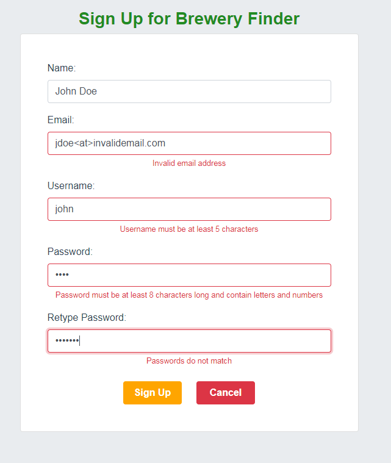
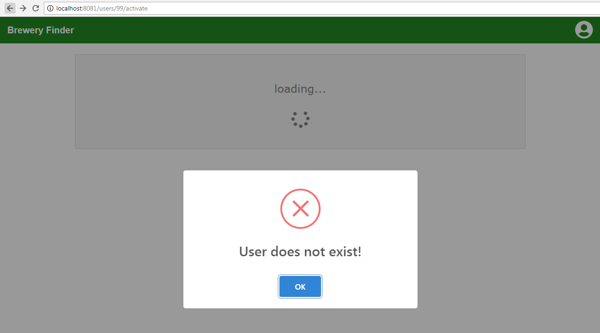
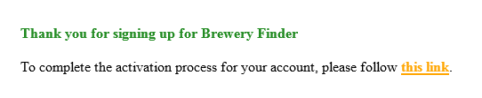
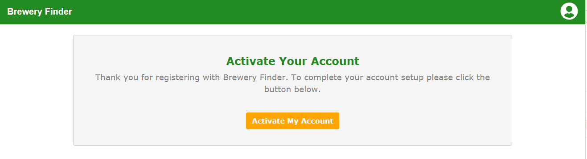
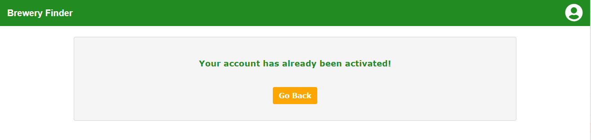

## Create the Sign Up Page

**TL;DR** - *The instructions for this section are outlined below.  If you do not want to copy and paste the code snippets, you can switch to the [solution branch](https://github.com/Bolton-and-Menk-GIS/Full-Stack-Application-Development/tree/07-signup-user) for this section by running: `git checkout 07-signup-user`*

To make a clean app structure, create a folder called `SignUp` inside the `components` folder. Inside this folder, create a component called `SignUp.vue`.  This will contain a form with validation containing the following fields that will be used to create a new user:

1. `Name` - no validation 
2. `Email` - will use a regular expression to make sure it is a valid email format
3. `Username` - must be a minimum of 5 characters and not already taken
4. `Password` - must be at least 8 characters long and contain letters and numbers
5. `Retype Password` - password validator to make sure it matches the first

The form validtion will look like this in the application:



To accomplish this, we will use the [`Vuelidate`](https://monterail.github.io/vuelidate/#getting-started) module.  We need to install this now using `npm`.  Open the terminal in VS Code (or node.js command prompt) and make sure the current directory is the `JavaScript/app` folder and type:

```node
npm install vuelidate --save
```

We also need to register this as a plugin.  To do so, import `Vuelidate` into the `main.js` file:

```js
import Vuelidate from 'vuelidate';
```

And under the line where we tell vue to use Bootstrap-Vue (`Vue.use(BootstrapVue)`), register `Vuelidate`:

```js
Vue.use(Vuelidate);
```

Save the changes to `main.js` and go back to the `SignUp.vue` component.

`Vuelidate` works by creating validators for inputs to make sure they pass some sort of schema test.  It comes with a lot of [builtin validators](https://monterail.github.io/vuelidate/#sub-builtin-validators) for convenience.  We will be using:

* `required` - field is required
* `minLength` - field has a minimum length of N
* `sameAs` - field value is the same as another (will use for the password verification)
* `email` - field matches email address schema

We will also create some custom validators:

* `strongPassword` - password is at least 8 characters and contains letters and numbers, defined by a regex using the [`helpers.regex()`](https://monterail.github.io/vuelidate/#sub-regex-based-validator) function from `Vuelidate`.
* `usernameNotTaken` - makes sure username has not already been taken

Another nice feature of `Bootstrap-Vue` is that it is [built to be support Form Validation](https://bootstrap-vue.js.org/docs/reference/validation) and even provides a `<b-form-invalid-feedback>` component for forms.  Now that we know which validators to use and what fields the form will support, we can add the `template`:

```html
<template>
  <div class="jumbotron signup-container mb-0">
    <h3 class="theme">Sign Up for Brewery Finder</h3>
    <b-card class="mx-auto p-4 signup-card">
      <b-form class="signup-form" v-if="state === 'default'" @submit="submit">
        <b-form-group label="Name:" label-text-align="left">
          <b-form-input type="text"
                        v-model.trim="name"
                        :state="!$v.name.$invalid"
                        aria-describedby="nameRequired"/>
          <b-form-invalid-feedback id="nameRequired">
            Name is Required
          </b-form-invalid-feedback>
        </b-form-group>

        <b-form-group label="Email:" label-text-align="left">
          <b-form-input type="email"
                        v-model.trim="email"
                        :state="!$v.email.$invalid"
                        aria-describedby="invalidEmail"/>
          <b-form-invalid-feedback id="invalidEmail">Invalid email address</b-form-invalid-feedback>
        </b-form-group>

        <b-form-group label="Username:" label-text-align="left">
          <b-form-input type="text" 
            v-model.trim="username" 
            :state="!$v.username.$invalid" 
            aria-describedby="tooShort"/>
          <b-form-invalid-feedback id="tooShort">{{ invalidUsernameFeedback }}</b-form-invalid-feedback>
        </b-form-group>

        <b-form-group label="Password:" label-text-align="left">
          <b-form-input type="password"
                        v-model.trim="password"
                        aria-describedby="strongFeedback"
                        :state="!$v.password.$invalid"/>
          <b-form-invalid-feedback id="strongFeedback">Password must be at least 8 characters long and contain letters and numbers</b-form-invalid-feedback>
        </b-form-group>

        <b-form-group label="Retype Password:" label-text-align="left">
          <b-form-input type="password"
                        v-model.trim="passwordVerify"
                        aria-describedby="retypeFeedback"
                        :state="!$v.passwordVerify.$invalid" />
          <b-form-invalid-feedback id="retypeFeedback">Passwords do not match</b-form-invalid-feedback>
        </b-form-group>

        <b-btn class="theme mt-2" :disabled="!formIsValid">Sign Up</b-btn>
        <b-btn variant="danger mt-2 ml-4 bold" @click="$router.push({name: 'home'})">Cancel</b-btn>
      </b-form>

      <!-- LOADING SPINNER -->
      <spinner :visible="state === 'loading'"  text="One moment please..."/>

      <div class="mt-2" v-if="state === 'registered'">
        <h5 class="theme">Successfully Registered</h5>
        <p class="mt-2">An activation email was sent to <b>{{ email }}</b>.  Please see email for further instructions.</p>
        <b-btn class="theme mt-4" @click="$router.push({name: 'home'})">Return To Map</b-btn>
      </div>

      <div class="error" v-if="state === 'error'">
        <b-alert :show="1" @dismissed="state = 'default'" variant="danger">Failed to create user, please try again.</b-alert>
      </div>

    </b-card>

  </div>
</template>
```

Each `<b-form-input>` component also has a validation `state` prop, which by using the `Vuelidate` [`validationMixin`](), each validation property can be accessed via the `$v.<data property>` and the boolean for if it is invalid is accessed via `$v.<data property>.$invalid` and can be used to display the validation messages when fields have not been validated.

Next add the JavaScript code to control the behavior:

```html
<script>
  import api from '../../modules/api';
  import { validationMixin } from "vuelidate"
  import { helpers, required, minLength, sameAs, email } from "vuelidate/lib/validators"

  // custom validators
  const strongPassword = helpers.regex('strongPassword', /^(((?=.*[a-z]))|((?=.*[a-z])(?=.*[0-9]))|((?=.*[A-Z])(?=.*[0-9])))(?=.{8,})/);

  const usernameNotTaken = (value, vm) => {
    return !vm.usernames.includes(value);
  }

  export default {
    name: "sign-up",
    mixins: [
      validationMixin
    ],
   
    async beforeMount(){
      this.usernames = await api.fetchUsernames();
    },
   
    data(){
      return {
        usernames: [],
        name: '',
        username: '',
        password: '',
        passwordVerify: '',
        email: '',
        state: 'default',
      }
    },

    validations: {
      name: {
        required
      },

      email: {
        required,
        email
      },

      username: {
        required,
        minLength: minLength(5),
        usernameNotTaken // custom validator!
      },

      password: {
        required,
        strongPassword // custom validator!
      },

      passwordVerify: {
        required,
        sameAsPassword: sameAs('password')
      }

    },

    methods: {

      async submit(){
        this.state = 'loading';
        try {
          const resp = await api.createUser({
            name: this.name,
            email: this.email,
            username: this.username,
            password: this.password,
            activation_url: this.activationUrl
          });
          console.log('CREATE USER RESPONSE: ', resp);
          if (resp.status === 'success'){
            this.state = 'registered';
          } else {
            this.state = 'error';
          }
        } catch(err) {
          console.log('error', err);
          this.state = 'error';
        }
      }
    },
    
    computed: {

      invalidUsernameFeedback(){
        return this.usernameTaken ? `"${this.username}" is already taken`: 'Username must be at least 5 characters';
      },

      activationUrl(){
        const urlParts = window.location.href.split('/');
        return `${urlParts.slice(0, urlParts.length-1).join('/')}/users/{id}/activate`;
      },

      formIsValid(){
        // disable button until everything is valid
        return [!this.$v.name.$invalid, !this.$v.username.$invalid, !this.$v.email.$invalid, !this.$v.password.$invalid, !this.$v.passwordVerify.$invalid].every(f => !!f);
      }

    }
  }
</script>
```

A summary of what we did is below:

* Within the component, the `validationMixin` was registered as a mixin and `data` properties are set to model to the form fields.

* in the `beforeMount` lifecycle hook, we are making a request to fetch usernames for the `usernameNotTaken` validator.

* When using the `validationMixin`, it is important to define the `validations` property, which tells the mixin how to interpret which fields have been validated.  Each field can have its own validators and we are setting the appropriate ones to each field.  Before the component code, the `strongPassword` and `usernameNotTaken` custom validators were also created.

* created a `submit()` method that will create the actual user.   

* created some computed props:
    * `invalidUsernameFeedback`  -to report the username is taken) and `activationUrl` 
    * `activationUrl` - tells the backend to know where to send the email to the user to activate their account
    * `formIsValid` - used to set the `disabled` property of the submit button based on the form validation

Next, add the css:

```html
<style scoped>

  .signup-container {
    min-height: calc(100vh - 60px);
  }

  @media screen and (max-width: 999px) {
    .signup-card {
      width: 75%;
    }
  }

  @media screen and (min-width: 1000px) {
    .signup-card {
      width: 50%;
    }
  }

</style>
```

### create the activation page

Now we can create the `ActivationPage.vue` component to handle the activation.  Put this file inside the `SignUp` folder as well and add the markup:

```html
<template>
  <div class="activation">
    <b-card class="w-75 mx-auto mt-4 activation-card">

      <div class="loading mt-4" v-if="state === 'checking'">
        <spinner text="loading..." :visible="true" />
      </div>

      <div class="default" v-if="state === 'default'">
        
        <div class="mt-2" v-if="userIsActivated">
          <p class="mt-2 theme">Your account has already been activated!</p>
          <b-button class="theme mt-4" @click="navigateToMap">Go Back</b-button>
        </div>

        <div class="not-activated" v-else>
          <h4 class="theme mt-2">Activate Your Account</h4>
          <p class="mt-2 activation">Thank you for registering with Brewery Finder.  To complete your account setup please click the button below.</p>
          <b-button class="theme mt-4" @click="activate">Activate My Account</b-button>
        </div>
        
      </div>


      <div class="mt-2" v-else>
        <spinner :visible="state === 'activating'" text="Activating your account..." />
        <b-alert :show="1" @dismissed="navigateToMap" v-if="state === 'activated'" variant="success">Successfully Activated Account</b-alert>
        <b-alert :show="1" @dismissed="state = 'default'" v-if="state === 'error'" variant="danger">Account Activation Failed, please try again.</b-alert>
      </div>

    </b-card>
  </div>
</template>
```

The first thing added is a `spinner` that will be displayed while checking to see if the user needs to be activated or not.  If the user is activated, a `div` will be displayed to inform the user their account is already activated and will include a back button to return to the `Home` componenent.  

If the user is not yet activated, there will be a button and message displayed to help them through the activation process. At the bottom, there is another spinner to handle the UI while the activation request is being sent.  Upon succesfull activation, the user is automatically returned back to the home.  

Next, add the JavaScript to control the behavior:

```html
<script>
  import api from '../../modules/api';
  import swal from 'sweetalert2';

  export default {
    name: "activation-page",

    data(){
      return {
        state: 'checking',
        userIsActivated: false
      }
    },

    // we want to check if the user is already activated
    beforeRouteEnter(to, from, next){
      console.log('BEFORE ACTIVATION PAGE ENTER: ', to, from, next);
      next(async (vm) => {
        // check status first
        vm.userIsActivated = await vm.checkStatus(to.params.id);
        console.log('STATUS: ', vm.userIsActivated);

        // now call next() to actually navigate to this route
        next();
      });

    },

    methods: {

      async checkStatus(id){
        this.status = 'checking';
        try {
          const resp = await api.userIsActive(id || this.id);
          this.state = 'default';
          return resp;
        } catch (err){
          // user does not exist?
          swal({
            title: 'User does not exist!',
            type: 'error',
          }).then((result)=>{
            this.navigateToMap();
          });
        }
        
      },
    
      async activate(){
        this.state = 'activating';
        try {
          const resp = await api.activate(this.id);
          console.log('ACTIVATION RESPONSE: ', resp);
          this.state = 'activated';
        } catch(err){
          this.state = 'error';
        }
      },

      navigateToMap(){
        this.$router.push({ name: 'home' });
      }

    },

    computed: {
      id(){
        return this.$route.params.id;
      }
    }
  }
</script>
```

One thing we are doing in the above that you may not have seen before is accessing the [Router Navigation Guard](https://router.vuejs.org/guide/advanced/navigation-guards.html) called `beforeRouteEnter`, which is a hook into the event that is fired before the `ActivationPage` is routed to.  Inisde this check, we want to check if the user has already activated their account as that will need to present some different content than the default activation content.

We also want to handle the situation where someone wants to activate a user that does not exist from the `beforeRouteEnter` guard.  For this case, we will use [Sweet Alert 2](https://sweetalert2.github.io/) to display an error message and then navigate the user back to the `Home` page:



**Important! Don't forget to install this module using `npm` in the terminal!**

```node
npm install sweetalert2 --save
```

Three methods are also added:

* `checkStatus` - checks to see if the user has been activated or not
* `activate` - sends the activation request to the server
* `navigateToMap` - takes the user back to the `Home` page.

We also create one computed property called `id` to fetch the user `id` passed in via a [route parameter in the url](https://router.vuejs.org/guide/essentials/passing-props.html#boolean-mode).

Finally add the css:

```html
<style scoped>

  .activation-card {
    background-color: whitesmoke;
    padding: 1rem;
  }

  .activation {
    font-family: Verdana, Geneva, sans-serif;
    color: gray;
    font-size: 1.15rem;
  }

</style>
```

Save the changes and we can test this out by clicking on the login button.  Instead of logging in, hit the `Sign Up` link this time. 


Oh snap!  Why didn't that work?  The `dismissLogin()` method of the `AppNavBar.vue` comoponent uses the router to navigate to the sign up page when the login modal is dismissed when the user clicks the `Sign Up` link:

```js
dismissLogin(){
  this.$refs.loginModal.hide();

  // for some reason the modal dismiss was causing a race condition and interfering with the router...
  setTimeout(()=>{
    this.$router.push({name: 'signup'});
  }, 100)
},
```

The reason why this did not work, is that the `SignUp.vue` component has not yet been registered with the router.  To do this, open the `router.js` file in the `modules` folder.  First we need to import the `SignUp` and `ActivationPage` components:

```js
import SignUp from '../compoenents/SignUp/SignUp';
import ActivationPage from '../components/SignUp/ActivationPage';
```

Then update the `routes` array to this:

```js
const routes = [
  { path: '/', name: 'home', component: Home },
  { path: '/sign-up', name: 'signup', component: SignUp },
  { path: '/users/:id/activate', name: 'activate', component: ActivationPage },
  
  // catch all route
  { path: '*', component: PageNotFound }
];
```

Now save the changes and try going to the Sign Up page again, it should work this time.  Try creating a user for yourself.  Once you create a new account, you should receive an email that looks something like this:



The link should take you here:



And visiting this page after already activating should present:



Clicking the button should successfully activate your account and take you back to the `Home` page.  That is all for this section, please continue to the [next section](08_Export_Data.md) to add the data export functionality.


