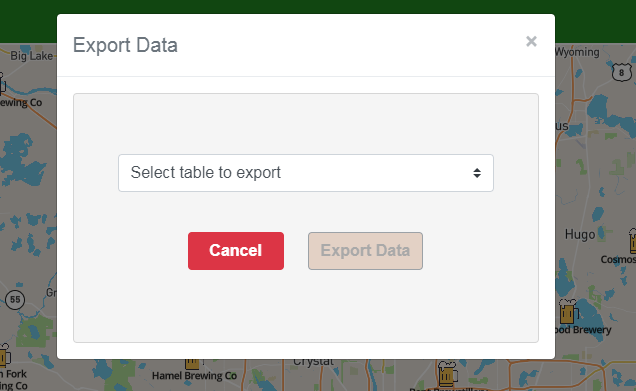

## Allow Data Exports

**TL;DR** - *The instructions for this section are outlined below.  If you do not want to copy and paste the code snippets, you can switch to the [solution branch](https://github.com/Bolton-and-Menk-GIS/Full-Stack-Application-Development/tree/08-export-data) for this section by running: `git checkout 08-export-data`*

When a user logs into the application, it will unlock some extra functionality to allow the user to export data as well as submit edits to the brewery database.  In this section, we will create some server side processes to export the data tables.  The following tables will be exportable as `.csv` files:

* `breweries` (with an option for shapefile export)
* `beers`
* `styles`
* `categories`

To implement this export functionality, let's create some functions to handle this on the backend. Open up the `utils.py` file and add the following functions:

```py
def export_data(table, fields=None, format='csv', **kwargs):
    """ exports table to csv or shapefile (latter only supported with breweries table)

    :param table: table to export
    :param fields: fields to include in export
    :param format: export type, defaults to csv (csv|shapefile)
    :param kwargs: filter parameters
    :return: download file, will be either a .csv file or .zip
    """
    # cleanup download directory by deleting files older than 30 minutes
    remove_files(download_folder, minutes=30)

    # get fields
    fields = validate_fields(table, fields)

    # allow shapefile export if table selected is breweries
    if format.lower() == 'shapefile' and table.__tablename__ == 'breweries':
        return export_to_shapefile(table, fields, **kwargs)

    else:
        # export data as csv
        results = to_json(query_wrapper(table, fields=fields, **kwargs), fields)

        # write csv file
        csvFilePath = os.path.join(download_folder, '{}.csv'.format(get_timestamp(table.__tablename__)))

        with open(csvFilePath, 'wb') as csvFile:
            writer = csv.DictWriter(csvFile, fields)
            writer.writeheader()
            for result in results:
                writer.writerow(result)

        return csvFilePath
        
def export_to_shapefile(table, fields=None, **kwargs):
    """ exports records to a shapefile, only supported with breweries table

    :param table: table object for breweries
    :param fields: field list to export in shapefile
    :param kwargs: query parameters to filter results
    :return: a zip file containing shapefile contents
    """
    results = toGeoJson(to_json(query_wrapper(table, **kwargs), fields=fields))
    features = results.get('features')
    if not len(features):
        return None

    # field mapping schema
    field_map = {
        'id':  { 'type': 'N' },
        'name': { 'type': 'C', 'size': '100' },
        'address': { 'type': 'C', 'size': '100' },
        'city': { 'type': 'C', 'size': '50' },
        'state': { 'type': 'C', 'size': '2' },
        'zip': { 'type': 'C', 'size': '11' },
        'monday': { 'type': 'C', 'size': '30' },
        'tuesday': {'type': 'C', 'size': '30'},
        'wendesday': {'type': 'C', 'size': '30'},
        'thursday': {'type': 'C', 'size': '30'},
        'friday': {'type': 'C', 'size': '30'},
        'saturday': {'type': 'C', 'size': '30'},
        'sunday': {'type': 'C', 'size': '30'},
        'comments': {'type': 'C', 'size': '255'},
        'brew_type': { 'type': 'C', 'size': '50' },
        'website': {'type': 'C', 'size': '255' },
        'x': { 'type': 'F' },
        'y': {'type': 'F'},
    }

    # create output folder for zipping up shapefile
    basename = get_timestamp(table.__tablename__)
    folder = os.path.join(download_folder, basename)
    output = os.path.join(folder, basename)
    if not os.path.exists(folder):
        os.makedirs(folder)

    # build schema based on first record
    first = features[0].get('properties', {})
    field_list = filter(lambda f: f in field_map and f in first, list_fields(table))

    # open shapefile writer
    with shapefile.Writer(output, 1) as w:

        # add fields
        for field in field_list:
            # get field definition
            fd = field_map.get(field, {})

            # specify name, type, field size, decimal size
            w.field(field, fd.get('type'), fd.get('size', '50'), 6 if fd.get('type') == 'F' else 0)

        # add features
        for feature in features:
            # write geometry first (accepts geojson)
            w.shape(feature.get('geometry'))

            # write attributes, filter by queried fields only
            w.record(**{f: feature.get('properties', {}).get(f) for f in field_list })

    # write .prj file with WGS 1984 coordinate info
    prj = os.path.join(folder, basename + '.prj')
    with open(prj, 'w') as f:
        f.write(WGS_1984)

    # zip all files for shapefile
    shutil.make_archive(folder, 'zip', folder)
    try:
        shutil.rmtree(folder)
    except:
        pass
    return folder + '.zip'


def remove_files(path, exclude=[], older_than=True, test=False, subdirs=False, pattern='*', **kwargs):
    """ removes old folders within a datetime.timedelta from now

    :param path: root directory to delete files from
    :param exclude: list of folders to skip over (supports wildcards). These directories will not be removed.
    :param older_than: option to remove all files older than a certain amount of days. Default is True.  If False, will
            remove all before the specified timedelta
    :param test: If True, performs a dry run to print out the mock results and does not actually delete files.
    :param subdirs: option to iterate through all sub-directories. Default is False.
    :param pattern: wildcard to match name scheme for files to delete, default is "*"
    :param kwargs: keyword arguments for time delta (days|months|years|weeks|hours|minutes|seconds)
    :return:
    """
    # if not kwargs, default to delete things older than one day
    deltas = ['days', 'months', 'years', 'weeks', 'hours', 'minutes', 'seconds']
    time_args = {}
    for k,v in kwargs.iteritems():
        if k in deltas:
            time_args[k] = v
    if not time_args:
        time_args['days'] = 1

    # get removal date and operator
    remove_after = datetime.datetime.now() - datetime.timedelta(**time_args)
    op = operator.lt
    if not older_than:
        op = operator.gt

    # optional test
    if test:
        def remove(*args): pass
    else:
        def remove(*args):
            os.remove(args[0])

    # walk thru directory
    for root, dirs, files in os.walk(path):
        if not root.endswith('.gdb'):
            for f in files:
                if not f.lower().endswith('.lock') and fnmatch.fnmatch(f, pattern):
                    if not any(map(lambda ex: fnmatch.fnmatch(f, ex), exclude)):
                        last_mod = datetime.datetime.fromtimestamp(os.path.getmtime(os.path.join(root, f)))

                        # check date
                        if op(last_mod, remove_after):
                            try:
                                remove(os.path.join(root, f))
                                print('deleted: "{0}"'.format(os.path.join(root, f)))
                            except:
                                print('\nCould not delete: "{0}"!\n'.format(os.path.join(root, f)))
                        else:
                            print('skipped: "{0}"'.format(os.path.join(root, f)))
                    else:
                        print('excluded: "{0}"'.format(os.path.join(root, f)))
                else:
                    print('skipped file: "{0}"'.format(os.path.join(root, f)))
        else:
            print('excluded files in: "{0}"'.format(root))

        # break or continue if checking sub-directories
        if not subdirs:
            break

    return
```

The breakdown of the above functions are as follows:

* `export_data` - This is the main function to handle the export which uses the `query_wrapper()` to fetch results from the database and will export to csv as the default format by using the [`csv`](https://docs.python.org/3/library/csv.html) module's [`DictWriter`](https://docs.python.org/3/library/csv.html#csv.DictWriter) to write the json to rows. It also accepts a `shapefile` format for the `breweries` table.

* `export_to_shapefile` - called by the `export_data` function if the format argument is set to `shapefile` and the table is `breweries`.  This uses the [`shapefile`](https://github.com/GeospatialPython/pyshp) module to write the shapefile and then puts all the files into a `.zip` file for downloading convenience.

* `remove_files` - this function will be used to make sure the `downloads` folder where the temporary files are created are deleted after a certain amount of time to keep things clean.  It accepts a folder and a [`timedelta`](https://docs.python.org/2/library/datetime.html#datetime.timedelta) object where files older than (now - timedelta) will be removed.  The default is to remove files older than 30 minutes.

Save the changes to the `utils.py` file.  Next, add an endpoint in the `brewery_api.py` file to handle export request:

```py
@brewery_api.route('/data/<tablename>/export', methods=['POST'])
@login_required
def export_table_data(tablename):
    table = table_dict.get(tablename)
    print(tablename, table)
    if table:
        args = collect_args()
        fields = args.get('fields')
        f = args.get('f')
        if f:
            del args['f']
        else:
            f = 'csv'
        if fields:
            del args['fields']

        outfile = export_data(table, fields, f, **args)
        return success('successfully exported data',
                       filename=os.path.basename(outfile),
                       url=url_for('static', filename=os.path.basename(outfile), _external=True))
    raise InvalidResource
```

The above function is just a thin wrapper around the `utils.export_data` function.  The function will return a `json` object that has a url to the static file we created.  Every `Flask` instance has a `static` endpoint builtin to [serve files](http://flask.pocoo.org/docs/1.0/tutorial/static/) and we defined the `static_folder` when we initialized the Flask app:

```py
app = Flask(app_name, static_folder=download_folder)
```

The `download_folder` is referenced in the `utils.py` file and will automatically be created as needed.  By saving things in that defined static folder, the [`flask.url_for`](http://flask.pocoo.org/docs/1.0/api/#flask.url_for) function can be used to form a url to download the file.

The other thing you may have noticed about the endpoint route we just created (`/data/<tablename>/export`) is that there is a dynamic parameter for the table.  In order to provide a simple string lookup to fetch the appropriate Table Model, create the following constant somewhere before the API methods/endpoints:

```py
# json object to lookup Table objects by name
table_dict = {
    'breweries': Brewery,
    'beers': Beer,
    'styles': Style,
    'categories': Category
}
```

Now save the changes and we can test in Postman.  Run the `export data` test in the `data` folder to test creating a csv file.  Next, run the `export data as shapefile` test to try out a shapefile export.  

### add export capabilities to the application

To facilitate the exporting functionality in the application, we will create a button that shows up in the `navbar` **if** the user has logged in. But before we do that, let's add a function to the `api.js` file to handle the request:

```js
async exportData({table='breweries', format='csv'}={}){
  try {
    return await request(`/data/${table}/export?f=${format}`, {
        method: 'post'
      });
    } catch(err){
      console.warn('export data failed: ', err);
  }
},
```

The above function will take an `object` with a `table` and `format` property which will default to exporting `breweries` in `csv` format.  Save the changes.

The user interface for the Export Data functionality will be simple.  It will consist of a dropdown and an export button, with a radio button showing up to allow `csv` vs `shapefile` exports if the table is set to `breweries`.  Of course, you could add options to filter the results for the export operation because the endpoint will support filters via the `query_wrapper`, but we will not do that here.  Create a new file called `ExportData.vue` inside the `JavaScript/app/components` folder and add the following `template`:

```html
<template>
  <b-modal id="export-modal"
           title="Export Data"
           header-text-variant="secondary"
           body-text-variant="secondary"
           :hide-footer="true"
           ref="exportModal"
           @ok="exportData">
    <b-card class="export-body">

      <div class="default" v-if="state === 'default'">
        <b-form-select v-model="selectedTable" :options="exportTables" class="mt-3 mb-3" />
        <b-form-group label="Export Format" v-if="selectedTable === 'breweries'" label-class="bold mt-2">
          <b-form-radio-group v-model="selectedExportType" :options="exportOptions" />
        </b-form-group>

        <div class="mx-auto mt-4">
          <b-button variant="danger" class="mr-4" style="font-weight: bold;" @click="dismiss">Cancel</b-button>
          <b-button class="theme" @click="exportData" :disabled="!selectedTable">Export Data</b-button>
        </div>
      </div>

      <spinner :visible="state === 'exporting'" text="Exporting Data..."/>

      <div class="download" v-if="state === 'completed'">
        <h4 class="theme">Successfully Exported <span class="capitalize">{{ selectedTable }}</span></h4>
        <font-awesome-icon
                title="download data"
                prefix="fas"
                icon="download"
                @click="download"
                class="download-btn mt-4">
        </font-awesome-icon>
      </div>

    </b-card>

  </b-modal>
</template>
```

The component will render as a Bootstrap-Vue modal ([`b-modal`](https://bootstrap-vue.js.org/docs/components/modal)).  Upon clicking the `OK` button, it will kick off the export process (which we will define momentarily).  Similar to the `LoginPage.vue` file, we will be handling some different states while using the `spinner` and [`alerts`](https://bootstrap-vue.js.org/docs/components/alert) accordingly:

* `default` - the component is ready to export
* `exporting` - currently running the export operation
* `completed` - successfully completed the export
* `failed` - export operation failed

One new component we will be using is the [`b-form-select`](https://bootstrap-vue.js.org/docs/components/form-select) which is a Bootstrap-Vue wrapper for a `<select>` input.  This has an `options` prop that is an array of objects with `text` and `value` properties for display and actual selected value respectively.  The nice thing about using `select` inputs in Vue.js is that the `v-model` directive can be used to bind to one or more (if multiple) selected values from the dropdown to a property.  

A [`b-form-radio-group`](https://bootstrap-vue.js.org/docs/components/form-radio) will be shown when the selected table is `breweries` to allow an additional export format.  And finally, upon a successful export, a download button will appear with a link to the file.  Next add the JavaScript code:

```html
<script>
  import api from '../modules/api';

  export default {
    name: "export-data",
    data() {
      return {
        state: 'default',
        downloadUrl: null,
        downloadFilename: null,
        selectedTable: null,
        selectedExportType: 'csv',
        exportTables: [
          { value: null, text: 'Select table to export' },
          { value: 'breweries', text: 'Breweries' },
          { value: 'beers', text: 'Beers' },
          { value: 'styles', text: 'Beer Styles' },
          { value: 'categories', text: 'Beer Categories' }
        ],
        exportOptions: [
          { value: 'csv', text: 'CSV' },
          { value: 'shapefile', text: 'Shapefile' }
        ]
      }
    },
    methods: {
      async exportData(){
        this.state = 'exporting';
        try {
          const result = await api.exportData({
            table: this.selectedTable,
            format: this.selectedExportType
          });
          this.url = result.url;
          this.filename = result.filename;
          this.state = 'completed';
        } catch(err){
          this.state = 'error';
        }

      },

      download(){
        const link = document.createElement('a');
        link.setAttribute('href', this.url);
        link.setAttribute('target', '_blank');
        link.setAttribute('download', this.filename);
        link.style.visibility = 'hidden';
        document.body.appendChild(link);
        link.click();
        document.body.removeChild(link);
        this.state = 'default';
      },

      dismiss(){
        this.$refs.exportModal.hide();
      }
    }
  }
</script>
```

Some `props` are set to populate the radio and select options, as well as storing the download url.  There are also 3 methods defined:

* `exportData` - called when the `OK` button is clicked and handles the export operation.  When complete, the `url` and `filename` data properties are set. This method also acts as the `state` manager.
* `download` - automatically downloads the file when the download button is clicked.
* `dismiss` - dismisses this modal

And finally add the css:

```html
<style scoped>

  .download-btn {
    color: forestgreen;
    font-size: 2.5rem;
    cursor: pointer;
  }
  .export-body {
    min-height: 250px;
    padding: 1.5rem;
    background-color: whitesmoke;
  }

</style>
```

Save the changes.

### handling the export from the `navbar`

Next, open the `AppNavBar.vue` file and update the template code to add the export data button:

```html
<template>
  <b-navbar toggleable="md" type="dark" class="theme-banner app-header" :sticky="true">
    <b-navbar-brand href="#"><strong>Brewery Finder</strong></b-navbar-brand>

    <b-navbar-nav class="ml-auto">

      <!-- ICON FOR DATA DOWNLOAD -->
      <span v-if="userLoggedIn" v-b-modal.export-modal>
        <i class="fas fa-external-link-alt mr-2 download-btn app-nav-btn"
           title="export brewery data">
        </i>
      </span>

      <!-- ICON FOR HANDLING LOGIN -->
      <span @click="userLoggedIn ? logout(): showLoginModal = true"
            :title="`sign ${ userLoggedIn ? 'out': 'in' }`">
        <font-awesome-icon
                prefix="fas"
                icon="user-circle"
                :class="['login-btn', 'app-nav-btn', {'logged-in': userLoggedIn}]">
        </font-awesome-icon>
      </span>

    </b-navbar-nav>

    <!--  LOGIN MODAL -->
    <b-modal id="login-modal" :hide-footer="true" ref="loginModal" v-model="showLoginModal">
      <login-page @user-logged-in="handleLogin" @dismiss-login-modal="dismissLogin"></login-page>
    </b-modal>

    <!-- LOGOUT MODAL -->
    <b-modal id="logout-modal" v-model="showLogout" :hide-footer="true">
      <div class="logout-container">
        <spinner :text="'Logging Out'" :visible="state === 'logging_out'" />
        <b-alert :show="1" v-if="state === 'logged_out'" @dismissed="showLogout = false" variant="success">Successfully Logged Out</b-alert>
      </div>
    </b-modal>

    <!-- PLACEHOLDER FOR EXPORT DATA MODAL -->
    <export-data />
    
  </b-navbar>
</template>
```

In the above `template` note that the export button will only be visible when the `userLoggedIn` data property is true, which we are already setting when the user logs in. We are also using a special directive from the `b-modal` called `v-b-modal.<modal-id>` which will automatically launch a modal matching the `<modal-id>` appended to the end when the `<span>` is clicked.

Now update the JavaScript:

1. import the `ExportData.vue` component:

```js
import ExportData from './ExportData';
```

2. Register the component:

```js
components: {
  LoginPage,
  ExportData
},
```


Now save the changes and test it.  Once you login, the export button should appear:


When clicked, the modal should appear and the `Export Data` button isn't active until there's a selection:



The button becomes enabled when the user picks a table:


The export format radio is available when `breweries` is selected:


And finally, after the export is complete a download is presented:


That is all for this section, proceed to the [next section](09_Edit_Breweries.md) to allow editing of the data.


