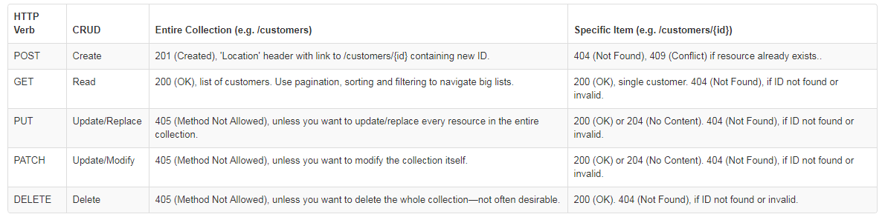
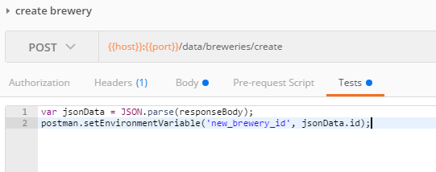
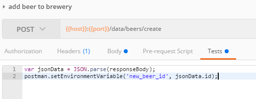
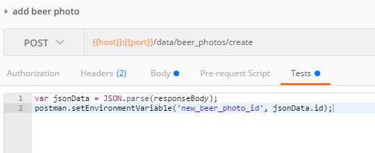

## Allow Users to Edit Breweries

**TL;DR** - *The instructions for this section are outlined below.  If you do not want to copy and paste the code snippets, you can switch to the [solution branch](https://github.com/Bolton-and-Menk-GIS/Full-Stack-Application-Development/tree/09-edit-breweries) for this section by running: `git checkout 09-edit-breweries`*

Adding [CRUD capabilities](https://stackify.com/what-are-crud-operations/) (create, add, update, and delete) in a REST API is not always the most straightforward thing to do, but thankfully [`Flask_SqlAlchemy`](http://flask-sqlalchemy.pocoo.org/2.3/queries/) will make it easy for us.  

Adding a new record to a database is as simple as creating a new instance from one of our table models and using the `session` to add the new feature.  To update, simply query the database to get the desrired row back as an object, and just update the properties like a normal Python object.  And to delete, start out by fetching the row object like an update and just telling the `session` to delete that object.  SqlAlchemy does all the heavy lifting for us and abstracts virtually everything out to take the burdon off the developer.  Let's add the following helper functions in the `utils.py` to handle the editing:

```py
# EDITING API BELOW

def get_object(table, **kwargs):
    """ fetches a single object (row) from a table

    :param table: table to query
    :param kwargs: filter params
    :return: an instance of a single object from table
    """
    try:
        return session.query(table).filter_by(**kwargs).first()
    except:
        return None

def create_object(table, **kwargs):
    """ creates a new record in the table

    :param table: table for which to add record
    :param kwargs: data for table record as json
    :return: newly created table object
    """
    return table(**kwargs)

def update_object(obj, **kwargs):
    """ creates a new record in the table

    :param obj: record from table
    :param kwargs: data to update record with as json
    :return: updated table object
    """
    for k,v in six.iteritems(kwargs):
        setattr(obj, k, v)
    return obj

def delete_object(obj):
    """ deletes a single object from table

    :param obj: record from table
    :return: id of deleted object
    """
    oid = obj.id
    obj.delete() if hasattr(obj, 'delete') else session.delete(obj)
    return oid
```

The above functions are pretty simple:

* `get_object` - fetches a single object from the database
* `create_object` - creates a new object from an input Table object
* `update_object` - updates an object properties
* `delete_object` - removes a record from the table

Save the changes.  Next, move over to the `brewery_api.py` file and add the endpoints we need.  Let's start with creating a new record.  The `create_object` function defined above will work for any table.  However, for creates, it is not always as simple as outlined above.  

The situation where this seems a little hairy is when adding related records.  For example, a brewery may have featured beers where the `breweries` table is the parent and the `beers` is the child that has a one-to-many relationship (one brewery serves many beers).  In order to relate back to the parent brewery, the `beers` table has a foreign key called `brewery_id` which corresonds to the `id` field in the `breweries` table.

#### But alas, SqlAlchemy to the resuce again!!!

SqlAlchemy makes adding these child records easy as can be.  in the `Brewery` class that extends the `DeclarativeBase` (`models.py`), it has a property called `beers`, which will return an array of related `beers`.  And because SqlAlchemy makes the database handlers Pythonic as possible, to add a new child record, we just have to `append` one to the list and the relationship mapping will happen behind the scenes automatically. 

It is literally as easy as doing the following:

```py
# get the brewery first
brewery = get_object(Brewery, id=57)

# now create a new beer
beer = Beer(name='New Beer')

# add new beer to database by adding it as a child of 'brewery'
# remember, the 'beers' property in this case is the existing related children
brewery.beers.append(beer)

# commit to save the changes
session.commit()
```

#### Boom Done! No messing around with filling in foreign keys!


Now that we know how that works, let's add our `CRUD` endpoints.  First off, we will secure them all by decorating them in the `@login_required` decorator.  One other best practice we will follow for these operations is to use the appropriate [`HTTP` verbs](https://www.restapitutorial.com/lessons/httpmethods.html):



According to the table above, for creating items we should use `POST`, for updating use `PUT` (it is also acceptable to allow `POST` here) and to delete use the `DELETE`.  So having this all this knowlege, we can add the `create` endpoint:

```py
# EDIT API BELOW

@brewery_api.route('/data/<tablename>/create', methods=['POST'])
@login_required
def create_item(tablename):

    table = table_dict.get(tablename)
    if table:
        args = collect_args()
        if current_user:
            args['created_by'] = current_user.id

        # check if related feature (Beer, etc)
        obj = None
        if tablename == 'beers' and 'brewery_id' in args:
            # must get brewery first
            brewery = get_object(table_dict['breweries'], id=args['brewery_id'])
            if not brewery:
                return dynamic_error(description='Missing Brewery Information',
                                     message='A "brewery_id" is required in order to create a new beer')

            # now that we have a valid brewery, create the new beer and append to the brewery "beers" attribute
            del args['brewery_id']
            obj = create_object(table, **args)
            brewery.beers.append(obj)

        elif tablename == 'beer_photos' and 'beer_id' in args and 'photo' in args:
            # fetch beer parent first
            try:
                beer = query_wrapper(Beer, id=args.get('beer_id'))[0]
            except:
                return dynamic_error(description='Missing Beer ID', message='A Beer ID is required for submitting a photo')
            photo_blob = args.get('photo')
            try:
                obj = table(**create_beer_photo(data=photo_blob.stream.read(), photo_name=photo_blob.filename))
            except Exception as e:
                return dynamic_error(message=str(e))
            beer.photos.append(obj)

        elif tablename == 'styles' and 'cat_id' in args:
            # fetch parent category first
            category = get_object(Category, id=args.get('cat_id'))
            return dynamic_error(description='Missing Category Information',
                                     message='A "cat_id" (category ID) is required in order to create a new beer style')
            del args['cat_id']
            obj = create_object(Style, **args)
            category.styles.append(obj)

        else:
            obj = create_object(table, **args)
            session.add(obj)

        if obj:
            # commit database transaction if we have a valid object
            session.commit()
            return success('Successfully created new item in "{}"'.format(tablename), id=obj.id)
        return dynamic_error(message='Missing parameters for creating a new {}'.format(tablename))

    raise InvalidResource
```

The above has the most moving parts out of the `CRUD` functions we will add, and that is because of relationships.  We start by first fetching the request data (`collect_args`).  Next, because the database wants to track which user creates content, we are fetching the [`current_user`](https://flask-login.readthedocs.io/en/latest/#flask_login.current_user) from `Flask_Login` to assign the user `id` value to the `created_by` field (this is the same name for all our tables).

Next, we start with the type checks:

1. if the table is `beers` and there is a valid `brewery_id`, we can add beers.
    * the `brewery_id` is required to select the parent brewery.  Once a brewery is fetched, a new beer is created and appended to the `beers` (the children)
    
2. else if the table is `beer_photos` and there is a valid `beer_id`, we can add a photo for a beer.
    * this works the same way as the `beers` to `breweries` relationship, except to create the beer photo, we will create it by using the `create_beer_photo` helper method from the `database_utils.py` file to reduce the file size and get it into our standardized thumbnail format.

3. else if the table is `styles` and there is a valid `cat_id`, we can add styles.
    
4. Else - it is a normal insert and we do not have to worry about parent/child relationships.  `session.add(obj)` is then called to add it to the database.

5. if a valid `obj` has been created, `commit` the edits and return the created `id`.


That is all for adding a new record.  Now onto the easier operations for `update` and `delete`:

```py
@brewery_api.route('/data/<tablename>/<id>/update', methods=['POST', 'PUT'])
@login_required
def update_item(tablename, id):
    table = table_dict.get(tablename)
    if table:
        obj = get_object(table, id=id)
        if not obj:
            raise InvalidResource
        args = collect_args()

        if tablename == 'beer_photos' and args.get('photo'):
            beer_photo = query_wrapper(table, id=id)[0]
            remove_filesystem_photo(beer_photo)

            photo_blob = args.get('photo')
            update_object(beer_photo, **create_beer_photo(data=photo_blob.stream.read(), photo_name=photo_blob.filename))
        else:
            update_object(obj, **args)
        session.commit()
        return success('Successfully updated item in "{}"'.format(tablename), id=obj.id)

    raise InvalidResource

@brewery_api.route('/data/<tablename>/<id>/delete', methods=['DELETE'])
@login_required
def delete_item(tablename, id):
    table = table_dict.get(tablename)
    if table:
        obj = get_object(table, id=id)
        if not obj:
            raise InvalidResource
        oid = obj.id
        delete_object(obj)
        session.commit()
        return success('Successfully deleted item in "{}"'.format(tablename), id=oid)

    raise InvalidResource
```

The above methods are pretty self explanatory and are mostly just thin wrappers on the `update_object` and `delete_object`.  However, there is a little extra code to handle `beer_photos` update, as the `photo` blob needs to be processed.  Go ahead and save the changes.

Now we can test the methods in Postman!  Find the `edits` folder inside the `Brewery API` collection and run the following tests:

1. `create brewery` - adds a brewery
    * **before running this test, add the following `Tests` code to create the `new_brewery_id` environment variable**
    
        ```js
        var jsonData = JSON.parse(responseBody);
        postman.setEnvironmentVariable('new_brewery_id', jsonData.id);
        ```
        
        
        
2. `check brewery updates` - fetches the brewery so we can see our changes
3. `update brewery` - updates a property of the brewery
4. run `check brewery updates` again 
5. `fetch beers for new brewery` - fetches beers for our new brewery, this will be empty this time
6. `add beer to brewery` - adds a new beer to our newly created brewery.
    * **make sure to add the following test code before adding photo to set the `new_beer_id`**:
    
        ```js
        var jsonData = JSON.parse(responseBody);
        postman.setEnvironmentVariable('new_beer_id', jsonData.id);
        ```
        
        
7. run `fetch beers for a new brewery` again to see our new beer
8. `add beer photo` - adds a photo to our new beer.  We will cover more in this in the next section, but we should still test this functionality now
    * **before running, add the test script to set the `new_beer_photo_id` environment variable**:
    
        ```js
        var jsonData = JSON.parse(responseBody);
        postman.setEnvironmentVariable('new_beer_photo_id', jsonData.id);
        ```
        
        
        
    * you will need to use the file picker in Postman to select the `pacific_phantom.png` image from the `Python/beer_sample/to_uplaod` folder.
    
9. `new beer photo infos` - to see the new beer photo info
10. `new beer photo download` - view the uploaded photo 
11. `delete brewery` - deletes the brewery
12. `check beers after deleting brewery` - checks the beers after deleting the brewery. 
    * When running this test, we can see that the beer we added for this brewery still exists.  As it turns out, this is not desired behavior, as when we delete the parent brewery, the children should also be deleted with that.  In order to enable that, we need to use [`Cascading`](https://docs.sqlalchemy.org/en/latest/orm/cascades.html) to bind the relationship of children to that of their parent.
    
    To enable this behavior, change the `beers` relationship of the `Brewery` class in `models.py` to this:

    ```py
    beers = relationship('Beer', back_populates='brewery', cascade="all, delete-orphan")
    ```
    
    And do the same for the `photos` in the `Beer` class:
    
    ```py
    photos = relationship(BeerPhotos, cascade="all, delete-orphan")
    ```
    
    And finally in the `styles` of the `Category` class:
    
    ```py
    styles = relationship('Style', back_populates='category', cascade="all, delete-orphan")
    ```
13. run the `delete new beer` test
14. now run the `check photo infos after deleting beer` to makes sure the cascading worked to to delete the beer photo as well.  You should see the following `InvalidResource` error shown below:


That is all for this section, now move on to the [next section](10_Client_Side_Edits.md) on editing in the application.


