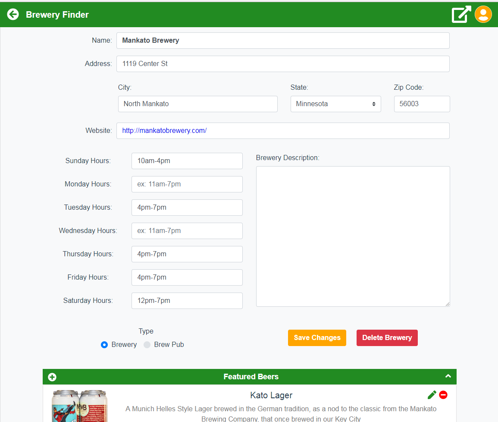

## Edit Breweries in the Application

**TL;DR** - *The instructions for this section are outlined below.  If you do not want to copy and paste the code snippets, you can switch to the [solution branch](https://github.com/Bolton-and-Menk-GIS/Full-Stack-Application-Development/tree/10-client-side-edits) for this section by running: `git checkout 10-client-side-edits`*

The first thing we need to do to enable editing on the client side is add the appropriate API methods.  Open the `api.js` file inside the `modules` folder.  Add the following methods:

first import the `enums` module:

```js
import enums from './enums';
```

and these methods:

```js
getBeer(id, options={}){
    return request(`/beers/${id}`, options);
  },

  async getStyles(options, asOptions=true){
    const resp = await request('/beer/styles', options);
    if (asOptions){
      return resp.map(s => s.style_name).sort().map(s => { return { text: s, value: s } });
    }
    return resp;
  },
  
createItem(table, options={}){
    options.method = 'post';
    return request(`/data/${table}/create`, options);
  },

  updateItem(table, data={}){
    const options = { method: 'put', data: data };
    const id = data.id;
    return request(`/data/${table}/${id}/update`, options);
  },

  deleteItem(table, id){
    return request(`/data/${table}/${id}/delete`, { method: 'delete' });
  },

  async uploadBeerPhoto(beer_id, file, photoId=null){

    // form data will store the photo blob in request body
    const formData = new FormData();

    // add photo blob
    formData.append('photo', file, file.name);
    formData.append('beer_id', beer_id);

    // return response
    const resp =  axios.post(`/data/beer_photos/${parseInt(photoId) > 0 ? photoId + '/update': 'create'}`,
      formData,
      {
        headers: {
          'Content-Type': 'multipart/form-data' // required for form data
        }
      }
    );
    console.log('PHOTO RESP API: ', resp);
    return resp;
  },

  async maboxReverseGeocode(lat, lng, access_token){
    const url = `https://api.mapbox.com/geocoding/v5/mapbox.places/${lng}%2C${lat}.json?access_token=${access_token}`;
    const resp = await request(url);
    if ((resp.features || []).length){
      const allParts = resp.features[0].place_name.split(',');

      // we only want the last 4 parts, if is an existing place in mapbox the name of place is returned first...skip this!
      const parts = allParts.splice(allParts.length - 4, allParts.length);
      const stZip = parts[2].split(' ').filter(s => s.length);
      return {
        address: parts[0],
        city: parts[1].trim(),
        state: enums.statesLookup[stZip[0]],
        zip: stZip[1]
      }
    }
    
    return {
      address: null,
      city: null,
      state: null,
      zip: null
    }
  }
  ```
  
  * `createItem` - will create a new item
  * `updateItem` - will update an existing feature
  * `deleteItem` - will delete an existing feature
  * `uploadBeerPhoto` - will add/update a beer photo based on whether or not an existing beer photo `id` is passed in
  * `mapboxReverseGeocode` - will use the Mapbox REST API to reverse geocode a point to obtain an address.  This will be used when creating new breweries as they will be created by first adding a point to the map.
  
That is all of the last API methods for the client side.  Save the changes. 

### create an Editable Brewery Component

Create a new folder called `Editing` inside the `JavaScript/app/src/components` folder.  Inside that, create a vue component called `EditableBreweryInfo.vue`.  As a reminder, the component UI will look like this when complete:


Now add the following `template` to the `EditableBreweryInfo.vue` file:

```html
<template>
  <b-card bg-variant="light" class="editable-brewery">

    <!--  SPINNER FOR LOADING -->
    <span style="font-size: 3.5rem;" class="centered" v-if="state === 'loading'">
      <spinner :text="'loading brewery info...'"/>
    </span>

    <!-- EDITABLE BREWERY CONTENT -->
    <b-container class="brewery-content" v-else>
      <b-row class="mt-2">
        <b-col sm="12">
          <b-form-group label="Name:"
                        horizontal
                        label-text-align="right"
                        :label-cols="2">
            <b-form-input v-model="brewery.name" class="bold" />
          </b-form-group>
        </b-col>
      </b-row>

      <!-- ADDRESS -->
      <b-row md="12">
        <b-col sm="12">
          <b-form-group label="Address:"
                        horizontal
                        label-text-align="right"
                        :label-cols="2">
            <b-form-input id="address" v-model="brewery.address"/>
          </b-form-group>
        </b-col>
      </b-row>

      <!--  city, st zip -->
      <b-row class="mt-2" align-h="end">
          <b-col sm="12" md="5">
            <b-form-group label="City:" label-text-align="left">
              <b-form-input v-model="brewery.city" />
            </b-form-group>
          </b-col>
          <b-col sm="6" md="3">
            <b-form-group label="State:" label-text-align="left">
              <b-form-select :options="stateList" v-model="brewery.state"></b-form-select>
            </b-form-group>
          </b-col>

          <b-col sm="6" md="2">
            <b-form-group label="Zip Code:" label-text-align="left">
              <b-form-input v-model="brewery.zip"/>
            </b-form-group>
          </b-col>
        <!--</div>-->
      </b-row>

      <!-- WEBSITE -->
      <b-row class="mt-2">
        <b-col sm="12">
          <b-form-group label="Website:"
                        horizontal
                        label-text-align="right"
                        :label-cols="2">
            <b-form-input id="website" v-model="brewery.website" style="color:#0000EE;"/>
          </b-form-group>
        </b-col>
      </b-row>

      <!--  WEEKDAY HOURS -->
      <b-row class="mt-2" >
        <b-col sm="12" md="6">
          <b-form-group v-for="weekday in weekday_fields"
                        horizontal
                        :label-cols="5"
                        label-class="capitalize"
                        :label="`${weekday} Hours:`"
                        :key="weekday" class="mt-2">
            <b-form-input :id="weekday" v-model="brewery[weekday]" placeholder="ex: 11am-7pm" />
          </b-form-group>
        </b-col>
        <b-col sm="12" md="6">
          <b-form-group label="Brewery Description:" label-text-align="left" class="mt-2" id="description">
            <b-form-textarea :rows="weekday_fields.length + 6" v-model="brewery.comments"></b-form-textarea>
          </b-form-group>
        </b-col>

      </b-row>

      <!--  SAVE BUTTON AND TYPE -->
      <b-row class="mt-4">
        <b-col sm="6">
          <b-form-group label="Type">
            <b-form-radio-group v-model="brewery.brew_type" :options="typeOptions">
            </b-form-radio-group>
          </b-form-group>
        </b-col>

        <b-col sm="6">
          <div class="save-container">
            <div class="buttons-container" v-if="state === 'loaded'">
              <b-button @click="saveChanges" class="theme mt-2" >Save Changes</b-button>
              <b-button class="bold mt-2 ml-4" variant="danger" @click="deleteBrewery">Delete Brewery</b-button>
            </div>

            <div v-else>
              <spinner text="Saving Changes..." :visible="state === 'saving'"/>

              <b-alert :show="1" @dismissed="state = 'loaded'"
                       v-if="state === 'saved'"
                       variant="success">
                Successfully Updated Brewery.
              </b-alert>

              <b-alert :show="1" @dismissed="state = 'loaded'"
                       v-if="state === 'error'"
                       variant="danger">
                Failed to Update Brewery, please try again.
              </b-alert>
            </div>
          </div>
        </b-col>
      </b-row>

      <!--  BEER ROWS -->

    </b-container>

  </b-card>
</template>
```

The template when rendered will look like the following:



There is not a whole lot of magic involved in the above template, it is mostly just standard form inputs that we will add and display using the `Bootstrap-Vue` components and the [bootstrap grid system](https://bootstrap-vue.js.org/docs/components/layout/). 

For most of the rows, for small devices the input will take up the entire screen while taking up half on larger devices.  We are splitting the rows in the middle for the weekday hours and description.  A `v-for` directive is also used to create all the weekday fields.  Under the form, there are two buttons to Delete the Brewery as well as a button to Save the Changes.

Next, add the `<script>` tag:

```html
<script>
  import api from '../../modules/api';
  import enums from '../../modules/enums';
  import Accordion from '../UI/Accordion';
  import { EventBus } from "../../modules/EventBus";
  import swal from 'sweetalert2';

  export default {
    name: "brewery-info",
    components: {
      Accordion
    },
    data(){
      return {
        state: 'loading',
        brewery: {},
        copy: {},
        weekday_fields: ['sunday', 'monday', 'tuesday', 'wednesday', 'thursday', 'friday', 'saturday'],
        stateList: enums.states,
        beers: [],
        typeOptions: [
          { text: 'Brewery', value: 'Brewery' },
          { text: 'Brew Pub', value: 'Brew Pub' }
        ]
      }
    },

    async mounted(){
      console.log('mounted editable brewery: ', this.$route.params);
    },

    // we want to make sure to intercept this to force the router to update
    // the current brewery
    beforeRouteEnter(to, from, next){
      next(async (vm)=>{
        // vm is reference to this component!
        await vm.update(to.params.brewery_id);
        console.log('updated brewery and calling next: ', vm.brewery);
        next();
      })

    },

    beforeRouteLeave (to, from, next) {
      // called when the route that renders this component is about to
      // be navigated away from.
      // has access to `this` component instance.
      // make sure there haven't been any changes before leaving route
      console.log('BEFORE BREWERY ROUTE LEAVE')
      if (this.state !== 'deleted' && JSON.stringify(this.brewery) != JSON.stringify(this.copy)){
        swal({
          type: 'warning',
          title: 'You have unsaved Edits',
          text: 'You are about to leave this page but have unsaved edits. Do you want to save your changes before proceeding?',
          showCancelButton: true,
          confirmButtonColor: 'forestgreen',
          cancelButtonColor: '#d33',
          cancelButtonText: "Don't Save Changes",
          confirmButtonText: 'Save Changes'
        }).then((choice)=>{
          if (choice){
            // save here before proceeding
            console.log('SAVE HERE!');
            this.saveChanges();
          }

          // now proceed
          next();
        })
      } else {
        next();
      }
    },

    methods: {
      async update(id){
        this.state = 'loading';
        this.beers.length = 0;
        if (!id){
          id = this.$route.params.brewery_id;
        }
        this.brewery = await api.getBreweries({id: id, options: { f: 'json'} });
        this.copy = Object.assign({}, this.brewery);
        this.updateBeers();
        this.state = 'loaded';
        return this.brewery;
      },

      async updateBeers(){
        this.beers.length = 0;
        this.beers.push(...await api.getBeersFromBrewery(this.brewery.id));
      },

      deleteBrewery(){
        console.log('clicked delete brewery!')
      },

      async saveChanges(){
        console.log('submitting edits: ', this.brewery);
        this.state = 'saving';
        try {
          const resp = await api.updateItem('breweries', this.brewery);

          // make sure to update copy so router guard isn't thrown
          this.copy = Object.assign({}, this.brewery);

          // emit change
          this.emitBreweryChange('update');
          this.state = 'saved';
        } catch(err){
          console.log('err: ', err);
          this.state = 'error';
        }

      },

      emitBreweryChange(type){
        EventBus.$emit('brewery-changed', {
          id: this.brewery.id,
          type: type
        });
      },
      
    }
  }
</script>
```

Save the changes.  In order to test this at the current state, we will need to register this component with the router.  Open the `modules/router.js` file and import the `EditableBreweryInfo.vue` file:

```js
import EditableBreweryInfo from '../components/Editing/EditableBreweryInfo';
```

Next, update the `routes` array to match this:

```js
const routes = [
  { path: '/', name: 'home', component: Home },
  { path: '/sign-up', name: 'signup', component: SignUp },
  { path: '/users/:id/activate', name: 'activate', component: ActivationPage },
  { path: '/brewery/:brewery_id', name: 'editableBreweryInfo', component: EditableBreweryInfo },
  
  // catch all route
  { path: '*', component: PageNotFound }
];
```

Save the changes and try navigating to the first brewery by changing the url to the following (you may have to adjust the port number):

[`http:localhost:8080/breweries/1`](http:localhost:8081/breweries/1)

For the `name`, `address`, and `website` components, the form inputs will take up the whole width ()
```html

```


### TODO: add  beer preview component

```html
<template>
  <b-list-group-item>
    <b-media>
      <b-img-lazy slot="aside" :src="thumbnailUrl" v-if="thumbnailUrl" height="128"/>
      <span slot="aside" title="no image available" v-else><font-awesome-icon prefix="fas" icon="image" class="no-img"/></span>
      <h5>{{ beer.name }}
        <span class="float-right action-btn" @click="emitDeleteBeer">
          <i class="fas fa-minus-circle remove-beer"
             title="remove beer">
          </i>
        </span>
        <span class="float-right action-btn" style="margin-right: 0.35rem;" @click="goToBeer">
          <i class="fas fa-pen" style="color: forestgreen;" title="edit beer"></i>
        </span>
      </h5>
      <p :class="[(beer.description || '').trim().length < 1 ? 'no-desc': 'desc']">{{ beer.description || 'no description available, click pen to edit' }}</p>

    </b-media>
  </b-list-group-item>
</template>

<script>
  import api from '../../modules/api';
  export default {
    name: "beer-preview",
    mounted(){
      this.getThumbnailUrl();
      hook.bp=this;
    },

    props: {
      beer: {
        type: Object,
        default(){
          return {};
        }
      }
    },
    data(){
      return {
        thumbnailUrl: null
      }
    },
    methods: {
      goToBeer(){
        console.log('going to beer! ', this.beer.id);
        this.$router.push({ name: 'editableBeerInfo', params: { beer_id: this.beer.id } })

      },

      async emitDeleteBeer(){
        this.$emit('delete-beer', this.beer.id);
        console.log('deleting beer with id: ', this.beer.id)
      },

      async getThumbnailUrl(){
        const photos = await api.getBeerPhotos(this.beer.id);
        console.log('beer photos: ', photos);
        if (photos.length){
          console.log('setting photo url: ', api.getPhotoUrl(photos[0].id));
          this.thumbnailUrl = api.getPhotoUrl(photos[0].id, true)
        }
      }
    }
  }
</script>

<style scoped>
  .desc {
    color: gray;
  }
  .no-desc {
    color: darkgray !important;
    font-style: italic;
  }
  .no-img {
    color: lightgray;
    font-size: 128px;
  }

  .action-btn {
    cursor: pointer;
    font-size: 1.25rem;
  }

  .remove-beer {
    color: red;
  }

</style>
```

### TODO: import and add to components

```import BeerPreview from './BeerPreview';`

```js
components: {
  Accordion,
  BeerPreview
},
```

### TODO: add to <--Beer Rows--> in EditableBreweryInfo

```html
<b-row class="mt-4">
        <accordion :header="'Featured Beers'" @action-btn-clicked="addBeer">
          <template slot="action_btn">
            <i class="fas fa-plus-circle" title="add new beer"></i>
          </template>

          <b-list-group v-for="beer in beers" v-show="beers.length" :key="beer.id">
            <beer-preview :beer="beer" @delete-beer="deleteBeer"/>
          </b-list-group>

          <h5 v-show="!beers.length" style="color: gray;" class="mt-2">No beers found, use plus button to add new beers</h5>

        </accordion>
      </b-row>
```

### TODO: add delete brewery and add/delete new beer

```js
deleteBrewery(){
        console.log('clicked delete brewery!')
        swal({
          title: 'Are you sure?',
          text: 'Once deleted, this operation cannot be undone',
          type: 'warning',
          showCancelButton: true,
          confirmButtonText: 'Yes, Delete',
          confirmButtonColor: 'forestgreen',
          showLoaderOnConfirm: true,
          allowOutsideClick: ()=> !swal.isLoading(),
          preConfirm: async ()=> {
            return await api.deleteItem('breweries', this.brewery.id);
          }
        }).then((res)=> {
          console.log('RES: ', res.value);
          this.state = 'deleted';
          EventBus.$emit('brewery-changed', {
            id: this.brewery.id,
            type: 'delete'
          });
          swal({
            type: 'success',
            title: 'Success!',
            text: 'successfully deleted brewery'
          }).then(()=>{
            this.$router.push({name: 'home'});
          });
        }).catch((err)=> {
          swal({
            type: 'error',
            title: 'Unable to Delete Brewery',
            text: "please make sure you're logged in to make this change"
          })
        })
      },

      async addBeer(){
        console.log('clicked add beer');
        swal({
          title: 'Create New Beer',
          input: 'text',
          showCancelButton: true,
          confirmButtonText: 'Create',
          confirmButtonColor: 'forestgreen',
          showLoaderOnConfirm: true,
          allowOutsideClick: ()=> !swal.isLoading(),
          preConfirm: async (name)=> {
            return await api.createItem('beers', {
              brewery_id: this.brewery.id,
              name: name
            });
          }
        }).then((res)=> {
          const newBeerId = res.value.id;
          console.log('CREATE BEER RESPONSE: ', res, newBeerId);
          swal({
            title: 'Success',
            text: 'successfully created new beer',
            confirmButtonText: 'Go To New Beer',
            cancelButtonText: 'Stay Here',
            showCancelButton: true
          }).then((res)=>{
            res.value ? this.goToEditBeer(newBeerId): this.emitBeerChange(newBeerId, 'create');
          });

        }).catch(err =>{
          console.log('error creating beer: ', err);
          swal({
            type: 'error',
            title: 'Unable to Create Beer',
            text: "please make sure you're logged in to make this change"
          })
        });
      },

      deleteBeer(id){
        //const component = this
        swal({
          title: 'Are you sure?',
          text: 'Once deleted, this operation cannot be undone',
          type: 'warning',
          showCancelButton: true,
          confirmButtonText: 'Yes, Delete',
          confirmButtonColor: 'forestgreen',
          showLoaderOnConfirm: true,
          allowOutsideClick: ()=> !swal.isLoading(),
          preConfirm: async ()=> {
            return await api.deleteItem('beers', id);
          }
        }).then((res)=> {
          console.log('RES: ', res.value);
          this.emitBeerChange(id, 'delete');

          swal({
            type: 'success',
            title: 'Success!',
            text: 'successfully deleted beer'
          });
        }).catch((err)=> {
          swal({
            type: 'error',
            title: 'Unable to Delete Beer',
            text: "please make sure you're logged in to make this change"
          })
        })
      },
      
      emitBeerChange(id, type){
        EventBus.$emit('beers-changed', {
          brewery_id: this.brewery_id,
          beer_id: id,
          type: type
        });
        this.updateBeers();
      },
      
      goToEditBeer(id){
        console.log('navigating to new beer: ', id);
        this.emitBeerChange(id, 'create');
        setTimeout(()=>{
          this.$router.push({ name: 'editableBeerInfo', params: { beer_id: id } });
        }, 250);
      },
```

### TODO: create EditableBeerInfo.vue

```html
<template>
  <b-card bg-variant="light" class="editable-beer" body-class="card-block">

    <!--  SPINNER FOR LOADING -->
    <span style="font-size: 3.5rem;" class="centered" v-if="state ==='loading'">
      <spinner :text="'loading beer info...'" :visible="true"/>
    </span>

    <!-- EDITABLE BREWERY CONTENT -->
    <b-container class="mx-auto" v-else>
      <b-row class="mt-3" align-h="center">
        <b-col>
          <div class="img-container" v-if="photoUrl && photoState !== 'missing'">
            <b-img :src="photoUrl" height="200" />
            <div class="mt-3">
              <b-button class="theme" @click="photoState = 'missing'">Update Photo</b-button>
            </div>
          </div>

          <div v-else class="file-uploader mx-auto w-50">
            <span v-if="photoState === 'uploading'">
              <b-alert  :show="1" v-if="photoState === 'error'" @dismissed="photoState = 'loaded'" variant="danger">Failed to Upload Photo</b-alert>
              <spinner :visible="photoState !== 'error'" text="Uploading Photo..."/>
            </span>

            <drop-zone @received-files="photoHandler" v-else />

          </div>
        </b-col>

      </b-row>

      <b-row class="mt-4">
        <b-col md="10" sm="12" align-h="center">
          <b-form-group label="Name:"
                        horizontal
                        label-text-align="right"
                        :label-cols="2">
            <b-form-input v-model="beer.name" style="font-weight: bold;" />
          </b-form-group>
        </b-col>

      </b-row>

      <b-row class="mt-2" align-h="center">
        <b-col :sm="prop.cols * 2" :md="prop.cols" v-for="prop in beer_props" :key="prop.field">
          <b-form-group :label="prop.label + ':'" label-text-align="left">
            <b-form-input :type="prop.type" v-model="beer[prop.field]" />
          </b-form-group>
        </b-col>
      </b-row>

      <b-row class="mt-2">
        <b-col md="10" sm="12" align-h="center">
          <b-form-group label="Style:"
                        horizontal
                        label-text-align="right"
                        :label-cols="2">
            <b-form-select :options="beerStyles" v-model="beer.style" />

          </b-form-group>
        </b-col>
      </b-row>

      <b-row class="mt-2">
        <b-col md="10" sm="12" align-h="center">
          <b-form-group label="Description:"
                        horizontal
                        label-text-align="right"
                        :label-cols="2">
            <b-form-textarea v-model="beer.description" :rows="6" />
          </b-form-group>
        </b-col>

      </b-row>

      <b-row class="mt-4 mb-4" align-h="center">
        <b-col md="10" sm="12">
          <spinner :visible="state === 'saving'" text="Saving Changes..."/>
          <b-alert :show="1" v-if="state === 'saveComplete'" @dismissed="state = 'loaded'" variant="success">Successfully Saved Changes</b-alert>
          <b-alert  :show="1" v-if="state === 'saveFailed'" @dismissed="state = 'loaded'" variant="danger">Failed to Save Changes</b-alert>
          <b-button class="theme" @click="saveChanges" v-if="state === 'loaded'">Save Changes</b-button>
        </b-col>
      </b-row>

    </b-container>

  </b-card>
</template>

<script>
  import api from '../../modules/api';
  import DropZone from '../UI/DropZone';
  import swal from 'sweetalert2';
  import { EventBus } from "../../modules/EventBus";

  export default {
    name: "beer-info",
    components: {
      DropZone
    },
    data(){
      return {
        state: 'loading',
        beer: {},
        copy: {},
        photoInfos: [],
        photoState: null,
        photoUrl: null,
        beerStyles: [],
        beer_props: [
          { label: 'IBU', field: 'ibu', type: 'number', cols: 2 },
          { label: 'Alcohol %', field: 'alc', type: 'number', cols: 2 },
          { label: 'Color', field: 'color', type: 'text', cols: 4 }
        ]
      }
    },

    async mounted(){
      console.log('mounted editable beer: ', this.$route.params);
      const styles = await api.getStyles();
      this.beerStyles.length = 0;
      this.beerStyles.push(...styles);
    },

    // we want to make sure to intercept this to force the router to update
    // the current beer
    beforeRouteEnter(to, from, next){
      console.log('BEFORE BEER ROUTE UPDATE: ', to, from, next);
      next(async (vm) => {
        await vm.update(to.params.beer_id);
        console.log('updated Beer and calling next: ', vm.beer);
        next();
        window.scrollTo(0,0);
      });

    },

    beforeRouteLeave (to, from, next){
      // called when the route that renders this component is about to
      // be navigated away from.
      // has access to `this` component instance.
      // make sure there haven't been any changes before leaving route
      if (JSON.stringify(this.beer) != JSON.stringify(this.copy)) {
        swal({
          type: 'warning',
          title: 'You have unsaved Edits',
          text: 'You are about to leave this page but have unsaved edits. Do you want to save your changes before proceeding?',
          showCancelButton: true,
          confirmButtonColor: 'forestgreen',
          cancelButtonColor: '#d33',
          cancelButtonText: "Don't Save Changes",
          confirmButtonText: 'Save Changes'
        }).then(async (choice) => {
          if (choice.value) {
            // save here before proceeding
            console.log('SAVE BEER HERE!');
            console.log(await this.saveChanges());
          }

          // now proceed
          next();
        })
      } else {
        next();
      }
    },

    methods: {
      async update(id){
        this.state = 'loading';
        if (!id){
          id = this.$route.params.beer_id;
        }
        this.beer = await api.getBeer(id);
        this.copy = Object.assign({}, this.beer);
        this.photoInfos.length = 0;
        const photoInfos = await api.getBeerPhotos(this.beer.id);
        console.log('photoInfos: ', photoInfos);
        this.photoInfos.push(...photoInfos);
        if (this.photoInfos.length){

          // set cacheBust param to true to capture when image is updated!
          this.photoUrl = api.getPhotoUrl(this.photoInfos[0].id, true);
          this.photoState = 'loaded';
        } else {
          this.photoUrl = null;
          this.photoState = 'missing';
        }
        console.log('loaded beer: ', this.beer);
        this.state = 'loaded';
        return this.beer;
      },

      emitBeerChange(){
        EventBus.$emit('beers-changed', {
          brewery_id: this.beer.brewery_id,
          beer_id: this.beer.id,
          type: 'update'
        });
      },

      async saveChanges(){
        console.log('clicked save changes');
       this.state = 'saving';
        try {
          const resp = await api.updateItem('beers', this.beer);

          // make sure to update copy so router guard isn't thrown
          this.copy = Object.assign({}, this.beer);
          this.emitBeerChange();
          this.state = 'saveComplete';
        } catch(err){
          console.log('err: ', err);
          this.state = 'saveFailed';
        }

      },

      async photoHandler(files){
        this.photoState = 'uploading';
        const photo = files[0];

        // photo already exists, we just need to update by passing in photoId
        // otherwise it will add a new one
        const photoId = this.photoInfos.length ? this.photoInfos[0].id: null;
        try{
          const resp = await api.uploadBeerPhoto(this.beer.id, photo, photoId);
          console.log('UPLOAD PHOTO RESP: ', resp);

          // now refresh photoInfos and update photoUrl
          const photoInfos = await api.getBeerPhotos(this.beer.id);
          console.log('photoInfos: ', photoInfos);
          this.photoInfos.length = 0;
          this.photoInfos.push(...photoInfos);

          // set cacheBust param to true to capture updated image!
          this.photoUrl = api.getPhotoUrl(this.photoInfos[0].id, true);
          this.emitBeerChange();
          this.photoState = 'loaded';
        } catch(err){
          console.warn('PHOTO UPLOAD ERROR: ', err);
          this.photoState = 'error';
        }

      }
    },

  }
</script>

<style scoped>

  .remove {
    color: red;
    font-size: 1.25rem;
    cursor: pointer;
  }

</style>
```

### register with router

`import EditableBeerInfo from '../components/Editing/EditableBeerInfo';`

#### update routes
```js
const routes = [
  { path: '/', name: 'home', component: Home },
  { path: '/sign-up', name: 'signup', component: SignUp },
  { path: '/users/:id/activate', name: 'activate', component: ActivationPage },
  { path: '/brewery/:brewery_id', name: 'editableBreweryInfo', component: EditableBreweryInfo },
  { path: '/beers/:beer_id', name: 'editableBeerInfo', component: EditableBeerInfo },
  
  // catch all route
  { path: '*', component: PageNotFound }
];
```

### add event handler in BreweryInfo.vue `mounted` to listen for new beers:

```js
// notify this component to reload featured beers
EventBus.$on('beers-changed', (obj)=>{
  if (obj.brewery_id == this.properties.id){
    this.fetchBeers();
  }
});
```

### navigation back button

```html
<span class="back mr-3" title="go back" @click="$router.back()" v-if="backEnabled">
  <font-awesome-icon prefix="fas" icon="arrow-circle-left"/>
</span>
```

```css
.back {
    font-size: 1.75rem;
    color: white;
    cursor: pointer;
}
```


### add event listener in main.js
```js
// listen for user login/logout events
EventBus.$on('user-logged-in', ()=>{
  this.userIsAuthenticated = true;
  // this.$refs.mapView.createAddBreweryButton();
});

EventBus.$on('user-logged-out', ()=>{
 this.userIsAuthenticated = false;
});
```

#### update data main.js

```js
// data must be a function that returns an object
data(){
  return {
    config: config,
    userIsAuthenticated: false
  }
}
```

### home.vue add watcher for user is authenticated

```js
'$root.userIsAuthenticated'(newVal){
  this.userIsAuthenticated = newVal;
}
```

### add brewery button map
```js
createAddBreweryButton(){
        const addButton = createControlButton({
          className: 'add-brewery',
          iconClass: 'fas fa-plus',
          onClick: this.addNewBrewery,
          title: 'add new brewery'
        });

        this.map.addControl(addButton, 'top-left');
        this.addBreweryButton = addButton;
      },

      deactivateAddBrewery(){
        this.state = 'default';
        this.canvas ? this.canvas.style.cursor = 'grab': null;
      },

      addNewBrewery(){
        console.log('clicked add new brewery!');
        if (this.state === 'adding'){
          this.deactivateAddBrewery();
          this.$emit('add-brewery-cancelled');
          return;
        }
        this.$emit('clicked-add-brewery');
        // set cursor to crosshair temporarily
        this.canvas = document.querySelector('.mapboxgl-canvas-container');
        this.canvas.style.cursor = 'crosshair';
        this.state = 'adding';
      },
```
 add watcher
```js
watch: {
      '$root.userIsAuthenticated'(newVal){
        if (newVal) {
          if (!this.addBreweryButton){
            this.createAddBreweryButton()
          }
        } else {
          if (this.addBreweryButton){
            this.map.removeControl(this.addBreweryButton);
            this.addBreweryButton = null;
          }
        }
      }
    }
```
update map click handler

update data
```js
return {
    map: null,
    selectionMarker: null,
    state: 'default',
    canvas: null,
    addBreweryButton: null,
 }
```

update mounted of map
```js
// update the brewery source when breweries have changed
      EventBus.$on('brewery-changed', async (obj)=>{
        console.log('brewery changed from map component: ', obj);
        this.map.getSource('breweries').setData(await api.getBreweries());
      });
```

```js
mapClick(map, e){
        console.log('map click: ', e);

        // find features
        if (this.state === 'default'){
          const features = map.queryRenderedFeatures(e.point, {
            layers: ['breweries']
          });

          console.log('found features: ', features);
          if (features.length){

            // handle selection on map
            const feature = features[0];
            this.handleIdentify(feature);
          } else if (this.selectionMarker){

            // clear selection on map and close identify
            this.selectionMarker.remove();
            this.selectionMarker = null;
            this.$emit('cleared-selection')
          }
        } else {
          this.$emit('new-brewery-point', e.lngLat);
        }
      },
```


### add home.vue methods

```js
import swal from 'sweetalert2';
import api from '../../modules/api';
```

```js
handleAddBrewery(){
        this.addBreweryActive = true;
        this.activateButton('.add-brewery');
      },

      deactivateAddBrewery(){
        const btn = document.querySelector('.add-brewery');
        btn ? btn.classList.remove('control-btn-active'): null;
        this.addBreweryActive = false;
        this.$refs.mapView.deactivateAddBrewery();
      },


      async createNewBrewery(point){

        swal({
          title: 'Create New Brewery',
          input: 'text',
          showCancelButton: true,
          confirmButtonText: 'Create',
          confirmButtonColor: 'forestgreen',
          showLoaderOnConfirm: true,
          allowOutsideClick: ()=> !swal.isLoading(),
          preConfirm: async (name)=> {
            const lat = point.lat;
            const lng = point.lng;

            // fetch access token from root vue instance "config" prop
            const accessToken = this.$root.config.map.accessToken;
            const params = await api.maboxReverseGeocode(lat, lng, accessToken);

            // add x,y coords
            params.x = point.lng;
            params.y = point.lat;

            // add brewery name to params and create new brewery
            params.name = name;
            const resp = await api.createItem('breweries', params);

            // notify new brewery has been created
            EventBus.$emit('brewery-change', {
              id: resp.id,
              type: 'create'
            });

            this.deactivateAddBrewery();
            return resp;
          }
        }).then((res)=> {
          const newBreweryId = res.value.id;
          this.emitBreweryChange(newBreweryId, 'create');
          swal({
            title: 'Success',
            text: 'successfully created new brewery',
            confirmButtonText: 'Go To New Brewery',
            cancelButtonText: 'Stay Here',
            showCancelButton: true
          }).then((res)=>{
            res.value ? this.goToEditBrewery(newBreweryId): null;
          });

        }).catch(err =>{
          console.log('error creating brewery: ', err);
          swal({
            type: 'error',
            title: 'Unable to Create Brewery',
            text: "please make sure you're logged in to make this change"
          })
        });

      },

      goToEditBrewery(id){

        // // small timeout to prevent race conditions
        // setTimeout(()=>{
          this.$router.push({ name: 'editableBreweryInfo', params: { brewery_id: id }})
        // }, 250)
      },

      emitBreweryChange(id, type){
        EventBus.$emit('brewery-changed', {
          id: id,
          type: type
        })
      },
```

update `mounted` of home

```js
// need to manually update this, because feature returned from map click is not
      // the original object
      EventBus.$on('brewery-changed', async (obj)=>{

        if (this.selectedBrewery && obj.id === this.selectedBrewery.properties.id){
          if (obj.type === 'delete'){
            this.clearSelection();
          } else {
            const resp = await api.getBrewery(obj.id, { f: 'geojson' });
            if (resp.features.length){
              // update brewery
              Object.assign(this.selectedBrewery, resp.features[0]);
            }
          }
        }
        if (obj.type === 'create'){
          this.deactivateAddBrewery();
        }
      });
```

### update template home.vue
```html
<!-- MAP VIEW-->
    <map-view
            ref="mapView"
            :userIsAuthenticated="userIsAuthenticated"
            @clicked-add-brewery="handleAddBrewery"
            @new-brewery-point="createNewBrewery"
            @add-brewery-cancelled="deactivateAddBrewery"
            @toggle-identify="identifyActivePanel"
            @cleared-selection="clearSelection"
            @brewery-identified="showBreweryInfo"
            @toggle-menu="menuActivePanel">
    </map-view>
```

 


