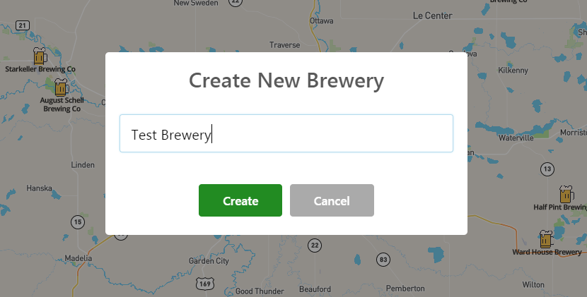

## Edit Breweries in the Application

**TL;DR** - *The instructions for this section are outlined below.  If you do not want to copy and paste the code snippets, you can switch to the [solution branch](https://github.com/Bolton-and-Menk-GIS/Full-Stack-Application-Development/tree/10-client-side-edits) for this section by running: `git checkout 10-client-side-edits`*

The first thing we need to do to enable editing on the client side is add the appropriate API methods.  Open the `api.js` file inside the `modules` folder. 

first import the `enums` module:

```js
import enums from './enums';
```

and add these methods:

```js
getBeer(id, options={}){
    return request(`/beers/${id}`, options);
  },

  async getStyles(options, asOptions=true){
    const resp = await request('/beer/styles', options);
    if (asOptions){
      return resp.map(s => s.style_name).sort().map(s => { return { text: s, value: s } });
    }
    return resp;
  },
  
createItem(table, options={}){
    options.method = 'post';
    return request(`/data/${table}/create`, options);
  },

  updateItem(table, data={}){
    const options = { method: 'put', data: data };
    const id = data.id;
    return request(`/data/${table}/${id}/update`, options);
  },

  deleteItem(table, id){
    return request(`/data/${table}/${id}/delete`, { method: 'delete' });
  },

  async uploadBeerPhoto(beer_id, file, photoId=null){

    // form data will store the photo blob in request body
    const formData = new FormData();

    // add photo blob
    formData.append('photo', file, file.name);
    formData.append('beer_id', beer_id);

    // return response
    const resp =  axios.post(`/data/beer_photos/${parseInt(photoId) > 0 ? photoId + '/update': 'create'}`,
      formData,
      {
        headers: {
          'Content-Type': 'multipart/form-data' // required for form data
        }
      }
    );
    console.log('PHOTO RESP API: ', resp);
    return resp;
  },

  async maboxReverseGeocode(lat, lng, access_token){
    const url = `https://api.mapbox.com/geocoding/v5/mapbox.places/${lng}%2C${lat}.json?access_token=${access_token}`;
    const resp = await request(url);
    if ((resp.features || []).length){
      const allParts = resp.features[0].place_name.split(',');

      // we only want the last 4 parts, if is an existing place in mapbox the name of place is returned first...skip this!
      const parts = allParts.splice(allParts.length - 4, allParts.length);
      const stZip = parts[2].split(' ').filter(s => s.length);
      return {
        address: parts[0],
        city: parts[1].trim(),
        state: enums.statesLookup[stZip[0]],
        zip: stZip[1]
      }
    }
    
    return {
      address: null,
      city: null,
      state: null,
      zip: null
    }
  }
  ```
  
  * `createItem` - will create a new item
  * `updateItem` - will update an existing feature
  * `deleteItem` - will delete an existing feature
  * `uploadBeerPhoto` - will add/update a beer photo based on whether or not an existing beer photo `id` is passed in
  * `mapboxReverseGeocode` - will use the Mapbox REST API to reverse geocode a point to obtain an address.  This will be used when creating new breweries as they will be created by first adding a point to the map.
  
That is all of the last API methods for the client side.  Save the changes. 

### create an Editable Brewery Component

Create a new folder called `Editing` inside the `JavaScript/app/src/components` folder.  Inside that, create a vue component called `EditableBreweryInfo.vue`.  As a reminder, the component UI will look like this when complete:


Now add the following `template` to the `EditableBreweryInfo.vue` file:

```html
<template>
  <b-card bg-variant="light" class="editable-brewery">

    <!--  SPINNER FOR LOADING -->
    <span style="font-size: 3.5rem;" class="centered" v-if="state === 'loading'">
      <spinner :text="'loading brewery info...'"/>
    </span>

    <!-- EDITABLE BREWERY CONTENT -->
    <b-container class="brewery-content" v-else>
      <b-row class="mt-2">
        <b-col sm="12">
          <b-form-group label="Name:"
                        horizontal
                        label-text-align="right"
                        :label-cols="2">
            <b-form-input v-model="brewery.name" class="bold" />
          </b-form-group>
        </b-col>
      </b-row>

      <!-- ADDRESS -->
      <b-row md="12">
        <b-col sm="12">
          <b-form-group label="Address:"
                        horizontal
                        label-text-align="right"
                        :label-cols="2">
            <b-form-input id="address" v-model="brewery.address"/>
          </b-form-group>
        </b-col>
      </b-row>

      <!--  city, st zip -->
      <b-row class="mt-2" align-h="end">
          <b-col sm="12" md="5">
            <b-form-group label="City:" label-text-align="left">
              <b-form-input v-model="brewery.city" />
            </b-form-group>
          </b-col>
          <b-col sm="6" md="3">
            <b-form-group label="State:" label-text-align="left">
              <b-form-select :options="stateList" v-model="brewery.state"></b-form-select>
            </b-form-group>
          </b-col>

          <b-col sm="6" md="2">
            <b-form-group label="Zip Code:" label-text-align="left">
              <b-form-input v-model="brewery.zip"/>
            </b-form-group>
          </b-col>
        <!--</div>-->
      </b-row>

      <!-- WEBSITE -->
      <b-row class="mt-2">
        <b-col sm="12">
          <b-form-group label="Website:"
                        horizontal
                        label-text-align="right"
                        :label-cols="2">
            <b-form-input id="website" v-model="brewery.website" style="color:#0000EE;"/>
          </b-form-group>
        </b-col>
      </b-row>

      <!--  WEEKDAY HOURS -->
      <b-row class="mt-2" >
        <b-col sm="12" md="6">
          <b-form-group v-for="weekday in weekday_fields"
                        horizontal
                        :label-cols="5"
                        label-class="capitalize"
                        :label="`${weekday} Hours:`"
                        :key="weekday" class="mt-2">
            <b-form-input :id="weekday" v-model="brewery[weekday]" placeholder="ex: 11am-7pm" />
          </b-form-group>
        </b-col>
        <b-col sm="12" md="6">
          <b-form-group label="Brewery Description:" label-text-align="left" class="mt-2" id="description">
            <b-form-textarea :rows="weekday_fields.length + 6" v-model="brewery.comments"></b-form-textarea>
          </b-form-group>
        </b-col>

      </b-row>

      <!--  SAVE BUTTON AND TYPE -->
      <b-row class="mt-4">
        <b-col sm="6">
          <b-form-group label="Type">
            <b-form-radio-group v-model="brewery.brew_type" :options="typeOptions">
            </b-form-radio-group>
          </b-form-group>
        </b-col>

        <b-col sm="6">
          <div class="save-container">
            <div class="buttons-container" v-if="state === 'loaded'">
              <b-button @click="saveChanges" class="theme mt-2" >Save Changes</b-button>
              <b-button class="bold mt-2 ml-4" variant="danger" @click="deleteBrewery">Delete Brewery</b-button>
            </div>

            <div v-else>
              <spinner text="Saving Changes..." :visible="state === 'saving'"/>

              <b-alert :show="1" @dismissed="state = 'loaded'"
                       v-if="state === 'saved'"
                       variant="success">
                Successfully Updated Brewery.
              </b-alert>

              <b-alert :show="1" @dismissed="state = 'loaded'"
                       v-if="state === 'error'"
                       variant="danger">
                Failed to Update Brewery, please try again.
              </b-alert>
            </div>
          </div>
        </b-col>
      </b-row>

      <!--  BEER ROWS -->

    </b-container>

  </b-card>
</template>
```

The template when rendered will look like the following:


There is not a whole lot of magic involved in the above template, it is mostly just standard form inputs that we will add and display using the `Bootstrap-Vue` components.  The first thing added is a `spinner` component that will be displayed while the the brewery info is being fetched. 

The form layout is positioned using the [bootstrap grid system](https://bootstrap-vue.js.org/docs/components/layout/). For most of the rows, for small devices the input will take up the entire screen while taking up half on larger devices using the `sm` and `md` properties.  We are splitting the rows in the middle for the weekday hours and description.  A `v-for` directive is also used to create all the weekday fields.  Under the form, there are two buttons to Delete the Brewery as well as a button to Save the Changes.  

Another `spinner` component is used to handle the state changes and [`b-alert`](https://bootstrap-vue.js.org/docs/components/alert) components are used to display

Next, add the `<script>` tag:

```html
<script>
  import api from '../../modules/api';
  import enums from '../../modules/enums';
  import Accordion from '../UI/Accordion';
  import { EventBus } from "../../modules/EventBus";
  import swal from 'sweetalert2';

  export default {
    name: "brewery-info",
    components: {
      Accordion
    },
    data(){
      return {
        state: 'loading',
        brewery: {},
        copy: {},
        weekday_fields: ['sunday', 'monday', 'tuesday', 'wednesday', 'thursday', 'friday', 'saturday'],
        stateList: enums.states,
        beers: [],
        typeOptions: [
          { text: 'Brewery', value: 'Brewery' },
          { text: 'Brew Pub', value: 'Brew Pub' }
        ]
      }
    },

    async mounted(){
      console.log('mounted editable brewery: ', this.$route.params);
    },

    // we want to make sure to intercept this to force the router to update
    // the current brewery
    beforeRouteEnter(to, from, next){
      next(async (vm)=>{
        // vm is reference to this component!
        await vm.update(to.params.brewery_id);
        console.log('updated brewery and calling next: ', vm.brewery);
        next();
      })

    },

    beforeRouteLeave (to, from, next) {
      // called when the route that renders this component is about to
      // be navigated away from.
      // has access to `this` component instance.
      // make sure there haven't been any changes before leaving route
      console.log('BEFORE BREWERY ROUTE LEAVE')
      if (this.state !== 'deleted' && JSON.stringify(this.brewery) != JSON.stringify(this.copy)){
        swal({
          type: 'warning',
          title: 'You have unsaved Edits',
          text: 'You are about to leave this page but have unsaved edits. Do you want to save your changes before proceeding?',
          showCancelButton: true,
          confirmButtonColor: 'forestgreen',
          cancelButtonColor: '#d33',
          cancelButtonText: "Don't Save Changes",
          confirmButtonText: 'Save Changes'
        }).then((choice)=>{
          if (choice){
            // save here before proceeding
            console.log('SAVE HERE!');
            this.saveChanges();
          }

          // now proceed
          next();
        })
      } else {
        next();
      }
    },

    methods: {
      async update(id){
        this.state = 'loading';
        this.beers.length = 0;
        if (!id){
          id = this.$route.params.brewery_id;
        }
        this.brewery = await api.getBreweries({id: id, options: { f: 'json'} });
        this.copy = Object.assign({}, this.brewery);
        this.updateBeers();
        this.state = 'loaded';
        return this.brewery;
      },

      async updateBeers(){
        this.beers.length = 0;
        this.beers.push(...await api.getBeersFromBrewery(this.brewery.id));
      },

      deleteBrewery(){
        console.log('clicked delete brewery!');
        
        swal({
          title: 'Are you sure?',
          text: 'Once deleted, this operation cannot be undone',
          type: 'warning',
          showCancelButton: true,
          confirmButtonText: 'Yes, Delete',
          confirmButtonColor: 'forestgreen',
          showLoaderOnConfirm: true,
          allowOutsideClick: ()=> !swal.isLoading(),
          preConfirm: async ()=> {
            return await api.deleteItem('breweries', this.brewery.id);
          }
        }).then((res)=> {
          console.log('RES: ', res.value);
          this.state = 'deleted';
          EventBus.$emit('brewery-changed', {
            id: this.brewery.id,
            type: 'delete'
          });
          swal({
            type: 'success',
            title: 'Success!',
            text: 'successfully deleted brewery'
          }).then(()=>{
            this.$router.push({name: 'home'});
          });
        }).catch((err)=> {
          swal({
            type: 'error',
            title: 'Unable to Delete Brewery',
            text: "please make sure you're logged in to make this change"
          })
        })
      },

      async saveChanges(){
        console.log('submitting edits: ', this.brewery);
        this.state = 'saving';
        try {
          const resp = await api.updateItem('breweries', this.brewery);

          // make sure to update copy so router guard isn't thrown
          this.copy = Object.assign({}, this.brewery);

          // emit change
          this.emitBreweryChange('update');
          this.state = 'saved';
        } catch(err){
          console.log('err: ', err);
          this.state = 'error';
        }

      },

      emitBreweryChange(type){
        EventBus.$emit('brewery-changed', {
          id: this.brewery.id,
          type: type
        });
      },
      
    }
  }
</script>
```

The breakdown of the above is as follows:

#### components

* `Accordion` - reusuable component to represent an accordion dropdown

#### data

* `state` - state handler for the component 
* `brewery` - brewery data
* `copy` - represents a copy of the `brewery` data to check for edits
* `weekday_fields` - list of field names for the weekday hours
* `stateList` - list of states for `State` select box
* `beers` - list of beers for the brewery
* `typeOptions` - type options for radio button 

#### Route Navigation Guards

* `beforeRouteEnter` - navigation hook before the app goes to this page, will fetch the current brewery data
* `beforeRouteLeave` - navigation hook before leaving this page, will check for unsaved edits and prompt user to save changes before leaving if changes were made.
* 
#### methods

* `update` - loads the brewery info by calling `api.getBreweries(<id>)` and fetches the beers
* `updateBeers` - fetches beers for this brewery by calling `api.getBeersFromBrewery(<id>)`
* `deleteBrewery` - will delete the current brewery, uses [`sweetalert2`](https://sweetalert2.github.io/) alert/dialog boxes to handle navigating back to the map if brewery is deleted as well as emitting the `brewery-changed` event from the success callback.
* `saveChanges` - saves edits made to this brewery
* `emitBreweryChange` - emits an event to show that a brewery has changed (`brewerey-changed`)

Save the changes.  

### register `EditableBreweryInfo` with router

In order to test this at the current state, we will need to register this component with the router.  Open the `modules/router.js` file and import the `EditableBreweryInfo.vue` file:

```js
import EditableBreweryInfo from '../components/Editing/EditableBreweryInfo';
```

Next, update the `routes` array to match this:

```js
const routes = [
  { path: '/', name: 'home', component: Home },
  { path: '/sign-up', name: 'signup', component: SignUp },
  { path: '/users/:id/activate', name: 'activate', component: ActivationPage },
  { path: '/brewery/:brewery_id', name: 'editableBreweryInfo', component: EditableBreweryInfo },
  
  // catch all route
  { path: '*', component: PageNotFound }
];
```

Save the changes and try navigating to the first brewery by changing the url to the following (you may have to adjust the port number):

[`http:localhost:8080/breweries/1`](http:localhost:8081/breweries/1)

### add  beer previews

Next, we need to add the beer preview list.  Create a new Vue component inside the `Editing` folder and call it `BeerPreview.vue`.  Add the following template:

```html
<template>
  <b-list-group-item>
    <b-media>
      <b-img-lazy slot="aside" :src="thumbnailUrl" v-if="thumbnailUrl" height="128"/>
      <span slot="aside" title="no image available" v-else><font-awesome-icon prefix="fas" icon="image" class="no-img"/></span>
      <h5>{{ beer.name }}
        <span class="float-right action-btn" @click="emitDeleteBeer">
          <i class="fas fa-minus-circle remove-beer"
             title="remove beer">
          </i>
        </span>
        <span class="float-right action-btn" style="margin-right: 0.35rem;" @click="goToBeer">
          <i class="fas fa-pen" style="color: forestgreen;" title="edit beer"></i>
        </span>
      </h5>
      <p :class="[(beer.description || '').trim().length < 1 ? 'no-desc': 'desc']">{{ beer.description || 'no description available, click pen to edit' }}</p>

    </b-media>
  </b-list-group-item>
</template>
```

The above template is a pretty simple one that will serve as a [`b-list-group-item`](https://bootstrap-vue.js.org/docs/components/list-group). A [`b-media`](https://bootstrap-vue.js.org/docs/components/media) component will be used to display the beer photo as a [`b-img`](https://bootstrap-vue.js.org/docs/components/image) that will be lazy loaded (will not display until scrolled) in the `aside` [slot](https://vuejs.org/v2/guide/components-slots.html#Named-Slots) placeholder.  The name and description are displayed as the content, and two action buttons are also displayed to allow an authenticated user to edit or delete the beer.

Next, add the `<script>` tag:

```html
<script>
  import api from '../../modules/api';
  export default {
    name: "beer-preview",
    mounted(){
      this.getThumbnailUrl();
    },

    props: {
      beer: {
        type: Object,
        default(){
          return {};
        }
      }
    },
    
    data(){
      return {
        thumbnailUrl: null
      }
    },
    
    methods: {
    
      goToBeer(){
        console.log('going to beer! ', this.beer.id);
        this.$router.push({ name: 'editableBeerInfo', params: { beer_id: this.beer.id } })

      },

      async emitDeleteBeer(){
        this.$emit('delete-beer', this.beer.id);
        console.log('deleting beer with id: ', this.beer.id)
      },

      async getThumbnailUrl(){
        const photos = await api.getBeerPhotos(this.beer.id);
        console.log('beer photos: ', photos);
        if (photos.length){
          console.log('setting photo url: ', api.getPhotoUrl(photos[0].id));
          this.thumbnailUrl = api.getPhotoUrl(photos[0].id, true)
        }
      }
    }
  }
</script>
```

The breakdown is as follows:

### `mounted` lifecycle hook
* `mounted` - will call the `getThumbnailUrl` method that will be defined later to fetch the photo url (with cache busting)

### props

* `beer` - beer info from database

### methods

* `goToBeer` - will use the `Router` to navigate to the selected beer for editing
* `emitDeleteBeer` - will emit an event to notify the app that a beer has been deleted
* `getThumbnailUrl` - will fetch the thumbnail url to for the beer

And finally, the `<style>` tag:

```html
<style scoped>
  .desc {
    color: gray;
  }
  .no-desc {
    color: darkgray !important;
    font-style: italic;
  }
  .no-img {
    color: lightgray;
    font-size: 128px;
  }

  .action-btn {
    cursor: pointer;
    font-size: 1.25rem;
  }

  .remove-beer {
    color: red;
  }

</style>
```
### add the beer previews to the `EditableBreweryInfo` component

Save the changes.  Now that this component is created, it is ready to be used inside the `EditableBreweryInfo`.  First, import it:

```js
import BeerPreview from './BeerPreview';
```

Then register it in the `components` object:

```js
components: {
  Accordion,
  BeerPreview
},
```

Next, update the template to paste the following where the `<-- Beer Rows -->` placeholder tag is located in the in `EditableBreweryInfo`'s `template`:

```html
  <b-row class="mt-4">
    <accordion :header="'Featured Beers'" @action-btn-clicked="addBeer">
      <template slot="action_btn">
        <i class="fas fa-plus-circle" title="add new beer"></i>
      </template>

      <b-list-group v-for="beer in beers" v-show="beers.length" :key="beer.id">
        <beer-preview :beer="beer" @delete-beer="deleteBeer"/>
      </b-list-group>

      <h5 v-show="!beers.length" style="color: gray;" class="mt-2">No beers found, use plus button to add new beers</h5>

    </accordion>
  </b-row>
```

In the above template, we are using our [`accordion`](../src/student/JavaScript/app/src/components/UI/Accordion.vue) component to wrap the featured beers list group in a a collapsible container.

### allow user to add, update and delete beers

```js
  async addBeer(){
    console.log('clicked add beer');
    swal({
      title: 'Create New Beer',
      input: 'text',
      showCancelButton: true,
      confirmButtonText: 'Create',
      confirmButtonColor: 'forestgreen',
      showLoaderOnConfirm: true,
      allowOutsideClick: ()=> !swal.isLoading(),
      preConfirm: async (name)=> {
        return await api.createItem('beers', {
          brewery_id: this.brewery.id,
          name: name
        });
      }
    }).then((res)=> {
      const newBeerId = res.value.id;
      console.log('CREATE BEER RESPONSE: ', res, newBeerId);
      swal({
        title: 'Success',
        text: 'successfully created new beer',
        confirmButtonText: 'Go To New Beer',
        cancelButtonText: 'Stay Here',
        showCancelButton: true
      }).then((res)=>{
        res.value ? this.goToEditBeer(newBeerId): this.emitBeerChange(newBeerId, 'create');
      });

    }).catch(err =>{
      console.log('error creating beer: ', err);
      swal({
        type: 'error',
        title: 'Unable to Create Beer',
        text: "please make sure you're logged in to make this change"
      })
    });
  },

  deleteBeer(id){
    //const component = this
    swal({
      title: 'Are you sure?',
      text: 'Once deleted, this operation cannot be undone',
      type: 'warning',
      showCancelButton: true,
      confirmButtonText: 'Yes, Delete',
      confirmButtonColor: 'forestgreen',
      showLoaderOnConfirm: true,
      allowOutsideClick: ()=> !swal.isLoading(),
      preConfirm: async ()=> {
        return await api.deleteItem('beers', id);
      }
    }).then((res)=> {
      console.log('RES: ', res.value);
      this.emitBeerChange(id, 'delete');

      swal({
        type: 'success',
        title: 'Success!',
        text: 'successfully deleted beer'
      });
    }).catch((err)=> {
      swal({
        type: 'error',
        title: 'Unable to Delete Beer',
        text: "please make sure you're logged in to make this change"
      })
    })
  },
  
  emitBeerChange(id, type){
    EventBus.$emit('beers-changed', {
      brewery_id: this.brewery_id,
      beer_id: id,
      type: type
    });
    this.updateBeers();
  },
  
  goToEditBeer(id){
    console.log('navigating to new beer: ', id);
    this.emitBeerChange(id, 'create');
    setTimeout(()=>{
      this.$router.push({ name: 'editableBeerInfo', params: { beer_id: id } });
    }, 250);
  },
```

The methods we just added are:

* `addBeer` - uses `swal` (sweetalert2) dialogs to add a new beer with a name, and then allows the user to choose to either stay on this brewery page or navigate to the new beer page to add a photo and fill in attributes.  The `beers-changed` event is also emitted.
* `deleteBeer` - deletes a beer from the list of featured beers and emits the `beers-changed` event.
* `goToEditBeer` - uses the `router` to navigate to a page where the user can edit beers.  We will create that component next.

Save the changes.

### create `EditableBeerInfo.vue` component

Now that we have the ability to add and edit beers, there needs to be a user interface to handle the updates.  We will create a form similar to the `EditableBreweryInfo` component using `Bootstrap-Vue`. Create a new file in the `Editing` folder called `EditableBreweryInfo.vue` and add the following template:

```html
<template>
  <b-card bg-variant="light" class="editable-beer" body-class="card-block">

    <!--  SPINNER FOR LOADING -->
    <span style="font-size: 3.5rem;" class="centered" v-if="state ==='loading'">
      <spinner :text="'loading beer info...'" :visible="true"/>
    </span>

    <!-- EDITABLE BREWERY CONTENT -->
    <b-container class="mx-auto" v-else>
      <b-row class="mt-3" align-h="center">
        <b-col>
          <div class="img-container" v-if="photoUrl && photoState !== 'missing'">
            <b-img :src="photoUrl" height="200" />
            <div class="mt-3">
              <b-button class="theme" @click="photoState = 'missing'">Update Photo</b-button>
            </div>
          </div>

          <div v-else class="file-uploader mx-auto w-50">
            <span v-if="photoState === 'uploading'">
              <b-alert  :show="1" v-if="photoState === 'error'" @dismissed="photoState = 'loaded'" variant="danger">Failed to Upload Photo</b-alert>
              <spinner :visible="photoState !== 'error'" text="Uploading Photo..."/>
            </span>

            <drop-zone @received-files="photoHandler" v-else />

          </div>
        </b-col>

      </b-row>

      <b-row class="mt-4">
        <b-col md="10" sm="12" align-h="center">
          <b-form-group label="Name:"
                        horizontal
                        label-text-align="right"
                        :label-cols="2">
            <b-form-input v-model="beer.name" style="font-weight: bold;" />
          </b-form-group>
        </b-col>

      </b-row>

      <b-row class="mt-2" align-h="center">
        <b-col :sm="prop.cols * 2" :md="prop.cols" v-for="prop in beer_props" :key="prop.field">
          <b-form-group :label="prop.label + ':'" label-text-align="left">
            <b-form-input :type="prop.type" v-model="beer[prop.field]" />
          </b-form-group>
        </b-col>
      </b-row>

      <b-row class="mt-2">
        <b-col md="10" sm="12" align-h="center">
          <b-form-group label="Style:"
                        horizontal
                        label-text-align="right"
                        :label-cols="2">
            <b-form-select :options="beerStyles" v-model="beer.style" />

          </b-form-group>
        </b-col>
      </b-row>

      <b-row class="mt-2">
        <b-col md="10" sm="12" align-h="center">
          <b-form-group label="Description:"
                        horizontal
                        label-text-align="right"
                        :label-cols="2">
            <b-form-textarea v-model="beer.description" :rows="6" />
          </b-form-group>
        </b-col>

      </b-row>

      <b-row class="mt-4 mb-4" align-h="center">
        <b-col md="10" sm="12">
          <spinner :visible="state === 'saving'" text="Saving Changes..."/>
          <b-alert :show="1" v-if="state === 'saveComplete'" @dismissed="state = 'loaded'" variant="success">Successfully Saved Changes</b-alert>
          <b-alert  :show="1" v-if="state === 'saveFailed'" @dismissed="state = 'loaded'" variant="danger">Failed to Save Changes</b-alert>
          <b-button class="theme" @click="saveChanges" v-if="state === 'loaded'">Save Changes</b-button>
        </b-col>
      </b-row>

    </b-container>

  </b-card>
</template>
```

Like the `EditableBreweryInfo` component, this will utilize a `spinner` while the beer info is being loaded into the template.  One thing we are adding here that was not present in the brewery editing page is a [`dropzone`](../src/student/JavaScript/app/src/components/UI/DropZone.vue) to handle uploading photos.  This will work by allowing the user to drag and drop a photo into th drop zone area.  Alternatively, the user can click on the drop zone to open the [filepicker](https://developer.mozilla.org/en-US/docs/Web/HTML/Element/input/file) dialog as a fallback option.

The next part is the form that is modeled to the fields of the `beer` object.  Like the editable brewery component, this also has a save button along with a `spinner` to handle the saving state and `b-alert`s for messages.  Next, add the `<script>` tag:

```html
<script>
  import api from '../../modules/api';
  import DropZone from '../UI/DropZone';
  import swal from 'sweetalert2';
  import { EventBus } from "../../modules/EventBus";

  export default {
    name: "beer-info",
    components: {
      DropZone
    },
    
    data(){
      return {
        state: 'loading',
        beer: {},
        copy: {},
        photoInfos: [],
        photoState: null,
        photoUrl: null,
        beerStyles: [],
        beer_props: [
          { label: 'IBU', field: 'ibu', type: 'number', cols: 2 },
          { label: 'Alcohol %', field: 'alc', type: 'number', cols: 2 },
          { label: 'Color', field: 'color', type: 'text', cols: 4 }
        ]
      }
    },

    async mounted(){
      console.log('mounted editable beer: ', this.$route.params);
      const styles = await api.getStyles();
      this.beerStyles.length = 0;
      this.beerStyles.push(...styles);
    },

    // we want to make sure to intercept this to force the router to update
    // the current beer
    beforeRouteEnter(to, from, next){
      console.log('BEFORE BEER ROUTE UPDATE: ', to, from, next);
      next(async (vm) => {
        await vm.update(to.params.beer_id);
        console.log('updated Beer and calling next: ', vm.beer);
        next();
        window.scrollTo(0,0);
      });

    },

    beforeRouteLeave (to, from, next){
      // called when the route that renders this component is about to
      // be navigated away from.
      // has access to `this` component instance.
      // make sure there haven't been any changes before leaving route
      if (JSON.stringify(this.beer) != JSON.stringify(this.copy)) {
        swal({
          type: 'warning',
          title: 'You have unsaved Edits',
          text: 'You are about to leave this page but have unsaved edits. Do you want to save your changes before proceeding?',
          showCancelButton: true,
          confirmButtonColor: 'forestgreen',
          cancelButtonColor: '#d33',
          cancelButtonText: "Don't Save Changes",
          confirmButtonText: 'Save Changes'
        }).then(async (choice) => {
          if (choice.value) {
            // save here before proceeding
            console.log('SAVE BEER HERE!');
            console.log(await this.saveChanges());
          }

          // now proceed
          next();
        })
      } else {
        next();
      }
    },

    methods: {
      async update(id){
        this.state = 'loading';
        if (!id){
          id = this.$route.params.beer_id;
        }
        this.beer = await api.getBeer(id);
        this.copy = Object.assign({}, this.beer);
        this.photoInfos.length = 0;
        const photoInfos = await api.getBeerPhotos(this.beer.id);
        console.log('photoInfos: ', photoInfos);
        this.photoInfos.push(...photoInfos);
        if (this.photoInfos.length){

          // set cacheBust param to true to capture when image is updated!
          this.photoUrl = api.getPhotoUrl(this.photoInfos[0].id, true);
          this.photoState = 'loaded';
        } else {
          this.photoUrl = null;
          this.photoState = 'missing';
        }
        console.log('loaded beer: ', this.beer);
        this.state = 'loaded';
        return this.beer;
      },

      emitBeerChange(){
        EventBus.$emit('beers-changed', {
          brewery_id: this.beer.brewery_id,
          beer_id: this.beer.id,
          type: 'update'
        });
      },

      async saveChanges(){
        console.log('clicked save changes');
       this.state = 'saving';
        try {
          const resp = await api.updateItem('beers', this.beer);

          // make sure to update copy so router guard isn't thrown
          this.copy = Object.assign({}, this.beer);
          this.emitBeerChange();
          this.state = 'saveComplete';
        } catch(err){
          console.log('err: ', err);
          this.state = 'saveFailed';
        }

      },

      async photoHandler(files){
        this.photoState = 'uploading';
        const photo = files[0];

        // photo already exists, we just need to update by passing in photoId
        // otherwise it will add a new one
        const photoId = this.photoInfos.length ? this.photoInfos[0].id: null;
        try{
          const resp = await api.uploadBeerPhoto(this.beer.id, photo, photoId);
          console.log('UPLOAD PHOTO RESP: ', resp);

          // now refresh photoInfos and update photoUrl
          const photoInfos = await api.getBeerPhotos(this.beer.id);
          console.log('photoInfos: ', photoInfos);
          this.photoInfos.length = 0;
          this.photoInfos.push(...photoInfos);

          // set cacheBust param to true to capture updated image!
          this.photoUrl = api.getPhotoUrl(this.photoInfos[0].id, true);
          this.emitBeerChange();
          this.photoState = 'loaded';
        } catch(err){
          console.warn('PHOTO UPLOAD ERROR: ', err);
          this.photoState = 'error';
        }

      }
    },

  }
</script>
```

The breakdown is as follows:

#### components
* `DropZone` - component to handle the file drop for photos to upload to server

#### data

* `state` - state for component
* `beer` - beer from database
* `photoInfos` - array of photo infos for this beer (should only be one)
* `photoState` - controls state of photo
* `photoUrl` - url to photo with cache busting enabled
* `beerStyles` - list of beer styles from `styles` table in database
* `beer_props` - list of props for a beer that are referenced in the `template`


#### `mounted`
fetches the beer styles

#### Route Navigation Guards

* `beforeRouteEnter` - navigation hook before the app goes to this page, will fetch the current brewery data
* `beforeRouteLeave` - navigation hook before leaving this page, will check for unsaved edits and prompt user to save changes before leaving if changes were made.

#### methods

* `update` - fetches the beer info from server
* `emitBeerChange` - notifies the app that the beer has changed or has been deleted
* `saveChanges` - saves the edits to this beer
* `photoHandler` - event handler for the `dropzone` when photos are added; it will upload the photo to the server

And add the `css`:

```html
<style scoped>

  .remove {
    color: red;
    font-size: 1.25rem;
    cursor: pointer;
  }

</style>
```

Save the changes.

### register with router

Next, this component is ready to be registered with the `router`. Open the `modules/router.js` file and import the `EditableBeerInfo`:

```js
import EditableBeerInfo from '../components/Editing/EditableBeerInfo';
```

and update the routes:

```js
const routes = [
  { path: '/', name: 'home', component: Home },
  { path: '/sign-up', name: 'signup', component: SignUp },
  { path: '/users/:id/activate', name: 'activate', component: ActivationPage },
  { path: '/brewery/:brewery_id', name: 'editableBreweryInfo', component: EditableBreweryInfo },
  { path: '/beers/:beer_id', name: 'editableBeerInfo', component: EditableBeerInfo },
  
  // catch all route
  { path: '*', component: PageNotFound }
];
```

Save the changes.  Now check if the router will navigate to a beer by using this in the url (may have to adjust port):

`http://localhost:8080/beers/1`

Now we know both the editable brewery and beers pages work, there is currently no way to get back to the map aside from hitting the browser's back button. To fix that, let's add a back button to the navbar that will appear when the user is on one of those pages, with an arrow appearing to the left of the "Brewery Finder" text.  Open the `AppNavBar.vue` and 

### navigation back button

Add the following `<span>` tag before the `<b-navbar-brand>`:
```html
<span class="back mr-3" title="go back" @click="$router.back()" v-if="backEnabled">
  <font-awesome-icon prefix="fas" icon="arrow-circle-left"/>
</span>
```

And add the css for the back button:

```css
.back {
    font-size: 1.75rem;
    color: white;
    cursor: pointer;
}
```

### add edit button to the brewery info

There is also currently no way to get to the editable brewery and beers.  The workflow to make an edit should start with the user logging in, and when the user is authenticated an edit button will be available in the identify window.  To facilitate this, first we will start with the `main.js` file to add a `data` property to the [root vue instance](https://vuejs.org/v2/guide/instance.html) called `userIsAuthenticated` to store the authentication state of the app.  First, update the `mounted` function in the `main.js` file to:

```js
    mounted(){
      console.log('MOUNTED MAIN VUE INSTANCE');

      // listen for user login/logout events
      EventBus.$on('user-logged-in', ()=>{
        this.userIsAuthenticated = true;
        console.log('user logged in main.js')
        // this.$refs.mapView.createAddBreweryButton();
      });

      EventBus.$on('user-logged-out', ()=>{
        this.userIsAuthenticated = false;
      });
    },
```

and then update the `data`:

```js
// data must be a function that returns an object
data(){
  return {
    config: config,
    userIsAuthenticated: false
  }
}
```

Save the changes to `main.js`.  Now, in order to allow the user to edit a brewery from the identify panel, we will need to know from the `BreweryInfo` component when a user has signed in; this is something we will pass from the `Home` component. Open the `Home.vue` file inside the `components/Home` folder and add the following function to the `watch` object after the `identifyActive` watcher:  


```js
  '$root.userIsAuthenticated'(newVal){
    this.userIsAuthenticated = newVal;
  }
```

Save the changes. This will watch for the `userIsAuthenticated` data property to change in the root Vue instance, and when that does change, the same property will automatically be updated in the `Home` component.  As a reminder, the property is then passed to the `BreweryInfo` component in the template:

```html
    <!-- BREWERY IDENTIFY CONTENT -->
    <brewery-info
            v-if="identifyActive"
            :userIsAuthenticated="userIsAuthenticated"
            :feature="selectedBrewery">
    </brewery-info>
```
    
### test adding a new beer

Now it's time to test the editing functionality.  To enable editing, first sign in with the either the user credentials you created or with the `test_user` account that is already there.  Those credentials are:

username:  `test_user`
password:  `user_123`

Go to the app and use the autocomplete box to search the `Mankato Brewery`. When the brewery shows up in the identify panel, you should see the edit button appear to the right of the brewery name:


Click on this and the router should take you to the `EditableBreweryInfo` component with the `Mankato Brewery` data modeled:


In the `Featured Beers` Accordion header, click on the plus button in the top left to test adding a new beer:


A `sweetalert` popup should appear where you can name the new beer, call it `Pacific Phantom` and hit the `Create` button:


The navigation guard should appear after the beer is created to ask if you want to go to edit the new beer or stay on this page, choose `Go To New Beer`:


Now on the edit beer page, first note that there is not an image for the newly created beer.  A sample photo has been provided called `pacific_phantom.png` which can be added from the `Python/beer_sample/to_upload` folder.  Before adding the photo, the page should look like this:


To add the photo, simply drag and drop it over the drop div.  Once added, the page should render the new photo:


Feel free to fill in the rest of the info from the [mankato brewery website](http://mankatobrewery.com/pacific-phantom-pale-ale/) or from the info below:

* `alc` - 4.7%
* `ibu` - 20
* `color` - GOLD
* `style` - choose one of the `Pale Ale` styles such as `American-Style Pale Ale`
* `description` - This illusory manifestation is here to help conquer your taste buds. At first, it is a pale, translucent, specter lending its shield to a simple balanced flavor. A single note of Pacifica hops provides a powerful aroma that lingers with a divine scent. This ghostly specter wields a sword to pierce pale ale expectations with bold intangible flavor.

When finished, it should look like this:


**DO NOT** save changes, instead hit the back button.  This should fire the navigation guard that checks for edits before moving to a different route.  You should see the following alert appear:


This time, hit the `Save Changes` button, which will commit our changes and then move back to the `Mankato Brewery` page.  On this page, scroll down to the bottom of the `Featured Beers` section and check to make sure the `Pacific Phantom` beer shows up in the list:


Now hit the back button again and view the `Featured Beers` section in the identify panel.  Note that the new beer did not show up here.  The reason it showed up in the `EditableBreweryInfo` component is because in the `update()` method, each time the page is loaded, the `updateBeers()` method is also called to refresh the cache of featured beers.  In the identify panel in the `BreweryInfo`, the featured beers are a little more static, where the `Featured Beers` are only refreshed whenever a brewery is identified.  This will be sufficient in most situations except this one where a brewery is already identified.  To fix this, we can add an event handler for when beer edits are fired.

Open the 'BreweryInfo.vue' component file in the 'Home' folder and add the following code to the `mounted()` method:

```js
// notify this component to reload featured beers
EventBus.$on('beers-changed', (obj)=>{
  if (obj.brewery_id == this.properties.id){
    this.fetchBeers();
  }
});
```

And make sure the `EventBus` has been imported:

```js
import { EventBus } from "../../modules/EventBus";
```

The `EventBus` will listen for the `beers-changed` event which is fired whenever new beers are added or existing beers are udpated or deleted.  This will check to see if the beers updated are coming from the brewery that is currently selected and if so, refresh the beer list.

### adding new breweries to the map

Now that we have covered the adding and editing of beers, as well as editing a brewery, how do we add a new brewery?  For starters, a new brewery will need to have a location (i.e. a `latitude` and `longitude`).  The most appropriate way to accomplish this to allow this to happen from the map, where the user can add point where the new brewery will be located.  This button should also onlly become available if/when the user signs in. 

We can start by adding the following methods to the `MapViewMglv` component (`/compoments/Home/MapViewMglv.vue` file):

```js
createAddBreweryButton(){
    const addButton = createControlButton({
      className: 'add-brewery',
      iconClass: 'fas fa-plus',
      onClick: this.addNewBrewery,
      title: 'add new brewery'
    });

    this.map.addControl(addButton, 'top-left');
    this.addBreweryButton = addButton;
  },

  deactivateAddBrewery(){
    this.state = 'default';
    if (this.canvas){
      this.canvas.style.cursor = 'grab'; 
      this.canvas.title = '';
    }
  },

  addNewBrewery(){
    console.log('clicked add new brewery!');
    if (this.state === 'adding'){
      this.deactivateAddBrewery();
      this.$emit('add-brewery-cancelled');
      return;
    }
    this.$emit('clicked-add-brewery');
    // set cursor to crosshair temporarily
    this.canvas = document.querySelector('.mapboxgl-canvas-container');
    this.canvas.style.cursor = 'crosshair';
    this.canvas.title = 'click on map location to place a new brewery'
    this.state = 'adding';
  },

```

And update the `mapClick` method:

```js
mapClick(map, e){
    console.log('map click: ', e);

    // find features
    if (this.state === 'default'){
      const features = map.queryRenderedFeatures(e.point, {
        layers: ['breweries']
      });

      console.log('found features: ', features);
      if (features.length){

        // handle selection on map
        const feature = features[0];
        this.handleIdentify(feature);
      } else if (this.selectionMarker){

        // clear selection on map and close identify
        this.selectionMarker.remove();
        this.selectionMarker = null;
        this.$emit('cleared-selection')
      }
    } else {
      this.$emit('new-brewery-point', e.lngLat);
    }
  },
```

The above methods serve important purposes:

* `createAddBreweryButton` - will create a `plus` sign button to the buttons in the top left of the map to allow signed in users to create new brewery points.  This uses the `MenuControlButton` module (`/modules/MenuControlButton.js`) to create a button that implements the `Mapbox GL` [`IControl`](https://www.mapbox.com/mapbox-gl-js/api/#icontrol) specfication methods of `onAdd` and `onRemove` to handle when the button is added or removed from the map controls.
* `deactivateAddBrewery` - will deactivate the add brewery button
* `addNewBrewery` - sets the map's cursor to a crosshair, sets map state to `adding`, and emits the `clicked-add-brewery` event which will be handled by the `Home` compoment later.
* `mapClick` - this method was updated to check the map's `state` property when the map is clicked.  When the state is `default` it will identify breweries and when the state is set to `adding`, it will emit the event instead of opening up the identify panel.  When the state is `adding`, an event called `new-brewery-point` is emitted and passes the new `Mapbox GL` [`LngLat`](https://www.mapbox.com/mapbox-gl-js/api/#lnglat) Point to pass the coordinates.

Next, add a watcher to check when the root Vue instance's `userIsAuthenticated` property changes (happens when user logs in or out) and will handle calling the `addBreweryButton()` method to add the button to the map.  When a user is logged in, the button is added, and removed when the user logs out:

```js
watch: {
      '$root.userIsAuthenticated'(newVal){
        if (newVal) {
          if (!this.addBreweryButton){
            this.createAddBreweryButton()
          }
        } else {
          if (this.addBreweryButton){
            this.map.removeControl(this.addBreweryButton);
            this.addBreweryButton = null;
          }
        }
      }
    }
```

Next, update the `data` properties to have an `addBreweryButton` property initialized as `null` for the `watcher` we just defined.

```js
return {
    map: null,
    selectionMarker: null,
    state: 'default',
    canvas: null,
    addBreweryButton: null,
 }
```

Finally, update the `mounted()` method to use the event bus to update the selected brewery after changes are made (smilar to how we updated the `Featured Beers` when changes were made:

```js
// update the brewery source when breweries have changed
      EventBus.$on('brewery-changed', async (obj)=>{
        console.log('brewery changed from map component: ', obj);
        this.map.getSource('breweries').setData(await api.getBreweries());
      });
```


### update the `Home` component

Save the changes.  Next, we will edit the `Home` component (`/components/Home/Home.vue`) to handle the methods for actually adding the brewery and handling the application navigation.  First, add the following imports:

```js
import swal from 'sweetalert2';
import api from '../../modules/api';
```

Then add the following methods:

```js
handleAddBrewery(){
    this.addBreweryActive = true;
    this.activateButton('.add-brewery');
  },

  deactivateAddBrewery(){
    const btn = document.querySelector('.add-brewery');
    btn ? btn.classList.remove('control-btn-active'): null;
    this.addBreweryActive = false;
    this.$refs.mapView.deactivateAddBrewery();
  },


  async createNewBrewery(point){

    swal({
      title: 'Create New Brewery',
      input: 'text',
      showCancelButton: true,
      confirmButtonText: 'Create',
      confirmButtonColor: 'forestgreen',
      showLoaderOnConfirm: true,
      allowOutsideClick: ()=> !swal.isLoading(),
      preConfirm: async (name)=> {
        const lat = point.lat;
        const lng = point.lng;

        // fetch access token from root vue instance "config" prop
        const accessToken = this.$root.config.map.accessToken;
        const params = await api.maboxReverseGeocode(lat, lng, accessToken);

        // add x,y coords
        params.x = point.lng;
        params.y = point.lat;

        // add brewery name to params and create new brewery
        params.name = name;
        const resp = await api.createItem('breweries', params);

        // notify new brewery has been created
        EventBus.$emit('brewery-change', {
          id: resp.id,
          type: 'create'
        });

        this.deactivateAddBrewery();
        return resp;
      }
    }).then((res)=> {
      const newBreweryId = res.value.id;
      this.emitBreweryChange(newBreweryId, 'create');
      swal({
        title: 'Success',
        text: 'successfully created new brewery',
        confirmButtonText: 'Go To New Brewery',
        cancelButtonText: 'Stay Here',
        showCancelButton: true
      }).then((res)=>{
        res.value ? this.goToEditBrewery(newBreweryId): null;
      });

    }).catch(err =>{
      console.log('error creating brewery: ', err);
      swal({
        type: 'error',
        title: 'Unable to Create Brewery',
        text: "please make sure you're logged in to make this change"
      })
    });

  },

  goToEditBrewery(id){

    // // small timeout to prevent race conditions
    // setTimeout(()=>{
      this.$router.push({ name: 'editableBreweryInfo', params: { brewery_id: id }})
    // }, 250)
  },

  emitBreweryChange(id, type){
    EventBus.$emit('brewery-changed', {
      id: id,
      type: type
    })
  },
```

* `handleAddBrewery` - this will be the event handler for when the user clicks on the add brewery button.  This will make it turn orange to signify it is the active button and sets the `addBreweryActive` state to `true`
* `deactivateAddBrewery` - deactivtes the add brewery button
* `createNewBrewery` - accepts the point emited from the `new-brewery-point` method and actually creates the new record. Note that it also gets a default address for the brewery by doing a reverse geocode via the `mapboxReverseGeocode`.  Like adding a new beer, this uses `sweetalert` to have the user give the brewery a name after they have added a point on the map.  It will also use a similar navigation guard to ask the user if they want to go to the edit page for the new brewery after it is added.
* `goToEditBrewery` - will navigate to the new brewery
* `emitBreweryChange` - will emit the `brewery-changed` event to notify other components


Next, add the following code to the `mounted` method:

```js
  // need to manually update this, because feature returned from map click is not
  // the original object
  EventBus.$on('brewery-changed', async (obj)=>{

    if (this.selectedBrewery && obj.id === this.selectedBrewery.properties.id){
      if (obj.type === 'delete'){
        this.clearSelection();
      } else {
        const resp = await api.getBrewery(obj.id, { f: 'geojson' });
        if (resp.features.length){
          // update brewery
          Object.assign(this.selectedBrewery, resp.features[0]);
        }
      }
    }
    if (obj.type === 'create'){
      this.deactivateAddBrewery();
    }
  });
```

The above code will update the currently identified brewery (`selectedBrewery` property) when edits have been made, or will clear the `selectedBrewery` if the brewery is deleted via the `clearSelection` method.

Finally, update the `map-view` component in the `template` of the `Home` component to add the event handlers for the methods we created earlier.  

### update template home.vue
```html
<!-- MAP VIEW-->
    <map-view
            ref="mapView"
            :userIsAuthenticated="userIsAuthenticated"
            @clicked-add-brewery="handleAddBrewery"
            @new-brewery-point="createNewBrewery"
            @add-brewery-cancelled="deactivateAddBrewery"
            @toggle-identify="identifyActivePanel"
            @cleared-selection="clearSelection"
            @brewery-identified="showBreweryInfo"
            @toggle-menu="menuActivePanel">
    </map-view>
```

Save the changes.  That's it! The app is complete.  Feel free to add to it and customize it to make it do other things.  But first, test out some of the functionality.  First, refresh the app and sign in again.  Then hit the add brewery button and click at a location on the map to create a new brewery.  Call it `Test Brewery` or whatever you want:



That should trigger the new brewery guard, choose `Go to New Brewery`:


It should look something like this (address will be different depending on where you clicked):


On the new Brewery Page, hit the red `Delete Brewery` button to make sure that works, a prompt should appear, click `Yes, Delete`:


And then a success message should appear:


 


