## Build Application for Production

*Note: The steps below only apply if you want to know how to deploy both the application and the Flask service to a web server.  The following instructions are for **[Microsoft IIS](https://www.iis.net/overview) only**.* 

At this point, our `Brewery Finder` application is complete with all the functionality we wanted to include.  Up to this point, we have only ran this app through our development environment.  But how do we build for production?  

#### update the router to use production url

Before we get to that, there is still one small problem that will need to be solved when deploying to production.  As we have been using the development server this whole time, the url to our app has been something like `http://localhost:8080/`, which is not what it will be when put on a production server.  As specified in the [Vue Router Docs](https://router.vuejs.org/api/#base), a `base` property needs to be set to match the scheme of the url on the production server.  

What this means is your production server uses a domain called `gis.yourcompany.com` and the app was in a folder called 'brewery-finder', the `base` would need to be set to `/brewery-finder/`, because that is where the router will match to when the application is opened and the full url would be `http://gis.yourcompany.com/brewery-finder`.  Any sub folders would also have to be called out here too. 

That being said, if you are going to save the app to the root folder of the web server (i.e. the `wwwroot` folder), and want to call the app `brewery-finder`, simply update the `router.js` file to initialize the `Router` with the following `base` property:

```js
export default new Router({
  base: '/brewery-finder/',
  mode: 'history',
  routes: routes
});
```

Also, one more thing just to be safe, go into the `src/JavaScript/app/public` folder and open the `index.html` file and make sure the `<base>` tag is set to: 

```html
<base href="./" />
```

This will ensure that all the files created in the build process will be relative to the output directory.  That is all the prep that we should need to do before bundling the app.

#### run the build script

Because the [`@vue/cli`](https://cli.vuejs.org/guide/) was used to create the application, there is an included npm script called `build` that we can use.  But first, let's explore how this application will be bundled.  Under the hood, the vue CLI uses [Webpack](https://webpack.js.org/) to bundle the application into one or more bundle files and will uglify the output.   Also, because we used [es6 JavaScript](https://medium.freecodecamp.org/write-less-do-more-with-javascript-es6-5fd4a8e50ee2), we also will need to use [`babel`](https://babeljs.io/) to transpile the code down to `es5` so that even Internet Explorer can run the app.

For this stuff to all work together, a couple things have been added to the `JavaScript/app` folder.  The first is a very small file called `babel.config.js` which contains the following:

```js
module.exports = {
  presets: [
    '@vue/app'
  ]
}
```

While this is a small amount of code, by using the [`@vue/app` preset](https://www.npmjs.com/package/@vue/babel-preset-app), we are basically allowing babel to transpile all new JavaScript features such as `async`, `await`, `spread operators`, etc.

The next important thing is the [`vue.config.js`](https://cli.vuejs.org/guide/webpack.html#simple-configuration) file:

```js
const webpack = require('webpack');
module.exports = {
  baseUrl: './',
  configureWebpack: config => {
    // this is not documented very well!

    // drop console logs for production
    if (process.env.NODE_ENV === 'production') {
      if ('uglifyOptions' in config.optimization.minimizer[0].options || {}) {
        console.log('dropping console logs for production.');
        config.optimization.minimizer[0].options.uglifyOptions.compress.drop_console = true;
      }
    }

    // now we must provide a webpack plugin for mapbox-gl
    // https://github.com/phegman/vue-mapbox-gl#importing-mapbox-gl-js-with-webpack
    config.plugins.push(new webpack.ProvidePlugin({
      mapboxgl: 'mapbox-gl'
    }));
  }
};
```

This is where the magic happens, as this is the condensed version of the webpack config, which is mostly abstracted now with the `@vue/cli`.  The first key set is the `baseUrl`, which is set to start relatively from the build folder for paths to all assests of the application.  

The next thing is that we want to hide all of our debugging console logs for the production version.  To accomplish this, we are tapping into the `uglifyOptions` and setting the `drop_console` to `true` when the `MODE_ENV` is `production` (which our build script will use this environment).  

And finally, because we are using Mapbox-gl and webpack, we will need to [shim](https://webpack.js.org/guides/shimming/) the `mapbox-gl` module to tell wepback how to bundle the modules.

And that is what is making it all work, as the `@vue/cli` is doing all the heavy lifting.  To build for production, make sure you're in the `JavaScript/app` folder in the terminal and enter:

```node
npm run build
```

This will take a minute to compile everything into a single `build` folder, which contains the entire application.  When complete, a single folder called `dist` should have been created in the `app` folder.  It should look like the following image:

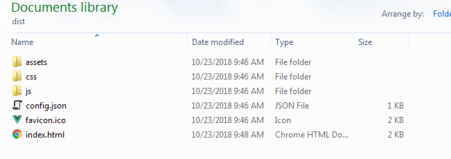

The contents are basically what is in the `public` folder which in our case contained:

* `assets` folder - folder contianing any static assets, in our case the avatar image for the sign in page and the beer icon for the map are included in this folder.
* `config.json` - the config file we added for our app
* `favicon.ico` - [favicon](https://en.wikipedia.org/wiki/Favicon) for our app.  In this case it is the Vue logo, which is added by default when using the `@vue/cli`.  Feel free to replace this with your own favicon.
* `index.html` - the html page for our app

There are also new folders created for both the bundled JavaScript (`js` folder) and style sheets (`css` folder).  If you explore the `js` folder, you should see bundle files similar to this (they will have different names every time):

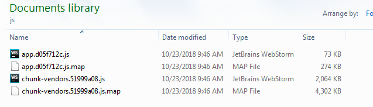

In the above, the actual application code has been combined and bundled into the small `app.*js` file with a size of about `~73KB`.  If you were to open that file, you will see that the JavaScript code has been transpiled to [es5](https://www.modernjs.com/syntax.html) and uglified/minified.  There is also a `chunk-vendors.*.js` file that contains all the app's dependencies combined into one or more bundle files that are also transpiled and minified (`vue`, `vue-router`, `sweetalert`, etc).  The same is also done with the `css` folder.

Now that the app code has been bundled, you can simply rename the `dist` folder to `brewery-finder` and copy it to your web server's `wwwroot` folder.  You can then test the app by going to the public url of the webserver, something like:

`http://gis.yourcompany.com/brewery-finder`

If the app renders you did everything correctly.  However, depending on what machine you have done these exercises on and which machine the app was deployed too, you may not see breweries in the map.  But wait, there's more!  


At this point, only the application code is on the production system, but the app is still accessing our Brewery API from `localhost`.  The Flask deployment is a lot more involved and is covered below.

### Deploying Flask to IIS

*Note: The majority of the steps followed are from [this tutorial](https://medium.com/@bilalbayasut/deploying-python-web-app-flask-in-windows-server-iis-using-fastcgi-6c1873ae0ad8) up until the *Install Visual C++ compiler* part.  Everything below also requries admin access to Microsoft IIS on a web server.*

The software requirements are:

* Microsoft IIS
* Python
* FastCGI Module for IIS

Please use the Tutorial referenced above to get through the steps of installing the [FastCGI](https://www.iis.net/downloads/microsoft/fastcgi-for-iis) module for IIS.  Once the `FastCGI` module has been installed, I would first recommend to set up an [Application Pool](https://docs.microsoft.com/en-us/iis/configuration/system.applicationhost/applicationpools/) to run Flask apps (future Flask apps can be ran from this too).

#### create an application pool

In Microsoft IIS go to `Application Pools` under the default instance and choose `Add Application Pool`.  Call it `Flask`:

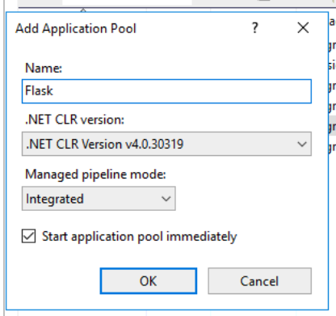

Make sure the *Start application pool immediately* box is checked and it `OK`.  Next, click on the new `Flask` app pool and right click  and choose `Advanced Settings` (or from the side menu).  Set the `Start Mode` to `AlwaysRunning`; this will make it so the service doesn't go to sleep.

Next, we need to copy the Flask app to the server itself.  Copy the `Python` folder to an appropriate place on the server. Once the folder has been copied to the web server, go back into IIS and right click on `Sites` to choose `Add Website`.  Name it `Brewery Service` and make sure to set the Application Pool to the `Flask` app pool we just set up.  Be sure to specify the path where you just copied the Python folder to.  In my case, I copied the `Python` folder to the webserver and renamed it to `BreweryService`.  Also, be sure to specify an **unused port** for the service to run on, I am using port `5022` for HTTP:

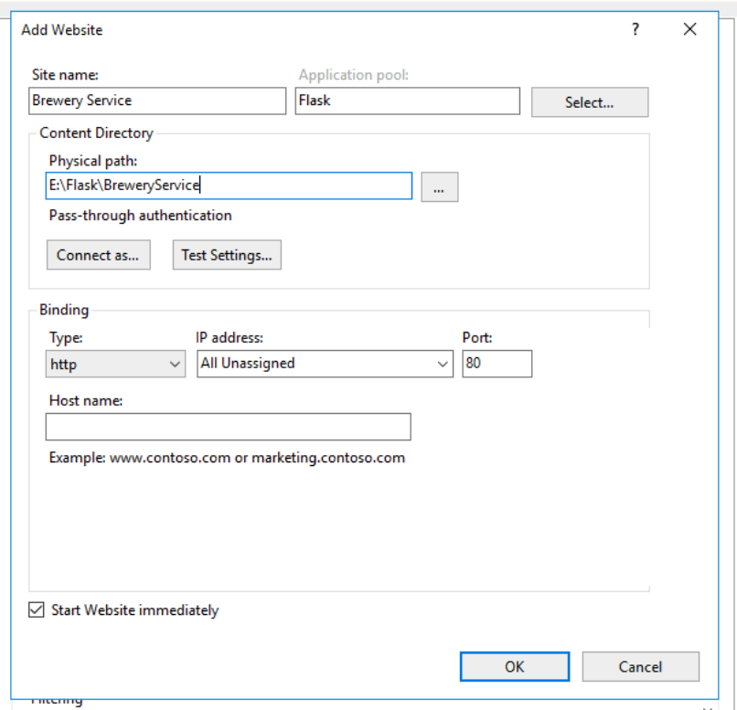

*Note: Depending on how security is set up on the server, you may need to use the `Connect as` option to provide credentials to run the Flask Service.  Elevated priviledges may be required to be able to write data (tempory files, etc) in the location of the Flask app.*

Make sure the *Start Website immediately* box is checked and hit OK.  For the next part, you can either provide the following `web.config` file in the folder you copied to the web server or manually go through the steps.  

#### Option 1: create a `web.config` file in the python folder

In my case, I copied the `Python` folder from the workshop onto my web server and placed it in a folder called `Flask` on the `E:\` and then renamed it to `BreweryService`.  So in my case the full path to the Flask stuff is:

`E:\Flask\BreweryService`

Create a file called `web.config` inside the folder you copied over. 

Your path will likely be different, but be sure replace the base path above to match your own environment when copying the below `xml` code into the `web.config` file:

```xml
<?xml version="1.0" encoding="utf-8"?>
<configuration>
    <system.webServer>
        <handlers>
            <add name="Brewery Service FastCGI" path="*" verb="*" modules="FastCgiModule" scriptProcessor="E:\Flask\BreweryService\app\venv\Scripts\python.exe|E:\Flask\BreweryService\app\venv\Lib\site-packages\wfastcgi.py" resourceType="Unspecified" requireAccess="Script" />
        </handlers>
    </system.webServer>
    <appSettings>
        <!-- Required settings -->
        <add key="WSGI_HANDLER" value="app.app" />
        <add key="PYTHONPATH" value="E:\Flask\BreweryService" />
    </appSettings>
</configuration>
```

The most important thing to set is the `scriptProcessessor`.  Notice that we are explicitly telling it to run the Flask app from the `virtualenv`'s Python executable and using the pipe (`|`) to then specify the script to run after it which is the `wfastcgi.py` file that was installed when the `virtualenv` was set up; make sure this is pointing to the correct file location.

Under the `<appSettings>` tag, there are 2 required variables to be set:

* `WSGI_HANDLER` - points to the `app.app`, which is referencing the `app` variable from the `app.py` file which is what runs the Flask app.
* `PYTHONPATH` - points to the folder that contains all the Python stuff (originally called `Python` in the workshop folder, but has been renamed in my case to `BreweryService`)

That is all for the configuration.  Skip to the `open firewall for flask app` section to allow inbound traffic.

#### Option 2: manual configuration

Make sure the `Brewery Service` Site is selected and Double Click on `Handler Mappings` and choose `Add Module Mapping` from the menu on the right.

Set the following:

* `Request Path` - `*`
* `Module` - `FastCGI`
* `Executable` - `<python executable>|<path to wfastcgi.py>`. We need to explicitly tell it to run the Flask app from the `virtualenv`'s Python executable and using the pipe (`|`) to then specify the script to run after it which is the `wfastcgi.py` file that was installed when the `virtualenv` was set up; make sure this is pointing to the correct file location.  In my case, it is: `E:\Flask\BreweryService\app\venv\Scripts\python.exe|E:\Flask\BreweryService\app\venv\Lib\site-packages\wfastcgi.py`
* `Name` - call this whatever you want, I called it `Brewery Service FastCGI`.

It should look similar to the following:

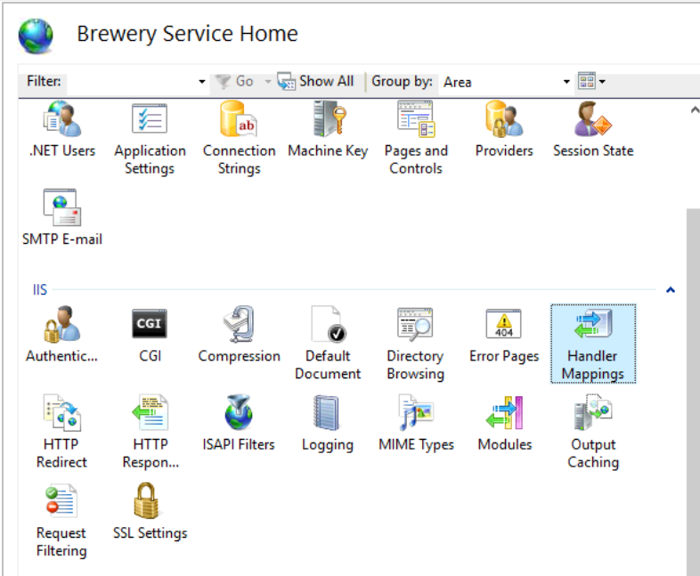

Before closing, Click `Request Restrictions`. Make sure *Invoke handler only if request is mapped to:* checkbox is unchecked:

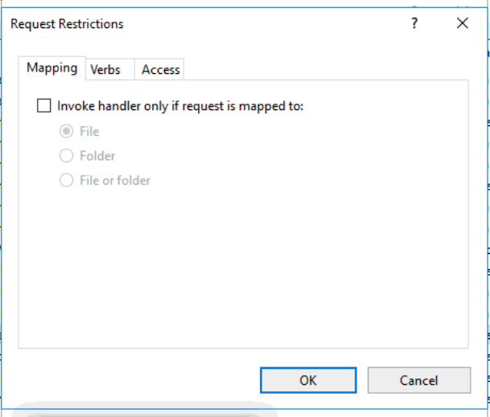

#### Optional - add HTTPS bindings

When we set up the site, I set HTTP bindings to port `5022`, but you can also set additional bindings for `HTTPS` calls.  To do this, when the site is highlighted click `Bindings` from the right and specify a port for HTTPS.  You can also provide an SSL certificate for your domain.

#### open firewall for flask app

At this point everything has been configured for our Flask app.  To make sure everything is working, make sure the site is selected in IIS and choose `Browse *:<port>` from the right menu.  That should open up a new tab in the default browser to our REST API at whatever port you specified:

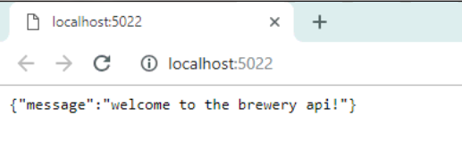

The above shows that it is running on this machine (hence `localhost`).  However, to make sure it is available to your network or even outside, the specified port(s) need to be opened in the Firewall.  Open the `Windows Firewall with Advanced Security on Local Computer` from the computer's search bar.  Click on the `Inbound Rules` in the left pane and then choose `New Rule` from the right menu to create a new Inbound Rule.  For the Rule type, choose `Port`:

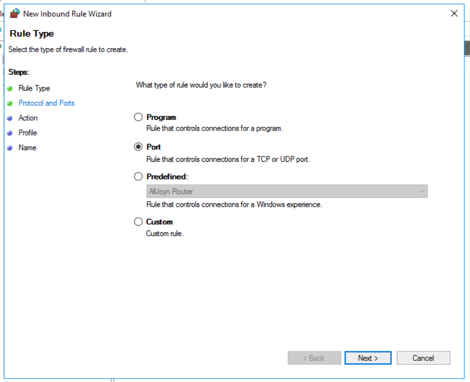

Hit next.  Make sure the rule applys to`TCP` protocol and set `Specify local ports`.  Here you can choose one specific port if you only set up HTTP bindings, or a range if you also allowed HTTPS.  You can also specify a larger range if you want to add other flask apps in the future and have them all be ran from ports 5000 through 5010.  Since I enabled both HTTP and HTTPS on ports `5022` and `5023` respectively, I am setting a range of `5022-5023`

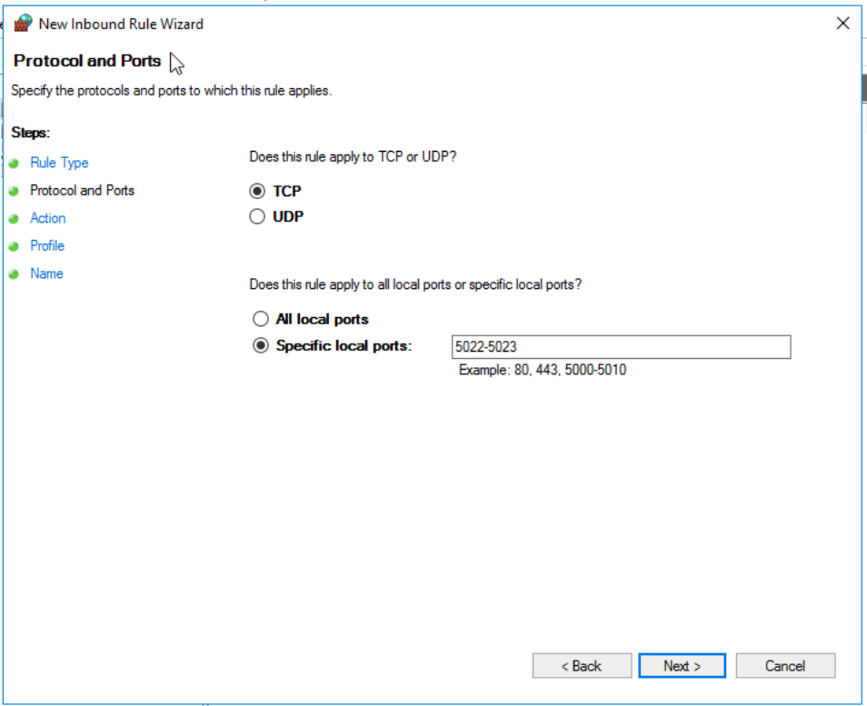

On the `Action` page, make sure to `Allow the connection`:

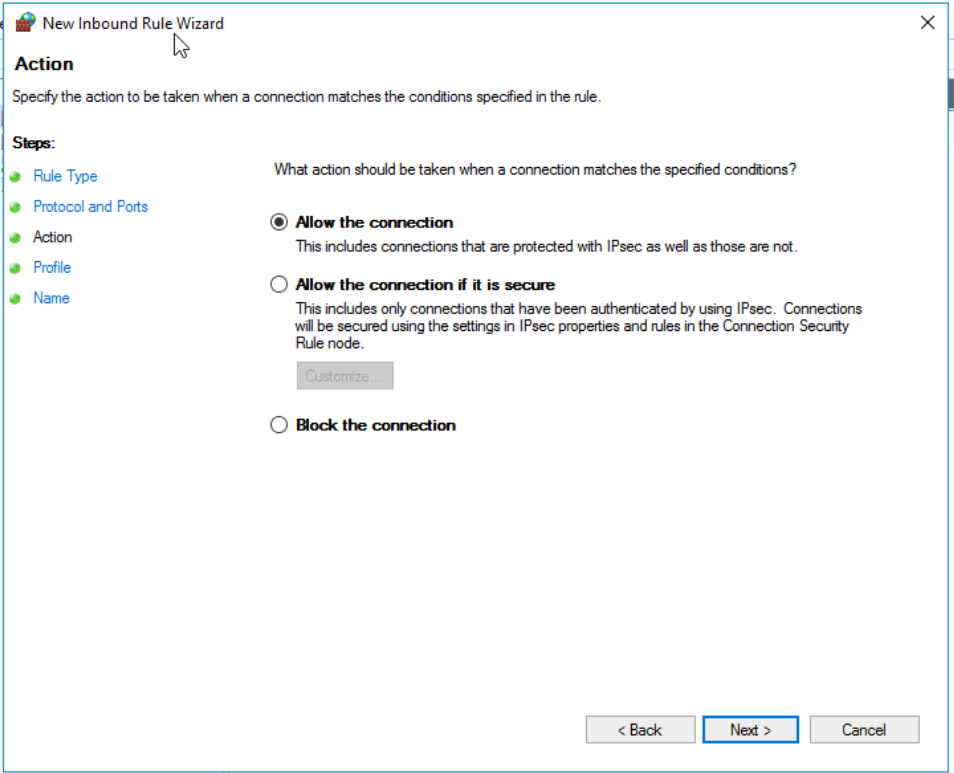

Hit Next.  Leave the `Profile` page as is and hit Next again.

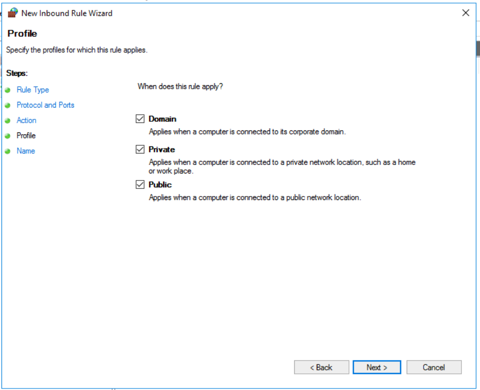

Finally, give the Inbound Rule a name and optionally a description and hit Finish:

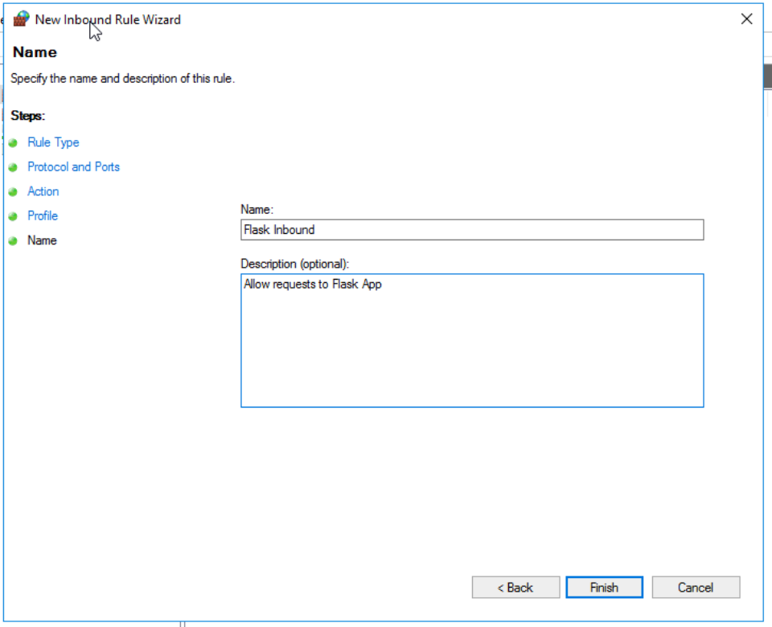

That is all!  Now test the service from another machine using the proper domain, something like `http://gis.yourcompany.com:5022/`:

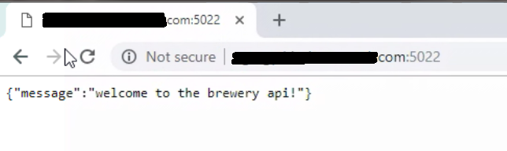

### tell production app to reference production Flask Service

Now that the Flask app is running on a web server via IIS, the production `Brewery Finder` app should reference this service instead of from `http://localhost:5001`.  That is where our `config.json` file comes in handy.  Within the `config.json` file for the app, we set an `api_base` that can easily be updatd without having to rebuild the app code.  Navigate to the location of the **production** Brewery Finder app we deployed earlier.  Open the `config.json` file and update the `api_base` to reflect the external path to the Flask service we just deployed.  Save the changes and close the file. 

Now launch the production application again and make sure everything is working.  Use [Fiddler]() or your browser's debugging tools to watch the network traffic to make sure the production Flask service is being used.

Congratulations!  We just created a Full Stack application from start to finish and even deployed it to a production environment!


